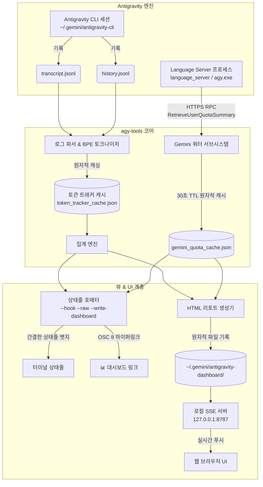

# ⚡ Antigravity CLI 개발자 툴킷 (`agy-tools`)

<div align="center">

**[English](README.md)** | **[한국어](README.ko.md)**

[](LICENSE)
[-brightgreen.svg)](#무의존성-아키텍처)
[](https://nodejs.org)
[-orange.svg)](#-다국어-지원-i18n--21개-언어)
[](#-설치-및-빠른-시작)

**Antigravity CLI를 위한 무의존성(Zero-dependency) 실시간 토큰 & 비용 분석 개발자 툴킷**

</div>

---

> [!NOTE]
> **토큰 사용량은 자체 토크나이저 및 휴리스틱 추정 엔진을 통해 직접 계산된 추정치입니다.**

---

## 🌟 개요

**Antigravity 개발자 툴킷 (`agy-tools`)**은 **Antigravity CLI** 환경에 최적화된 고정밀 무의존성 CLI 및 웹 대시보드 스위트입니다. 핵심 명령어인 **`agy-tokens`** (`agy-tools`, `agy-dashboard` 별칭 지원)는 초경량 상태줄 뱃지, 실시간 1:1 레이트 리밋 쿼터 풀 추적, 브라우저 기반 실시간 웹 대시보드를 제공합니다.

### 왜 `agy-tools`인가요?
- **Antigravity 코드 수정 0%**: `~/.gemini/antigravity-cli/settings.json`의 `statusLine` 설정 한 줄이 **유일한 연동 포인트**입니다.
- **1:1 실시간 Gemini 쿼터 풀 연동**: 로컬 Language Server와 HTTPS/HTTP RPC로 직접 통신하여 **5시간(5h)** 및 **7일(7d)** 롤링 쿼터 잔여량과 리셋 카운트다운을 표시합니다.
- **실시간 SSE 웹 대시보드**: `http://127.0.0.1:8787`에서 Server-Sent Events(SSE)와 동적 SVG 벡터 차트 기반의 반응형 대시보드를 제공합니다.
- **2026 최신 플래그십 모델 완벽 지원**: **Gemini 3.7 Flash**, **Gemini 3.6 Flash**, **Gemini 3.5 Flash**, **Claude Opus 4.6**, **Claude Sonnet 4.6** 등 최신 모델을 완벽하게 인식하고 단가를 계산합니다.
- **외부 의존성 제로(Zero-Dependency)**: Node.js 내장 모듈(`http`, `fs`, `path`, `net`, `child_process`)만으로 작성되어 마이크로초 단위의 즉각적인 실행 속도를 자랑합니다.
- **완벽한 다국어(i18n) 지원**: 시스템 로케일 자동 감지와 아랍어/히브리어 등 RTL(우에서 좌로 쓰기)을 포함한 21개 언어를 기본 지원합니다.

---

## 🏗 시스템 아키텍처



---

## ⚡ 상태줄 연동 — 유일한 연동 포인트

`agy-tokens`는 터미널 상태줄을 통해 실시간 토큰 사용량을 표시합니다. **Antigravity 내부 코드를 전혀 수정할 필요가 없습니다.**

### 간결하고 직관적인 상태줄 형식
불필요한 접두어를 제거하여 깔끔하고 정보 밀도가 높은 상태줄을 제공합니다:

**한국어 상태줄:**
```text
⚡ [Antigravity] 이번 턴: 1.2k (₩0.3) | 오늘 누적: 45.8k (₩9.9) | 캐시: 82% | 5h: ▰▰▰▰▱ 79% (4h 10m) | 7d: ▰▱▱▱▱ 21% (3d 20h) | 📊 대시보드
```

**영어 상태줄:**
```text
⚡ [Antigravity] Turn: 1.2k ($0.0002) | Today: 45.8k ($0.0068) | Cache: 82% | 5h: ▰▰▰▰▱ 79% (4h 10m) | 7d: ▰▱▱▱▱ 21% (3d 20h) | 📊 Dashboard
```

### 설정 파일 구성
`~/.gemini/antigravity-cli/settings.json` 파일에 아래와 같이 `statusLine` 설정을 추가합니다:

```json
{
  "statusLine": {
    "type": "command",
    "command": "agy-tokens --hook --raw --write-dashboard",
    "enabled": true,
    "stack_with_default": true
  }
}
```

- **전역 명령어 방식 (가장 권장)**: `npm link` 또는 설치 스크립트 실행 후 `"command": "agy-tokens --hook --raw --write-dashboard"`로 설정합니다.
- **직접 Node 경로 지정 시**: `"command": "node /경로/agy-tools/bin/agy-tokens.js --hook --raw --write-dashboard"` (경로를 큰따옴표로 감싸지 마세요).
- **Windows 8.3 축약 경로**: PATH가 자식 프로세스에 상속되지 않거나 공백이 포함된 경우 `"command": "C:\\PROGRA~1\\nodejs\\node.exe %APPDATA%\\npm\\NODE_M~1\\AGY-TO~1\\bin\\AGY-TO~1.JS --hook --raw --write-dashboard"`

- `--hook`: Antigravity의 `PostInvocation` 훅 규격에 맞는 페이로드를 생성합니다.
- `--raw`: 터미널 상태줄에 직접 출력하기 위해 JSON 래퍼를 벗겨낸 순수 텍스트를 출력합니다.
- `--write-dashboard`: 턴이 실행될 때마다 대시보드 데이터 파일을 원자적으로 최신화합니다.

---

## 📦 설치 및 빠른 시작

### 방법 1: 전역 NPM 링크 (권장)

```bash
git clone https://github.com/myk1yt/agy-tools.git
cd agy-tools
npm link
```

### 방법 2: 원클릭 자동 설치 스크립트

**Windows (명령 프롬프트 / PowerShell):**
```cmd
scripts\install.bat
```

**Linux / macOS:**
```bash
chmod +x scripts/install.sh
./scripts/install.sh
```

---

## 🤖 지원 AI 모델 및 공식 가격표

`agy-tools`는 Antigravity CLI(`/model`)에서 선택 가능한 모든 2026 플래그십 AI 모델을 지원하며, 프롬프트 캐싱 할인율과 원격 가격 동기화를 지원합니다:

| 모델 ID | 모델 표시명 | 제공사 | 컨텍스트 크기 | 입력 / 1M | 캐시 입력 / 1M | 출력 / 1M |
| :--- | :--- | :--- | :--- | :--- | :--- | :--- |
| `gemini-3.7-flash` | **Gemini 3.7 Flash** | Google | 1M | $0.15 | $0.0375 | $0.60 |
| `gemini-3.7-flash-thinking` | **Gemini 3.7 Flash (Thinking)** | Google | 1M | $0.15 | $0.0375 | $0.60 |
| `gemini-3.6-flash` | **Gemini 3.6 Flash** | Google | 1M | $0.15 | $0.0375 | $0.60 |
| `gemini-3.5-flash` | **Gemini 3.5 Flash** | Google | 1M | $0.15 | $0.0375 | $0.60 |
| `gemini-2.5-pro` | **Gemini 2.5 Pro** | Google | 2M | $1.25 | $0.3125 | $5.00 |
| `gemini-2.0-flash` | **Gemini 2.0 Flash** | Google | 1M | $0.10 | $0.0250 | $0.40 |
| `claude-opus-4.6` (`claude-3-opus`) | **Claude Opus 4.6** | Anthropic | 200k | $15.00 | $1.50 | $75.00 |
| `claude-sonnet-4.6` (`claude-3.7-sonnet`, `claude-3.5-sonnet`) | **Claude Sonnet 4.6** | Anthropic | 200k | $3.00 | $0.30 | $15.00 |
| `claude-3.5-haiku` | **Claude 3.5 Haiku** | Anthropic | 200k | $0.80 | $0.08 | $4.00 |
| `gpt-4o` | **GPT-4o** | OpenAI | 128k | $2.50 | $1.25 | $10.00 |
| `o3-mini` | **o3-mini** | OpenAI | 200k | $1.10 | $0.55 | $4.40 |
| `o1` | **o1** | OpenAI | 200k | $15.00 | $7.50 | $60.00 |

### 동적 가격 동기화 엔진
공식 API 단가 변동 시 언제든지 최신 가격 카탈로그를 동기화할 수 있습니다:
```bash
# 공식 API 가격표 전체 출력 (원화 환산)
agy-tokens --prices --currency krw

# 원격 저장소에서 최신 가격 정보 즉시 동기화
agy-tokens --sync-prices

# 24시간 이상 지난 가격 캐시 자동 동기화
agy-tokens --auto-sync
```

### 스마트 퍼지 휴리스틱 요금제 추정
등록되지 않은 신규 모델이나 커스텀 모델이 로그에서 발견되면 정규식 휴리스틱(`flash`, `pro`, `mini`, `free`, `local`)을 기반으로 적절한 요금 티어를 자동으로 부여합니다.

---

## 📊 실시간 SSE 웹 대시보드

웹 브라우저에서 직관적으로 사용할 수 있는 오프라인 지원 실시간 분석 대시보드입니다:

```bash
# 로컬 SSE 대시보드 서버를 시작하고 브라우저에서 바로 열기
agy-tokens --serve --open

# 정적 HTML 대시보드를 생성하고 브라우저에서 바로 열기
agy-tokens --html --open
```

### 주요 기능
- **듀얼 트랜스포트 프로토콜**: `http://127.0.0.1:8787` 환경에서는 실시간 Server-Sent Events(`/events`)로 동작하며, `file://` 로컬 파일 환경에서는 CORS 제한 없이 스크립트 태그 인젝션 폴링으로 매끄럽게 동작합니다.
- **동적 순수 SVG 차트**: 입력 토큰, 캐시 토큰, 출력 토큰을 구분하는 30일 누적 스택 바 차트, 인터랙티브 툴팁, 동적 Y축 스케일링을 지원합니다.
- **턴 단위 모델 기여도 분석**: 사고(Thinking) 모드, 세션 중 모델 변경, 도구 호출 비용을 정밀하게 분리 추적합니다.
- **인터랙티브 필터링**: 오늘, 어제, 7일, 30일, 사용자 지정 날짜 범위 및 특정 AI 모델별 필터링을 지원합니다.
- **VS Code 터미널 OSC 8 연동**: VS Code 내부 터미널에서 상태줄의 `📊 대시보드` 링크를 클릭하면 백그라운드 서버를 자동 기동하여 브라우저로 연결합니다.

👉 **자세한 기술 문서는 [docs/DASHBOARD.md](docs/DASHBOARD.md)에서 확인하세요.**

---

## ⏱ 1:1 실시간 Gemini 쿼터 풀 연동

`agy-tools`는 **Antigravity Language Server**와 로컬 HTTPS/HTTP RPC(`RetrieveUserQuotaSummary`)로 직접 통신하여 실제 사용량 쿼터를 측정합니다:

- **5시간 제한 (`5h`)**: 단기 버스트 쿼터 잔여율 측정.
- **7일 제한 (`7d`)**: 주간 누적 쿼터 잔여율 측정.
- **실시간 리셋 카운트다운**: 리셋 시점까지 남은 시간 실시간 포맷팅 (`4h 10m`, `3d 20h` 등).
- **30초 원자적 캐시**: `~/.gemini/gemini_quota_cache.json`에 저장되어 상태줄 평가 시 1ms 미만의 초고속 응답을 보장합니다.

```bash
# 실시간 Gemini 쿼터 상태 수동 조회 및 동기화
agy-tokens --sync-quota
```

👉 **자세한 기술 문서는 [docs/QUOTA_POOL.md](docs/QUOTA_POOL.md)에서 확인하세요.**

---

## 🚀 CLI 명령어 및 옵션 전체 레퍼런스

모든 기능은 `agy-tools`, `agy-dashboard`, `agy-tokens` 중 편한 명령어로 호출할 수 있습니다:

### 주요 사용 예시

```bash
# 오늘의 사용량 요약 (기본값)
agy-tokens

# 최근 7일간의 사용량 표 (원화 KRW 기준)
agy-tokens --7d --currency krw

# 최근 30일간의 사용량 표 (달러 USD 기준)
agy-tokens --30d --currency usd

# 사용자 지정 날짜 범위 사용량 조회 (유로 EUR 기준)
agy-tokens --range 2026-08-01..2026-08-29 --currency eur

# 가장 최근 세션의 턴별 상세 내역 확인
agy-tokens --session

# 특정 세션 UUID의 턴별 상세 내역 확인
agy-tokens --session <세션-UUID>

# 무료 티어 / 정액제 모드 (비용 숨김, 순수 토큰량만 표시)
agy-tokens --free

# 스크립트 연동을 위한 순수 JSON 출력
agy-tokens --today --json
```

### 🎛 CLI 전체 옵션 테이블

| 옵션 | 단축 옵션 | 설명 |
| :--- | :--- | :--- |
| `--today` | `-t` | 오늘의 토큰 및 비용 요약 표시 *(기본값)* |
| `--yesterday` | `-y` | 어제의 토큰 및 비용 요약 표시 |
| `--7d`, `--week` | | 최근 7일간의 일별 상세 내역 및 합계 표시 |
| `--30d`, `--month` | | 최근 30일간의 일별 상세 내역 및 합계 표시 |
| `--range <start..end>` | | 사용자 지정 날짜 범위 통계 (`YYYY-MM-DD..YYYY-MM-DD`) |
| `--all` | `-a` | 전체 기록에 대한 종합 통계 표시 |
| `--session [id]` | `-s` | 최근 또는 지정 세션의 턴별 상세 내역 표시 |
| `--currency <code\>` | | 표시 통화 지정: `usd`, `krw`, `jpy`, `eur`, `gbp` |
| `--lang <code\>` | | 인터페이스 언어 지정 (아래 21개 언어 지원) |
| `--model <name>` | | 적용 단가 모델 수동 지정 (예: `gemini-3.7-flash`, `claude-3.7-sonnet`) |
| `--free`, `--no-cost` | | 무료/정액 요금제 모드 (금액을 숨기고 토큰량만 표시) |
| `--json` | | 프로그램 연동을 위한 순수 JSON 데이터 출력 |
| `--hook`, `--badge` | | Antigravity PostInvocation 훅용 상태줄 뱃지 페이로드 출력 |
| `--raw` | | JSON 래퍼 없이 순수 뱃지 문자열만 출력 |
| `--fresh`, `--no-cache` | | 캐시를 무시하고 모든 대화 로그를 완전히 새로 파싱 |
| `--prices`, `--models` | | 공식 API 가격표 카탈로그 출력 |
| `--sync`, `--sync-prices` | | 최신 공식 API 가격 카탈로그 동기화 |
| `--sync-quota` | | Language Server에서 실시간 Gemini 쿼터 풀 동기화 |
| `--auto-sync` | | 가격 캐시가 24시간 이상 지난 경우 자동 동기화 |
| `--html`, `--dashboard` | | 자동 갱신 HTML 대시보드 아티팩트 생성 |
| `--serve [port]` | | 로컬 실시간 SSE 대시보드 서버 시작 (기본 포트: `8787`) |
| `--port <n>` | | `--serve`용 포트 지정 (`0` 지정 시 빈 임의 포트 자동 할당) |
| `--open` | | `--html`/`--serve` 실행 후 기본 브라우저에서 대시보드 자동 열기 |
| `--write-dashboard` | | 상태줄 실행 시 대시보드 데이터 파일 자동 갱신 |
| `--no-link` | | 상태줄 뱃지에서 클릭 가능한 대시보드 링크 제외 |
| `--refresh <sec>` | | 대시보드 폴링 간격(초) 설정 (기본값: `5`) |
| `--no-color` | | 터미널 ANSI 컬러 코드 비활성화 |
| `--help`, `-h` | | 도움말 화면 표시 |
| `--version`, `-v` | | 버전 정보 표시 |

---

## 🌐 다국어 지원 (i18n) — 21개 언어

`agy-tools`는 운영체제 로케일(`LANG`, `LC_ALL` 등)을 자동으로 감지하며, 21개 언어 및 아랍어/히브리어 등 우에서 좌로 읽는 RTL(Right-to-Left) 환경을 완벽 지원합니다:

| 지역 | 지원 언어 및 로케일 코드 |
| :--- | :--- |
| **동아시아** | 한국어 (`ko`), English (`en`), 日本語 (`ja`), 简体中文 (`zh`), 繁體中文 (`zh-TW`) |
| **남아시아 & 동남아시아** | हिन्दी (`hi`), Tiếng Việt (`vi`), Bahasa Indonesia (`id`), ภาษาไทย (`th`) |
| **유럽** | Deutsch (`de`), Français (`fr`), Español (`es`), Português (`pt`), Italiano (`it`), Nederlands (`nl`), Polski (`pl`), Svenska (`sv`), Русский (`ru`), Türkçe (`tr`) |
| **중동 (RTL 지원)** | العربية (`ar`), עברית (`he`) |

```bash
# 한국어로 출력 고정
agy-tokens --7d --lang ko

# 일본어로 출력 고정
agy-tokens --30d --lang ja

# 아랍어(RTL)로 출력 고정
agy-tokens --lang ar
```

---

## 📚 상세 기술 문서 안내

자세한 내부 아키텍처, 시퀀스 다이어그램 및 프로토콜 규격은 `docs/` 디렉터리의 상세 가이드를 참조하세요:

- 📖 **[Gemini 쿼터 풀 연동 아키텍처 (docs/QUOTA_POOL.md)](docs/QUOTA_POOL.md)**: HTTPS/HTTP RPC 프로세스 탐색, 5h/7d 슬라이딩 윈도우, 원자적 캐싱 및 1ms 미만 상태줄 조회 메커니즘을 다룹니다.
- 📊 **[실시간 SSE 웹 대시보드 아키텍처 (docs/DASHBOARD.md)](docs/DASHBOARD.md)**: 듀얼 트랜스포트(SSE 푸시 + 스크립트 인젝션 폴링), SVG 벡터 차트 엔진, VS Code 터미널 연동 및 루프백 보안을 다룹니다.

---

## 📄 라이선스

이 프로젝트는 **MIT 라이선스**에 따라 배포됩니다. 자세한 내용은 [`LICENSE`](LICENSE) 파일을 참조하세요.

Developed with ❤️ by **kim,yong-tai**.
