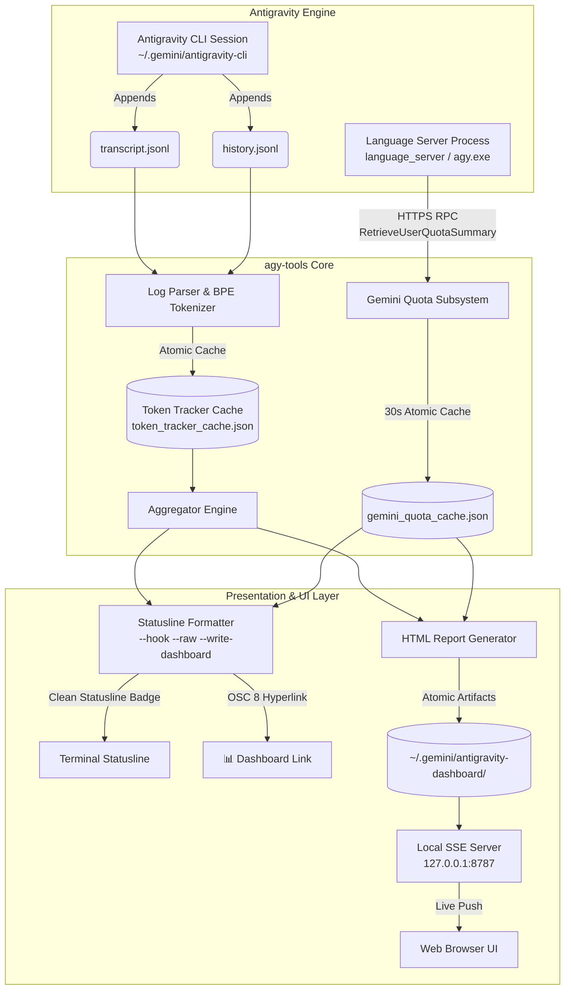
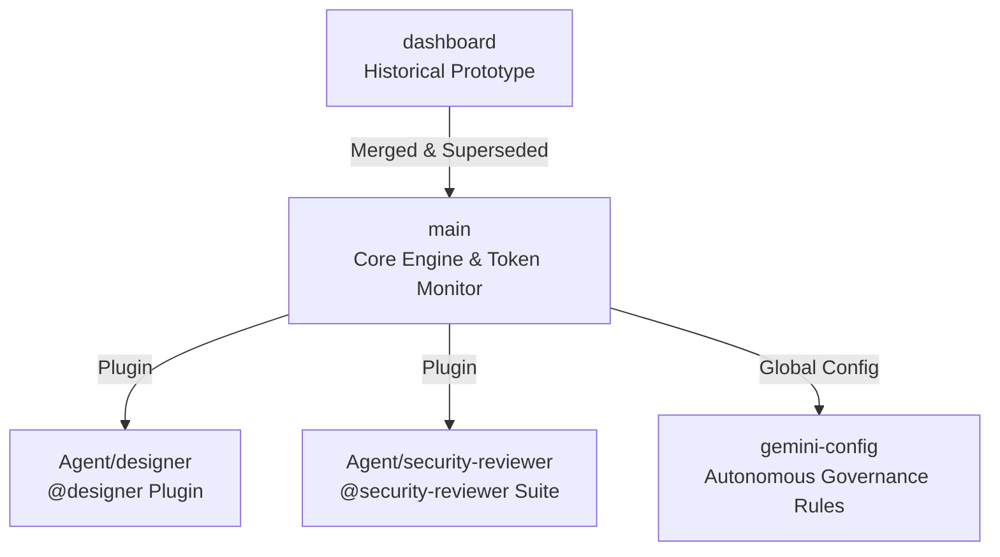

# ⚡ Antigravity CLI Developer Toolkit (`agy-tools`)

<div align="center">

**[English](README.md)** | **[한국어](README.ko.md)**

[](LICENSE)
[-brightgreen.svg)](#zero-dependency-architecture)
[](https://nodejs.org)
[-orange.svg)](#-internationalization-i18n--21-languages)
[](#-installation--quick-start)

**Zero-dependency Developer Toolkit & Real-Time Token/Cost Analytics Suite for Antigravity CLI**

</div>

---

> [!NOTE]
> **Token usage is an estimated value calculated directly by our tokenizer / heuristic estimation engine.**

---

## 🌟 Executive Overview

**Antigravity Developer Toolkit (`agy-tools`)** is a high-precision, zero-dependency CLI and dashboard suite designed specifically for **Antigravity CLI**. Its flagship command **`agy-tokens`** (also aliased as `agy-tools` and `agy-dashboard`) delivers instant statusline analytics, live 1:1 rate limit quota tracking, and an interactive real-time web dashboard.

### Why `agy-tools`?
- **Zero Antigravity Code Modifications**: A single `statusLine` command entry in `~/.gemini/antigravity-cli/settings.json` is the **ONLY** integration point needed.
- **1:1 Gemini Quota Pool Tracking**: Connects directly to the local Language Server via HTTPS/HTTP RPC to display exact **5-Hour (5h)** and **7-Day (7d)** rolling quota buckets with live countdown timers.
- **Real-Time SSE Web Dashboard**: Opens an interactive single-page dashboard on `http://127.0.0.1:8787` powered by Server-Sent Events (SSE) and responsive pure-SVG vector charts.
- **2026 Flagship Model Support**: Full out-of-the-box attribution for **Gemini 3.7 Flash**, **Gemini 3.6 Flash**, **Gemini 3.5 Flash**, **Claude Opus 4.6**, **Claude Sonnet 4.6**, and more.
- **Zero External Dependencies**: Engineered with pure Node.js standard libraries (`http`, `fs`, `path`, `net`, `child_process`) for sub-millisecond execution and instant startup.
- **Full Internationalization (i18n)**: 21 languages with automatic system locale detection and bidirectional RTL support (Arabic, Hebrew).

---

## 🏗 System Architecture



---

## 🌐 Agy-Tools Ecosystem & Branch Catalog

This repository hosts a multi-faceted developer ecosystem beyond the core token tracker. Each major capability lives in its own dedicated branch:



| Branch | Description | Key Capabilities | Quick Start |
|---|---|---|---|
| [`main`](https://github.com/myk1yt/agy-tools/tree/main) | **Core Engine & Developer Toolkit** | Statusline badge, SSE Web Dashboard, 1:1 Gemini Quota Pool RPC, Dynamic Pricing, 21 languages | `git clone https://github.com/myk1yt/agy-tools.git && cd agy-tools && scripts\install.bat` |
| [`Agent/designer`](https://github.com/myk1yt/agy-tools/tree/Agent/designer) | **Zero-MCP Design Specialist** | `@designer` agent, 5 modular skills (SVG, 3D Canvas, Cyberpunk, Sandbox, QA Harness) | `git checkout Agent/designer && powershell -ExecutionPolicy Bypass -File scripts/install-designer.ps1` |
| [`Agent/security-reviewer`](https://github.com/myk1yt/agy-tools/tree/Agent/security-reviewer) | **Enterprise Multi-Agent Security Audit** | `@security-reviewer` orchestrator + 4 domain inspectors (OWASP, IAM, Credentials, Supply Chain) | `git checkout Agent/security-reviewer && powershell -ExecutionPolicy Bypass -File scripts/install-security-reviewer.ps1` |
| [`gemini-config`](https://github.com/myk1yt/agy-tools/tree/gemini-config) | **Autonomous Multi-Agent Governance** | 7-Stage Lifecycle Protocol, Master Zero-Source-Edit Invariant, orchestrator skills | `git checkout gemini-config && scripts\install.bat` |
| [`dashboard`](https://github.com/myk1yt/agy-tools/tree/dashboard) | **Historical Prototype** | Original token tracker foundation (fully merged into `main`) | — |

> [!TIP]
> Each branch is self-contained with its own 1-click install/uninstall scripts. Switch branches with `git checkout <branch>` before running installers.

---

## 🎨 Agent Plugins

### `@designer` — Zero-MCP Self-Contained Design Specialist

> **Branch**: [`Agent/designer`](https://github.com/myk1yt/agy-tools/tree/Agent/designer) · **Author**: myk1yt · **Version**: 1.0.0

Autonomous design agent generating mathematically verified UI/UX designs, interactive widgets, and 3D graphics directly inside Antigravity chat — without Figma, Blender, or any external MCP tools.

**5 Bundled Modular Skills:**

| Skill | Description |
|---|---|
| `design-core-harness` | Visual QA verification loop with 4-dimension defect checklist (ascender clipping, z-index collision, placeholder retention, WCAG AAA contrast) |
| `design-vector-svg` | Mathematically precise 680px SVG layout engine with character width formulas and 9-family 4-tier color matrix |
| `design-interactive-sandbox` | Live in-chat HTML sci-widgets with real-time parameter controls and 60fps canvas animation |
| `design-3d-canvas` | WebGL 2.0 procedural geometry and custom GLSL vertex/fragment shaders (toroid, geodesic) |
| `design-cyberpunk-brainmap` | Cyberpunk CRT scanline topology UI with DOM/SVG neural pulse DAG networks |

**Installation & Usage:**
```bash
# 1. Switch to designer branch
git checkout Agent/designer

# 2. Install (Windows PowerShell)
powershell -ExecutionPolicy Bypass -File scripts/install-designer.ps1

# 2. Install (Linux / macOS)
bash scripts/install-designer.sh
```

Invoke in Antigravity CLI: `/agent` → select `designer`, or mention `@designer` directly.

---

### `@security-reviewer` — Enterprise Multi-Agent Security Audit Suite

> **Branch**: [`Agent/security-reviewer`](https://github.com/myk1yt/agy-tools/tree/Agent/security-reviewer) · **Author**: myk1yt · **Version**: 1.0.0

Lead Security Reviewer orchestrating specialized domain subagents for pre-commit audits: OWASP/CWE, Secrets/Credentials, Cloud/IaC, and Antigravity MCP privileges.

**4 Domain Inspector Subagents:**

| Subagent | Coverage |
|---|---|
| `sec-app-vuln` | OWASP Top 10 (2021) & CWE Top 25 — SQL Injection, XSS, Path Traversal, SSRF, Prompt Injection, ReDoS |
| `sec-cloud-iam` | GCP IAM least privilege, Terraform/K8s/Dockerfile security, firewall rules (`0.0.0.0/0`, `allUsers`) |
| `sec-credential-scanner` | Hardcoded API keys, private certs, JWT tokens, `.env` leakage, PII exposure |
| `sec-supply-mcp` | Supply chain CVEs, MCP tool privilege escalation, CORS/CSP headers |

**Standardized Audit Report:** 4-part EGC format — Philosophy Alignment → Scope → Consolidated Findings (Critical/High/Med/Low with exploit PoCs & remediations) → Quality Gate Verdict (PASS / CONDITIONAL PASS / FAIL).

**Installation & Usage:**
```bash
# 1. Switch to security-reviewer branch
git checkout Agent/security-reviewer

# 2. Install (Windows PowerShell)
powershell -ExecutionPolicy Bypass -File scripts/install-security-reviewer.ps1

# 2. Install (Linux / macOS)
bash scripts/install-security-reviewer.sh
```

Invoke in Antigravity CLI: `/agent` → select `security-reviewer`, or mention `@security-reviewer` directly.

---

## 📜 Autonomous Multi-Agent Governance (`gemini-config`)

> **Branch**: [`gemini-config`](https://github.com/myk1yt/agy-tools/tree/gemini-config)

Shareable global configuration bundle that provisions the **7-Stage Multi-Agent Lifecycle Protocol** and engineering governance rules directly into your `~/.gemini` directory.

**Core Components:**
- **`rules/AGENTS.md`**: Master Zero-Source-Edit & Zero-Monolithic-Execution invariants, 7-Stage lifecycle (`Intent → Decompose → Strategy → Adversarial Audit → SRP Plan → Worker Exec → Blind QA → Delivery`)
- **`rules/GEMINI.md`**: Cross-platform, zero-dependency engineering standards
- **`skills/autonomous-orchestrator`**: Multi-agent delegation and double-blind QA runbook
- **`skills/usage`**: Slash command `/usage` for instant token and cost analytics
- **`hooks/hooks.json`**: Antigravity PostInvocation turn badge hook

**Installation:**
```bash
# 1. Switch to gemini-config branch
git checkout gemini-config

# 2. Install (Windows)
scripts\install.bat

# 2. Install (Linux / macOS)
chmod +x scripts/install.sh && ./scripts/install.sh
```

---

## 📦 Quick Start & Installation

Prerequisites: **Node.js 16+** ([nodejs.org](https://nodejs.org)) and **Antigravity CLI**

### 1️⃣ One-Click Installation (Recommended)

Run the following 3 commands in your terminal. This registers global commands **AND automatically configures the statusline (`statusLine`) hook in `settings.json`**:

**Windows (Command Prompt / PowerShell):**
```cmd
git clone https://github.com/myk1yt/agy-tools.git
cd agy-tools
scripts\install.bat
```

**Linux / macOS:**
```bash
git clone https://github.com/myk1yt/agy-tools.git
cd agy-tools
chmod +x scripts/install.sh && ./scripts/install.sh
```

### 2️⃣ Getting Started
1. **Restart Antigravity CLI (`agy`)**.
2. Your terminal statusline will immediately display real-time token metrics and live Gemini quota pools!
3. To open the real-time browser dashboard, click `📊 Dashboard` in your terminal statusline or run:
```bash
agy-tokens --html --open
```

---

## ⚡ Statusline Integration & Architecture

`agy-tokens` operates as a statusline-powered real-time token monitor. **No modification of Antigravity core files is required.**

The installer script (`install.bat` / `install.sh`) automatically and safely merges the `statusLine` configuration into `~/.gemini/antigravity-cli/settings.json` (preserving your existing settings and creating automatic backups).

### Clean Statusline Format
The statusline badge renders without redundant prefixes, keeping terminal output clean, dense, and informative:

**English Statusline:**
```text
⚡ [Antigravity] Turn: 1.2k ($0.0002) | Today: 45.8k ($0.0068) | Cache: 82% | 5h: ▰▰▰▰▱ 79% (4h 10m) | 7d: ▰▱▱▱▱ 21% (3d 20h) | 📊 Dashboard
```

**Korean Statusline:**
```text
⚡ [Antigravity] 이번 턴: 1.2k (₩0.3) | 오늘 누적: 45.8k (₩9.9) | 캐시: 82% | 5h: ▰▰▰▰▱ 79% (4h 10m) | 7d: ▰▱▱▱▱ 21% (3d 20h) | 📊 대시보드
```

- `--hook`: Formats output for Antigravity's `PostInvocation` statusline runner.
- `--raw`: Strips JSON wrapper for direct terminal statusline display.
- `--write-dashboard`: Atomically synchronizes real-time dashboard data on every turn.

### 🔧 Manual Setup & Troubleshooting

If you prefer manual configuration or operate in specialized container/PATH environments:

#### Manual `settings.json` Configuration
Add the `statusLine` hook to `~/.gemini/antigravity-cli/settings.json`:
```json
{
  "statusLine": {
    "type": "command",
    "command": "agy-tokens --hook --raw --write-dashboard",
    "enabled": true,
    "stack_with_default": true
  }
}
```

- **Direct Node path**: `"command": "node /path/to/agy-tools/bin/agy-tokens.js --hook --raw --write-dashboard"`
- **Windows 8.3 short paths (if PATH is not inherited by subprocesses)**:
  `"command": "C:\\PROGRA~1\\nodejs\\node.exe %APPDATA%\\npm\\NODE_M~1\\AGY-TO~1\\bin\\AGY-TO~1.JS --hook --raw --write-dashboard"` (ensure backslashes are escaped as `\\`)

---

## 🤖 Supported AI Models & Pricing Matrix

`agy-tools` supports all 2026 flagship AI models available in Antigravity CLI (`/model`), including subword token pricing, prompt caching discounts, and dynamic price sync:

| Model ID | Display Name | Provider | Context Window | Input / 1M | Cached Input / 1M | Output / 1M |
| :--- | :--- | :--- | :--- | :--- | :--- | :--- |
| `gemini-3.7-flash` | **Gemini 3.7 Flash** | Google | 1M | $0.15 | $0.0375 | $0.60 |
| `gemini-3.7-flash-thinking` | **Gemini 3.7 Flash (Thinking)** | Google | 1M | $0.15 | $0.0375 | $0.60 |
| `gemini-3.6-flash` | **Gemini 3.6 Flash** | Google | 1M | $0.15 | $0.0375 | $0.60 |
| `gemini-3.5-flash` | **Gemini 3.5 Flash** | Google | 1M | $0.15 | $0.0375 | $0.60 |
| `gemini-2.5-pro` | **Gemini 2.5 Pro** | Google | 2M | $1.25 | $0.3125 | $5.00 |
| `gemini-2.0-flash` | **Gemini 2.0 Flash** | Google | 1M | $0.10 | $0.0250 | $0.40 |
| `claude-opus-4.6` (`claude-3-opus`) | **Claude Opus 4.6** | Anthropic | 200k | $15.00 | $1.50 | $75.00 |
| `claude-sonnet-4.6` (`claude-3.7-sonnet`, `claude-3.5-sonnet`) | **Claude Sonnet 4.6** | Anthropic | 200k | $3.00 | $0.30 | $15.00 |
| `claude-3.5-haiku` | **Claude 3.5 Haiku** | Anthropic | 200k | $0.80 | $0.08 | $4.00 |
| `gpt-4o` | **GPT-4o** | OpenAI | 128k | $2.50 | $1.25 | $10.00 |
| `o3-mini` | **o3-mini** | OpenAI | 200k | $1.10 | $0.55 | $4.40 |
| `o1` | **o1** | OpenAI | 200k | $15.00 | $7.50 | $60.00 |

### Dynamic Pricing Sync Engine
Keep your pricing catalog synchronized with official API price updates:
```bash
# Display full official pricing catalog table
agy-tokens --prices --currency krw

# Synchronize latest pricing catalog from remote repository
agy-tokens --sync-prices

# Automatically check and sync pricing if older than 24 hours
agy-tokens --auto-sync
```

### Smart Fuzzy Heuristic Fallback
If custom or newly released models are detected in your session logs, `agy-tools` applies intelligent regex heuristics (`flash`, `pro`, `mini`, `free`, `local`) to assign appropriate rate tiers automatically.

---

## 📊 Real-Time SSE Web Dashboard

The web dashboard is an offline-capable, real-time analytics suite accessible from any web browser:

```bash
# Start local SSE server and open dashboard in browser
agy-tokens --serve --open

# Generate static HTML report and open immediately
agy-tokens --html --open
```

### Highlights
- **Dual Transport Protocol**: Operates via Server-Sent Events (`/events`) on `http://127.0.0.1:8787` or via script-tag polling on `file://` local pages without CORS errors.
- **Dynamic Pure-SVG Charts**: 30-day token volume visualizer with stacked bars (Input, Cached, Output), interactive tooltips, and dynamic Y-axis scaling.
- **Turn-by-Turn Model Attribution**: Full visibility into reasoning effort, multi-model sessions, and tool executions.
- **Interactive Filtering**: Real-time filtering by date range (Today, 7d, 30d, Custom Range) and AI model.
- **VS Code Terminal OSC 8 Integration**: Clicking the `📊 Dashboard` badge inside VS Code terminal automatically starts the background server and opens the browser.

👉 **Read the complete technical specification in [docs/DASHBOARD.md](docs/DASHBOARD.md)**.

---

## ⏱ 1:1 Gemini Quota Pool Integration

`agy-tools` directly queries the **Antigravity Language Server** via HTTPS/HTTP RPC (`RetrieveUserQuotaSummary`) to extract authentic rate limit metrics:

- **5-Hour Limit (`5h`)**: Short-term sliding window burst quota.
- **7-Day Limit (`7d`)**: Weekly sliding window cumulative allowance.
- **Live Countdown Timers**: Real-time remaining duration formatting (e.g. `4h 10m`, `3d 20h`).
- **30-Second Atomic Cache**: Cached at `~/.gemini/gemini_quota_cache.json` for sub-millisecond statusline reading with non-blocking background refreshes.

```bash
# Synchronize and inspect live Gemini quota pool
agy-tokens --sync-quota
```

👉 **Read the complete technical specification in [docs/QUOTA_POOL.md](docs/QUOTA_POOL.md)**.

---

## 🚀 CLI Commands & Options Reference

All CLI capabilities are accessible via `agy-tools`, `agy-dashboard`, or `agy-tokens`:

### Usage Examples

```bash
# View today's usage summary (default)
agy-tokens

# View 7-day breakdown table in Korean Won (KRW)
agy-tokens --7d --currency krw

# View 30-day breakdown table in US Dollars (USD)
agy-tokens --30d --currency usd

# View custom date range in Euro (EUR)
agy-tokens --range 2026-08-01..2026-08-29 --currency eur

# Inspect turn-by-turn breakdown for the latest session
agy-tokens --session

# Inspect turn-by-turn breakdown for a specific conversation UUID
agy-tokens --session <conversation-uuid>

# Free tier / flat subscription mode (pure token metrics, zero cost)
agy-tokens --free

# Programmatic JSON output for scripts and automation
agy-tokens --today --json
```

### 🎛 Complete CLI Options Reference

| Option | Shorthand | Description |
| :--- | :--- | :--- |
| `--today` | `-t` | Display today's usage summary *(default)* |
| `--yesterday` | `-y` | Display yesterday's usage summary |
| `--7d`, `--week` | | Display 7-day daily breakdown table and grand total |
| `--30d`, `--month` | | Display 30-day daily breakdown table and grand total |
| `--range <start..end>` | | Display aggregation for custom date range (`YYYY-MM-DD..YYYY-MM-DD`) |
| `--all` | `-a` | Display full historical breakdown across all recorded sessions |
| `--session [id]` | `-s` | Display turn-by-turn breakdown for latest or specified conversation ID |
| `--currency <code\>` | | Display currency: `usd`, `krw`, `jpy`, `eur`, `gbp` |
| `--lang <code\>` | | UI language code (see 21 supported languages below) |
| `--model <name>` | | Override model pricing (e.g. `gemini-3.7-flash`, `claude-3.7-sonnet`) |
| `--free`, `--no-cost` | | Free/Flat quota mode (hides dollar costs, displays token metrics) |
| `--json` | | Output raw JSON data for programmatic integration |
| `--hook`, `--badge` | | Output statusline badge payload for Antigravity PostInvocation hook |
| `--raw` | | Output raw statusline badge string without JSON envelope |
| `--fresh`, `--no-cache` | | Bypass cache and force full re-parsing of transcript logs |
| `--prices`, `--models` | | Display official API pricing catalog table |
| `--sync`, `--sync-prices` | | Synchronize latest official API pricing catalog |
| `--sync-quota` | | Fetch and synchronize live Gemini quota pool from Language Server |
| `--auto-sync` | | Automatically check and synchronize pricing if older than 24 hours |
| `--html`, `--dashboard` | | Generate self-refreshing HTML dashboard artifact |
| `--serve [port]` | | Start local real-time SSE dashboard server (default: `8787`) |
| `--port <n>` | | Specify custom port for `--serve` (`0` for random port) |
| `--open` | | Automatically open dashboard in default browser after `--html`/`--serve` |
| `--write-dashboard` | | Write dashboard data files during statusline evaluation |
| `--no-link` | | Suppress clickable OSC 8 dashboard link in statusline badge |
| `--refresh <sec>` | | Set dashboard polling interval in seconds (default: `5`) |
| `--no-color` | | Disable ANSI terminal color codes |
| `--help`, `-h` | | Display CLI help screen |
| `--version`, `-v` | | Display version information |

---

## 🌐 Internationalization (i18n) — 21 Languages

`agy-tools` automatically detects the host system locale (`LANG`, `LC_ALL`, etc.) and supports 21 languages out-of-the-box, with dedicated bidirectional Right-to-Left (RTL) formatting:

| Region | Supported Languages & Locale Codes |
| :--- | :--- |
| **East Asia** | English (`en`), 한국어 (`ko`), 日本語 (`ja`), 简体中文 (`zh`), 繁體中文 (`zh-TW`) |
| **South & Southeast Asia** | हिन्दी (`hi`), Tiếng Việt (`vi`), Bahasa Indonesia (`id`), ภาษาไทย (`th`) |
| **Europe** | Deutsch (`de`), Français (`fr`), Español (`es`), Português (`pt`), Italiano (`it`), Nederlands (`nl`), Polski (`pl`), Svenska (`sv`), Русский (`ru`), Türkçe (`tr`) |
| **Middle East (RTL)** | العربية (`ar`), עברית (`he`) |

```bash
# Force Korean language output
agy-tokens --7d --lang ko

# Force Japanese language output
agy-tokens --30d --lang ja

# Force Arabic (RTL) language output
agy-tokens --lang ar
```

---

## 📚 Deep-Dive Technical Documentation

For in-depth architectural specifications, sequence diagrams, and protocol definitions, refer to our technical guides in `docs/`:

- 📖 **[Gemini Quota Pool Architecture (docs/QUOTA_POOL.md)](docs/QUOTA_POOL.md)**: Details HTTPS/HTTP RPC discovery, 5h/7d sliding windows, atomic caching, and sub-millisecond statusline reading.
- 📊 **[Real-Time SSE Web Dashboard Architecture (docs/DASHBOARD.md)](docs/DASHBOARD.md)**: Details the dual transport mechanism (SSE push + script polling), SVG chart engine, VS Code terminal integration, and loopback security.

---

## 📄 License

Distributed under the **MIT License**. See [`LICENSE`](LICENSE) for details.

Developed with ❤️ by **kim,yong-tai**.
