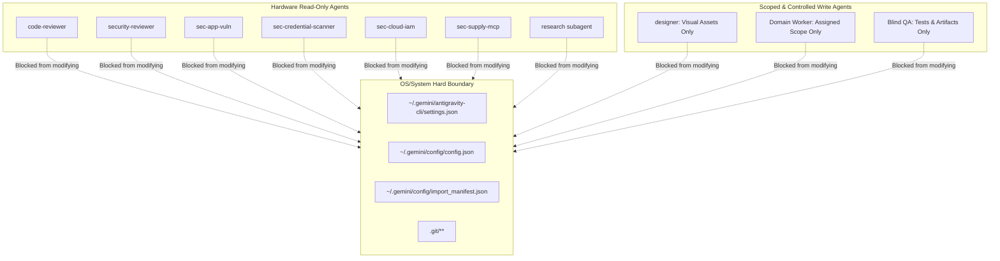
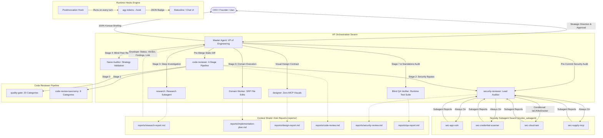

# Comprehensive Agent Infrastructure & Topology Scan Report
**Document Version**: 1.0.0  
**Date**: 2026-10-10  
**Author**: Staff AI Systems Architecture Specialist (Subagent 1)  
**Target Workspaces**: `D:\OneDrive\Projects\Antigravity-cli` & Global Config `C:\Users\k1yt\.gemini\config`

---

## 1. Executive Summary & Inventory Overview

A complete structural and static inspection was performed across the Antigravity ecosystem, encompassing repository assets, global configurations, plugin packages, rules protocols, tool permissions, and lifecycle hooks. 

The current system operates under the **Pure VP of Engineering Paradigm** (`AGENTS.md`), strictly separating the Master Agent (strategic conductor & primary conversational partner) from specialized subagents. Subagents persist dense logs to disk (`reports/<domain>-report.md`) while returning lightweight status envelopes to maintain orchestrator context hygiene.

### Infrastructure Statistics at a Glance
| Component Category | Total Count | Active Components & Identifiers |
| :--- | :---: | :--- |
| **Static Plugins** | 4 | `agy_help`, `code_reviewer`, `designer`, `security_reviewer` |
| **Registered Agents (Static)** | 7 | `agy_help`, `code-reviewer`, `designer`, `security-reviewer`, `sec-app-vuln`, `sec-credential-scanner`, `sec-cloud-iam`, `sec-supply-mcp` |
| **Dynamic Lifecycle Agents** | 4 | `Research Subagent`, `Naive Auditor`, `Domain Worker`, `Blind QA Verifier` |
| **Global & Workspace Skills** | 10 | `autonomous-orchestrator`, `code-review-taxonomy`, `quality-gate`, `security-review-orchestrator`, `usage`, `design-core-harness`, `design-vector-svg`, `design-interactive-sandbox`, `design-3d-canvas`, `design-cyberpunk-brainmap` |
| **Built-in System Skills** | 8 | `agy-customizations`, `antigravity_guide`, `automation`, `generative_ui`, `migrate-workflows`, `permissioned-github`, `plugin`, `ui-plugin-navigation` |
| **Core Rulebooks** | 2 | `AGENTS.md` (Swarm & Lifecycle Protocol), `GEMINI.md` (Engineering Guidelines) |
| **Lifecycle Hooks Configured** | 1 | `PostInvocation` (`agy-tokens --hook` real-time token/cost badge) |
| **Zero-Dependency CLI Scripts** | 3 | `agy-tools` (gateway), `agy-dashboard` (TUI), `agy-tokens` (counter) |

---

## 2. Complete Agent & Subagent Inventory

### 2.1 Master Orchestrator (VP of Engineering)
- **Role**: Primary Conversational Partner & Strategic Conductor.
- **Invariants**: 
  - **Zero-Source-Edit Invariant**: Never touches project source code (`lib/**`, `src/**`, `test/**`).
  - **Zero-Monolithic-Execution Invariant**: Never runs test or build commands directly (`flutter test`, `cargo test`, `npm test`, etc.).
  - **Prompt-Length Irrelevance**: 1-line queries never exempt delegation.
- **Allowed Scope**: `.gemini/**`, `rules/**`, `skills/**`, `brain/<conversation-id>/**`.
- **Tools**: Subagent orchestration (`define_subagent`, `invoke_subagent`, `send_message`), artifact authoring.

### 2.2 Static Registered Subagents (Plugins)

| Agent Name | Owning Plugin | Frontmatter Schema | Model Anchor | Toolset Permitted | Core Specialty & Responsibilities |
| :--- | :--- | :--- | :--- | :--- | :--- |
| **`agy_help`** | `agy_help` | `main: true, sub: true` | Auto / Default | `view_file`, `list_dir`, `grep_search`, `find_by_name` | 4-Tier Fallback Hierarchy for official Antigravity ecosystem documentation, CLI flags, IDE lenses, SDK patterns. `commandExecutionPolicy: ask_user`. |
| **`code-reviewer`** | `code_reviewer` | `main: true, sub: true` | Auto / Flash-High | `view_file`, `list_dir`, `grep_search`, `find_by_name`, `run_command`, `invoke_subagent`, `send_message` | Read-only pre-merge diff inspection; 4-stage pipeline (Stage 0 Deterministic `quality-gate`, Stage 1 8-Category Taxonomy, Stage 2 Confidence Filter, Stage 3 Verdict). Strictly read-only; zero tolerance for P0. |
| **`designer`** | `designer` | `main: true, sub: true` | Auto / Flash-High | `view_file`, `list_dir`, `grep_search`, `find_by_name`, `write_to_file`, `replace_file_content`, `run_command`, `generate_image` | Zero-MCP self-contained visual specialist: 680px inline SVG, in-chat interactive `sci-widget` sandboxes, web-native 3D/GLSL canvas, cyberpunk D3/DAG topology. Governed by mandatory `design.md` pre-contract. |
| **`security-reviewer`** | `security_reviewer` | `main: true, sub: true` | `gemini-3.8-flash-high` | `view_file`, `list_dir`, `grep_search`, `find_by_name`, `invoke_subagent`, `send_message` | Lead Security Reviewer orchestrating 4 domain subagents (`sec-app-vuln`, `sec-credential-scanner`, `sec-cloud-iam`, `sec-supply-mcp`). Strictly read-only; outputs consolidated EGC Threat Model and vulnerability report. |
| **`sec-app-vuln`** | `security_reviewer` | `main: false, sub: true` | `gemini-3.8-flash-high` | `view_file`, `list_dir`, `grep_search`, `find_by_name`, `send_message` | OWASP Top 10 & CWE Top 25 (SQLi, XSS, Path Traversal, SSRF), Prompt Injection, Confused Deputy flows, Business Logic Abuse, DoS/ReDoS. |
| **`sec-credential-scanner`** | `security_reviewer` | `main: false, sub: true` | `gemini-3.8-flash-high` | `view_file`, `list_dir`, `grep_search`, `find_by_name`, `send_message` | Hardcoded secrets, API tokens, private certificates (`.pem`, `.key`), PII leaks. Enforces mock test token exemption rule. |
| **`sec-cloud-iam`** | `security_reviewer` | `main: false, sub: true` | `gemini-3.8-flash-high` | `view_file`, `list_dir`, `grep_search`, `find_by_name`, `send_message` | GCP `roles/iam.securityReviewer` pattern mapping. Conditional dispatch (disabled by default; activates only for `*.tf`, `*.k8s.yaml`, Dockerfiles). Least-privilege IAM, permissive egress, public storage audits. |
| **`sec-supply-mcp`** | `security_reviewer` | `main: false, sub: true` | `gemini-3.8-flash-high` | `view_file`, `list_dir`, `grep_search`, `find_by_name`, `send_message` | Supply chain dependencies (CVEs in manifests/lockfiles), Antigravity MCP server tool definitions, runtime permissions, CORS/CSP policies. |

### 2.3 Dynamic Subagents (Synthesized during 7-Stage Lifecycle)
- **`Research Subagent / Deep Investigator` (Stage 3)**: Dispatched for multi-file codebase surveys, external web lookups, and technical specification analysis.
- **`Naive Auditor` (Stage 4)**: Unprimed subagent with zero prior conversational context. Audits draft strategy reports against: (1) Intent Alignment, (2) Grounded Soundness, (3) Risk & Edge Cases (Max 3 loops).
- **`Domain Worker` (Stage 6)**: Atomic code execution agent. Assigned strict single-responsibility file boundaries and injected intent. Executes source edits and self-tests in isolation.
- **`Blind QA Verifier` (Stage 7 & Stand-Alone)**: Independent verification subagent. Executes multi-tier test suites in live terminal, performs curl checks, and validates 1:1 plan reconciliation.

---

## 3. Skills Catalog & Functional Matrix

### 3.1 Global & Workspace Skills (`~/.gemini/config/skills/`)
1. **`autonomous-orchestrator`** (`SKILL.md`):
   - Multi-agent dynamic orchestration, intent injection payload formatting, 7-stage feature lifecycle runbook, double-blind audit rules, and stack-adaptive test synthesis (TypeScript, Python, Rust, Go, Flutter, Docs).
2. **`code-review-taxonomy`** (`SKILL.md`):
   - 8 orthogonal taxonomy lenses (`correctness`, `security`, `stability`, `data-integrity`, `performance`, `maintainability`, `test-coverage`, `style-docs`).
   - Anti-bikeshedding rule (Rule 13), public contract blast radius grep, confidence scoring (≥75 filter).
3. **`quality-gate`** (`SKILL.md` - 625 lines):
   - Universal, project-agnostic 20-category verification engine (QG-01 to QG-20).
   - 6-tier command resolution from CI workflows and scripts.
   - Audit-only invariant: strips mutating flags (`--fix`, `-w`, `fmt`, `add`, `updateSnapshot`).
4. **`security-review-orchestrator`** (`SKILL.md` - 32,077 bytes):
   - Orchestrates multi-pass security reviews: self-review, specialized tooling, taint analysis, and remediation verification loops.
5. **`usage`** (`SKILL.md`):
   - Real-time token analytics, prompt cache hit-rate metrics, model pricing breakdowns.
6. **`design-core-harness`** (`SKILL.md`):
   - Pre-contract `design.md` protocol, visual QA verification loop, 4-point defect checklist.
7. **`design-vector-svg`** (`SKILL.md`):
   - 680px fixed-width SVG layout engine, text width mathematical formulas (Latin 6.5px, CJK 13.0px), 9-family 4-tier color matrix.
8. **`design-interactive-sandbox`** (`SKILL.md`):
   - Live in-chat `sci-widget` single-file HTML/CSS/JS applications, 60fps canvas animations, parameter control sliders.
9. **`design-3d-canvas`** (`SKILL.md`):
   - Procedural WebGL/Three.js shaders, raymarched signed distance functions, context-loss recovery.
10. **`design-cyberpunk-brainmap`** (`SKILL.md`):
    - Deep radial gradients, CRT scanline grids, 7.5s laser sweeps, DOM/SVG neural pulse DAG networks.

### 3.2 Built-in Skills (`~/.gemini/antigravity-cli/builtin/skills/`)
1. **`agy-customizations`**: Complete specifications for Skills, Rules, Plugins, Hooks, MCP servers, and JSON configurations.
2. **`antigravity_guide`**: Authoritative offline manuals for Antigravity CLI, IDE, Desktop App, and Python SDK.
3. **`automation`**: Terminal automation, macro execution, and headless scripting runbooks.
4. **`generative_ui`**: Responsive UI component synthesis and sandbox specs.
5. **`migrate-workflows`**: Tooling and workflows migration guides.
6. **`permissioned-github`**: GitHub operations with fine-grained access tokens.
7. **`plugin`**: Plugin manifest creation, discovery, packaging, and validation.
8. **`ui-plugin-navigation`**: In-IDE routing and navigation helpers.

---

## 4. Rules & Governance Protocol

### 4.1 `AGENTS.md` (The VP of Engineering Paradigm)
- **100% Delegation Invariant**: Master executes zero direct labor. Direct edits to application files and direct executions of test/build commands are strictly prohibited.
- **Context Shield**: Specialists work in isolated contexts and output full analyses to disk (`reports/<domain>-report.md`). Orchestrator receives only a 4-field return schema (`[Status]`, `[Verdict]`, `[Key Findings]`, `[Artifact Link]`).
- **6 Domain Swarm Boundaries**: Research, Domain Workers, Designer, Code Reviewer, Security Reviewer Swarm, Blind QA Verifier.
- **Multi-Tier Definition of Done**: Build pass is the floor; visual inspection passes; code review diff P0=0, P1=0; security review Critical=0, High=0; runtime tests 100% pass.
- **Living Decision Log**: `decisions.md` maintained in workspace root for CEO-level decisions.
- **Language Policy**: Internal system English; CEO communication 100% Korean.

### 4.2 `GEMINI.md` (Core Engineering Guidelines)
- **Zero External Dependency**: Pure Node.js built-ins (`fs`, `path`, `crypto`, `child_process`, `os`, `readline`). Prohibits bloatware (`chalk`, `commander`, `yargs`, `rimraf`).
- **Multi-Platform Portability**: Cross-platform path resolution, TTY checking, ASCII table fallbacks, safe terminal escape handling.
- **Atomic File Operations**: Wrap all disk writes in safe temp-write + atomic rename (`writeAtomic`).
- **Context & Prompt Hygiene**: Progressive disclosure, streaming readers for large files, prompt caching layout.
- **Built-in Testing**: Standalone test runners (`node test/run-tests.js`) using built-in `assert`.

---

## 5. Slash Commands, CLI Features & Deployment Infrastructure

### 5.1 CLI Commands & Subcommands
- **Antigravity CLI Core**:
  - TUI Slash Commands: `/help`, `/exit`, `/quit`, `/model`, `/clear`.
  - Subcommands: `agy plugin list`, `agy plugin enable <name>`, `agy plugin disable <name>`, `agy agents`, `agy models`, `agy mcp list`, `agy version`.
- **Developer Toolkit Gateway (`agy-tools`)**:
  - `agy-tools dashboard`: Token & Cost Dashboard (today, 7d, 30d, session breakdowns).
  - `agy-tools prices`: Live API pricing catalog for Gemini/Claude models.
  - `agy-tools sync-prices`: Real-time pricing catalog update.
  - `agy-tokens`: Fast turn token counter and badge emitter.

### 5.2 Lifecycle Hooks (`hooks/hooks.json` & `~/.gemini/config/hooks/hooks.json`)
```json
{
  "$schema": "https://raw.githubusercontent.com/google-gemini/antigravity/main/schemas/hooks.schema.json",
  "name": "antigravity-lifecycle-hooks",
  "version": "1.0.0",
  "hooks": {
    "PostInvocation": {
      "enabled": true,
      "command": "agy-tokens",
      "args": ["--hook"],
      "description": "Outputs a 1-line real-time token and cost badge after every turn invocation"
    }
  }
}
```
- Receives context on `stdin` (protojson format with `conversationId`, `stepIdx`, etc.).
- Supported Event Types: `PreToolUse`, `PostToolUse`, `PreInvocation`, `PostInvocation`, `Stop`.

### 5.3 Deployment & Synchronization Scripts
- **`scripts/lib/configure-rules.js`**: Synchronizes `rules/AGENTS.md` and `rules/GEMINI.md` to `~/.gemini/config/rules/` with atomic writes and timestamped `.bak.YYYYMMDD-HHMMSS` backups.
- **`scripts/lib/configure-customizations.js`**: Recursively deploys `rules/`, `plugins/`, `skills/`, and `hooks/` to `~/.gemini/config/`. Idempotent and zero-dependency.

---

## 6. Tool Permissions & Security Sandboxing



- **Physical Exclusion**: `code-reviewer`, `security-reviewer`, and all four `sec-*` inspectors have `write_to_file` and `replace_file_content` removed from their frontmatter tool declarations.
- **Execution Policy**: `agy_help` enforces `commandExecutionPolicy: ask_user` to prevent unprompted local command execution.
- **System Protection Boundaries**: Hardcoded system protection rules deny direct read/write access to sensitive files (`settings.json`, `config.json`, `import_manifest.json`), preventing accidental privilege escalation or corruption.

---

## 7. Complete Current DAG Topology



---

## 8. Gap Analysis & Bridge to Subagent 2 & 3

1. **The Missing Static Plugin**:
   While `AGENTS.md` and the DAG diagrams explicitly depict `research / DeepInvestigator`, **no physical plugin definition** (`plugins/research` or `plugins/investigator`) currently exists in `plugins/` or `~/.gemini/config/plugins/`. Research tasks currently rely on ad-hoc dynamic prompt synthesis, leading to potential variance in rigor.
2. **Epistemic & Fact-Checking Gaps**:
   Unlike `code-reviewer` (which has `code-review-taxonomy` and `quality-gate`) or `security-reviewer` (which has OWASP/CWE mappings), research subagents have **no dedicated skill** for:
   - Primary source attribution and URL/hash citation tracking.
   - Cross-referencing claims across independent documentation tiers.
   - Uncertainty boundary quantification (e.g. distinguishing verified compiler behaviour from speculative training knowledge).
3. **Multi-Language Specification Blind Spots (C++, Rust, TypeScript, C#)**:
   Existing skills focus exclusively on generic static linters and build checks. They lack formal rulebooks for compiler-level edge cases (C++ ISO versioning/UB, Rust borrow checker/Miri/unsafe invariants, TypeScript variance/type-level recursion, C# Roslyn/AOT/P-Invoke boundaries).
``