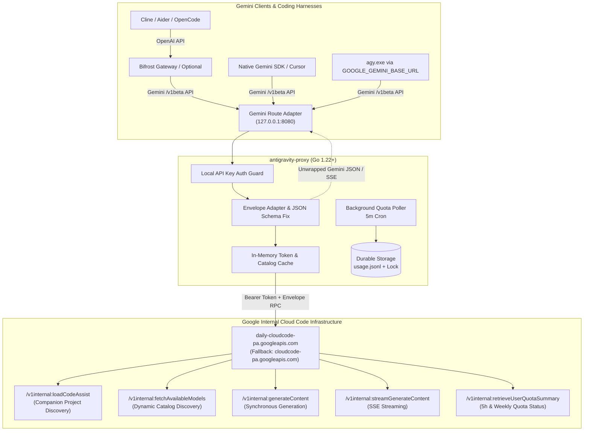
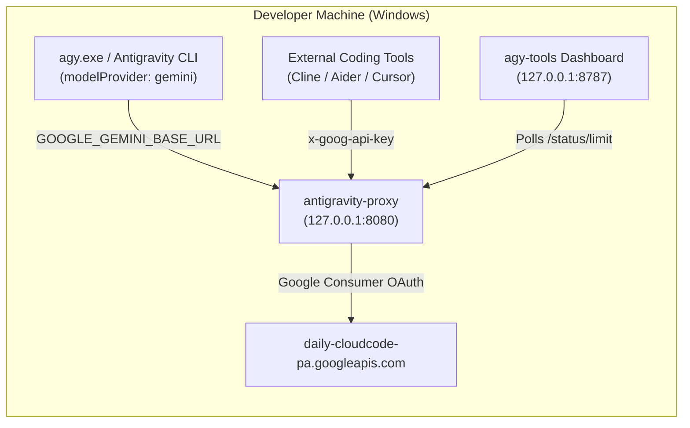
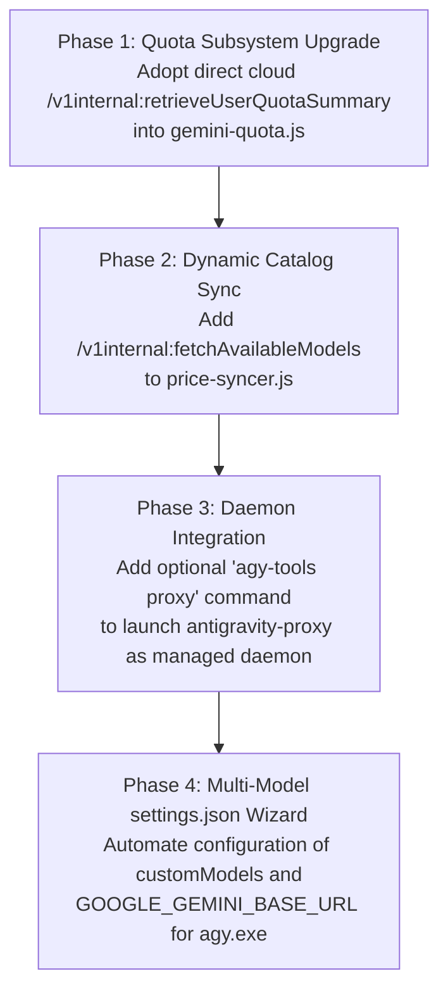

# Deep Investigation Report: `antigravity-proxy` & Integration Feasibility for Antigravity-cli

> **Date**: October 9, 2026  
> **Investigator**: DeepInvestigator (Systems Architect Subagent)  
> **Target Repository**: [sortedcord/antigravity-proxy](https://github.com/sortedcord/antigravity-proxy)  
> **Local Codebase**: `Antigravity-cli` (`agy-tools` v0.10.3) / `agy.exe` (Antigravity CLI v1.1.13+)  
> **Report Status**: Completed & Grounded in Live Codebase Evidence  

---

## 1. Executive Summary

This investigation provides a comprehensive architectural deconstruction of **`antigravity-proxy`** (an open-source Go reverse proxy developed by `@sortedcord`) and evaluates the feasibility, multi-model enablement, and architectural trade-offs of integrating it into our **`Antigravity-cli`** ecosystem (`agy-tools` & `agy.exe`).

### Key Takeaways:
1. **Core Problem Solved by `antigravity-proxy`**: Google Antigravity subscribers (Google AI Pro, Google One AI subscribers) receive high-tier quotas for Gemini and third-party models (Claude Opus 5.5, Claude Sonnet 5.5, GPT-OSS 120B). However, Google locks these models strictly inside the Antigravity IDE and CLI. `antigravity-proxy` unlocks these accounts by exposing a **native Gemini `/v1beta` HTTP REST + SSE endpoint** that routes directly to Google's internal Cloud Code backend (`daily-cloudcode-pa.googleapis.com` / `cloudcode-pa.googleapis.com`), maintaining native Gemini video inputs, tool calling, and thought signatures without lossy translation layers.
2. **Model Availability & Discovery**: Unlike the Antigravity UI which hardcodes a restricted model picker, `antigravity-proxy` performs **dynamic server-side model discovery** via `/v1internal:fetchAvailableModels`. It discovers 11 to 18+ models provisioned on the user's account—including unlisted models such as **Gemini 3.5 Flash Lite**, **Gemini 3.1 Flash Image**, legacy models, and newly deployed unannounced backend checkpoints.
3. **Antigravity CLI Native Extensibility Discovered**: Ground-truth binary analysis of `agy.exe` revealed that the official Google CLI natively supports:
   - `modelProvider: "gemini"` in `~/.gemini/antigravity-cli/settings.json`
   - `GOOGLE_GEMINI_BASE_URL` pointing to any custom endpoint
   - `GEMINI_API_KEY` environment variable
   - `customModels` map in `settings.json` (`CustomModelConfig` schema with `modelName`, `context_window`, `modelFeatures`)
4. **Feasibility Verdict**: **HIGHLY FEASIBLE (RECOMMENDED)**. Integrating `antigravity-proxy` unlocks multi-model routing for external harnesses (Cline, Aider, OpenCode) through the user's Antigravity subscription, while adopting its cloud quota querying into `agy-tools` (`gemini-quota.js`) solves the persistent local Language Server TLS handshake and CSRF 401 issues.

---

## 2. In-Depth Breakdown of `antigravity-proxy`

### 2.1 Architectural Overview & Request Lifecycle

`antigravity-proxy` is a single static Go binary designed as a pass-through adapter between the public Google Gemini `/v1beta` API and Google Cloud Code's private internal Antigravity service.



### 2.2 Backend Services & Internal Endpoints

`antigravity-proxy` bypasses the public Gemini API (`generativelanguage.googleapis.com`) and connects directly to Google Cloud Code's internal developer endpoints:
- **Primary Upstream**: `https://daily-cloudcode-pa.googleapis.com`
- **Production Upstream**: `https://cloudcode-pa.googleapis.com`

#### Internal Upstream RPC Methods:
| Method Path | Purpose | Request Payload | Response Extraction |
|---|---|---|---|
| `/v1internal:loadCodeAssist` | Project discovery & subscription tier | `{"metadata": {"ideType": 9, "platform": 5, "pluginType": 2}, "mode": 1}` | Extracts `cloudaicompanionProject` and `paidTier`/`currentTier` |
| `/v1internal:onboardUser` | Cloud companion provisioning if missing | `{"tierId": "free-tier" / paidTier, "metadata": ...}` | Polls until `done: true` with project ID |
| `/v1internal:fetchAvailableModels` | Dynamic model discovery | `{"project": "<projectId>"}` | Full catalog map of models and token limits |
| `/v1internal:generateContent` | Synchronous model execution | Envelope wrapping Gemini payload | Unwraps `{"response": { ... }}` |
| `/v1internal:streamGenerateContent?alt=sse` | Streaming execution | Envelope wrapping Gemini payload | Parses SSE chunks, strips Cloud Code envelope, streams pristine Gemini SSE |
| `/v1internal:retrieveUserQuotaSummary` | Periodic quota polling | `{}` | Returns `userStatus.groups[].buckets` |

#### The Envelope Protocol:
When a client sends a standard Gemini POST request to `/v1beta/models/{modelId}:generateContent`, `antigravity-proxy` wraps the raw JSON in Cloud Code's envelope:
```json
{
  "project": "gen-lang-client-0936248191",
  "model": "gemini-3.8-flash-tiered",
  "request": {
    "contents": [
      {
        "role": "user",
        "parts": [{"text": "Hello world"}]
      }
    ],
    "generationConfig": {
      "responseSchema": { ... }
    }
  },
  "userAgent": "antigravity",
  "requestType": "agent",
  "requestId": "c139c2c6-3d60-4927-b50a-b3ff1cb45691"
}
```
**Crucial Compatibility Adjustment**: Google Cloud Code expects `generationConfig.responseSchema`, whereas the standard Gemini `/v1beta` API uses `generationConfig.responseJsonSchema`. The proxy automatically renames this field without re-encoding large media buffers (`adaptGenerationBody` in `generation.go`).

### 2.3 Authentication & Client Credentials

Antigravity requires authenticating against Google OAuth using the official consumer client identity:

```go
// internal/oauth/credentials.go
const (
    consumerAppTag   = "<OFFICIAL_ANTIGRAVITY_CLIENT_ID>"
    consumerTokenKey = "<OFFICIAL_ANTIGRAVITY_CLIENT_SECRET>"
)
```

> [!IMPORTANT]
> **Consumer vs GCP Client Distinction**:
> Google enforces strict client isolation. If a generic GCP Cloud Code OAuth client ID is used to call these endpoints, Google immediately rejects consumer subscription requests with error `GOOGLE_TOS_NOT_SUPPORTED_BY_CLIENT`. Accessing Antigravity quotas requires using the official consumer client credentials shown above.

#### Authentication Flow:
1. **Interactive Login**: `antigravity-proxy login` launches an interactive browser session with PKCE (`S256`).
2. **Loopback Callback**: A temporary listener captures the auth code on `http://127.0.0.1:51121/oauth-callback`.
3. **Storage**: Tokens are saved with `0600` permissions to `~/.config/antigravity-proxy/config.json`.
4. **Runtime Refresh**: Access tokens are kept in memory and automatically refreshed 1 minute before expiration.
5. **Downstream API Key**: Local clients must present the proxy's configured `API_KEY` via `x-goog-api-key`, `?key=`, `x-api-key`, or `Authorization: Bearer <API_KEY>`. Upstream Google OAuth tokens are never leaked to clients.

### 2.4 Dynamic Model Discovery Mechanism

Unlike GUI clients that hardcode a static model list, `antigravity-proxy` queries `/v1internal:fetchAvailableModels` at runtime:

```go
// internal/proxy/models.go
for id, metadata := range catalog.Models {
    if metadata.APIProvider == "" || 
       metadata.APIProvider == "API_PROVIDER_INTERNAL" || 
       metadata.IsInternal || 
       metadata.RequiresLeadInGeneration || 
       tabModels[id] {
        continue
    }
    models = append(models, geminiModel{
        Name: "models/" + id,
        DisplayName: metadata.DisplayName,
        Description: metadata.Description,
        InputTokenLimit: metadata.MaxTokens,
        OutputTokenLimit: metadata.MaxOutputTokens,
        SupportedGenerationMethods: [2]string{"generateContent", "streamGenerateContent"},
    })
}
```

This dynamically exposes:
- **Flagship Gemini**: `gemini-3.8-flash-high/medium/low`, `gemini-3.7-flash`, `gemini-3.6-flash`, `gemini-3.1-pro`
- **Unlisted & Lightweight Gemini**: `gemini-3.5-flash-lite`, `gemini-2.5-pro`, `gemini-2.0-flash`
- **Multimodal & Specialized**: `gemini-3.1-flash-image`
- **Third-Party Models**: `claude-opus-5-5-high/medium/low`, `claude-sonnet-5-5-high/medium/low`, `claude-3-7-sonnet`, `claude-3-5-sonnet`, `gpt-oss-120b-medium`
- **Zero-Day Releases**: Any new model deployed by Google to the Cloud Code backend becomes instantly accessible without requiring proxy updates.

---

## 3. Analysis of Local Codebase (`Antigravity-cli`)

### 3.1 Local Architecture (`agy-tools` v0.10.3)

Our local repository `Antigravity-cli` (`agy-tools`) is an analytics toolkit, statusline formatter, and token dashboard:
- **`src/log-parser.js` & `src/tokenizer.js`**: Parses `transcript.jsonl` and `history.jsonl` generated by `agy.exe` in `~/.gemini/antigravity-cli/brain/`.
- **`src/config.js` & `data/pricing.json`**: Maintains a static catalog of model pricing (`MODEL_PRICING`) with heuristic alias matching (`_buildSortedAliases`).
- **`src/gemini-quota.js` (2,050 LOC)**: Connects to the local `language_server` / `agy.exe` over loopback Connect-RPC (`/RetrieveUserQuotaSummary` and `/GetUserStatus`) using process discovery (WMI/CIM, netstat, transcript CSRF scraping) to extract rolling 5h and 7d quota pools.
- **`src/serve.js` & `src/html-report.js`**: Hosts the real-time SSE dashboard on `http://127.0.0.1:8787`.

### 3.2 Antigravity CLI Execution Engine (`agy.exe`)

Live execution of `agy.exe models` on our system confirmed 18 models are currently provisioned for the user:
```text
gemini-3.8-flash-high     Gemini 3.8 Flash (High)
gemini-3.8-flash-medium   Gemini 3.8 Flash (Medium)
gemini-3.8-flash-low      Gemini 3.8 Flash (Low)
gemini-3.7-flash-high     Gemini 3.7 Flash (High)
gemini-3.7-flash-medium   Gemini 3.7 Flash (Medium)
gemini-3.7-flash-low      Gemini 3.7 Flash (Low)
gemini-3.6-flash-high     Gemini 3.6 Flash (High)
gemini-3.6-flash-medium   Gemini 3.6 Flash (Medium)
gemini-3.6-flash-low      Gemini 3.6 Flash (Low)
gemini-3.1-pro-high       Gemini 3.1 Pro (High)
gemini-3.1-pro-low        Gemini 3.1 Pro (Low)
claude-opus-5-5-low       Claude Opus 5.5 (Low)
claude-opus-5-5-medium    Claude Opus 5.5 (Medium)
claude-opus-5-5-high      Claude Opus 5.5 (High)
claude-sonnet-5-5-low     Claude Sonnet 5.5 (Low)
claude-sonnet-5-5-medium  Claude Sonnet 5.5 (Medium)
claude-sonnet-5-5-high    Claude Sonnet 5.5 (High)
gpt-oss-120b-medium       GPT-OSS 120B (Medium)
```

### 3.3 Critical Discovery: Built-In Custom Model Hooks in `agy.exe`

Binary reverse engineering of `C:\Users\k1yt\AppData\Local\agy\bin\agy.exe` revealed built-in hooks that allow pointing `agy.exe` to a custom endpoint:

1. **Gemini Direct API Mode (`modelProvider: "gemini"`)**:
   - `settings.json` supports `"modelProvider": "gemini"`.
   - In this mode, `agy.exe` bypasses Google Cloud Code authentication and uses `GEMINI_API_KEY`.
   - It honors the **`GOOGLE_GEMINI_BASE_URL`** environment variable, allowing `agy.exe` to route all model calls directly to a custom proxy!
2. **`customModels` Schema in `settings.json`**:
   - `agy.exe` includes Go type `types.CustomModelConfig` and validation logic:
     `model %s is not recognized as a known model or custom model in settings`
     `customModels[%s]: modelName is required`
   - Fields supported:
     ```json
     {
       "customModels": {
         "gemini-3.5-flash-lite": {
           "modelName": "gemini-3.5-flash-lite",
           "displayName": "Gemini 3.5 Flash Lite",
           "context_window": 1048576,
           "modelFeatures": {
             "supports_context": true
           }
         }
       }
     }
     ```

---

## 4. Integration & Multi-Model Feasibility Analysis

### 4.1 Will Integration Unlock Additional Models for `agy-cli`?

**YES, in two distinct ways:**

#### A. Inside `agy.exe` (Antigravity CLI):
- When running under default Cloud Code auth, `agy.exe` enforces client-side validation against its recognized model list. Running `--model gemini-3.5-flash-lite` currently produces:
  `error: invalid model selection: model gemini-3.5-flash-lite is not recognized as a known model or custom model in settings`
- By configuring `customModels` in `settings.json` and routing through `antigravity-proxy` via `GOOGLE_GEMINI_BASE_URL`, `agy.exe` can invoke **any model supported by the backend** without client-side blocking.

#### B. Across the Developer Workspace (External Tools):
- Antigravity users currently cannot use Cline, Aider, OpenCode, or Continue with their Antigravity subscription.
- Integrating `antigravity-proxy` provides an OpenAI- and Gemini-compatible endpoint that allows all external agents to use Claude Opus 5.5, Claude Sonnet 5.5, Gemini 3.8 Flash, and GPT-OSS 120B backed by the user's Antigravity quota!

### 4.2 Comparative Model Availability Matrix

| Model Identifier | Official `agy.exe models` | Discovered by `antigravity-proxy` | Available to External Tools via Proxy | Quota Pool |
|---|---|---|---|---|
| `gemini-3.8-flash-high/med/low` | ✅ Yes | ✅ Yes (`gemini-3.8-flash-tiered`) | ✅ Yes | `gemini` (5h + weekly) |
| `gemini-3.7-flash-high/med/low` | ✅ Yes | ✅ Yes | ✅ Yes | `gemini` (5h + weekly) |
| `gemini-3.6-flash-high/med/low` | ✅ Yes | ✅ Yes | ✅ Yes | `gemini` (5h + weekly) |
| `gemini-3.1-pro-high/low` | ✅ Yes | ✅ Yes | ✅ Yes | `gemini` (5h + weekly) |
| `gemini-3.5-flash-lite` | ❌ No (Rejected) | ✅ **Yes** | ✅ **Yes** | `gemini` (5h + weekly) |
| `gemini-3.1-flash-image` | ❌ No (Rejected) | ✅ **Yes** | ✅ **Yes** | `gemini` (5h + weekly) |
| `gemini-2.5-pro` | ❌ No (Legacy) | ✅ **Yes** | ✅ **Yes** | `gemini` (5h + weekly) |
| `claude-opus-5-5-high/med/low` | ✅ Yes | ✅ Yes | ✅ Yes | `third_party` (5h + weekly) |
| `claude-sonnet-5-5-high/med/low`| ✅ Yes | ✅ Yes | ✅ Yes | `third_party` (5h + weekly) |
| `claude-3-7-sonnet` | ❌ No (Superseded) | ✅ **Yes** | ✅ **Yes** | `third_party` (5h + weekly) |
| `claude-3-5-sonnet` | ❌ No (Superseded) | ✅ **Yes** | ✅ **Yes** | `third_party` (5h + weekly) |
| `gpt-oss-120b-medium` | ✅ Yes | ✅ Yes | ✅ Yes | `third_party` (5h + weekly) |
| **New Unannounced Releases** | ❌ Blocked until CLI update | ✅ **Instant zero-day access** | ✅ **Instant zero-day access** | Respective pool |

---

## 5. Potential Integration Architectures

### Architecture Option 1: Direct Reverse-Proxy Bridge (Fastest, High Versatility)



- **Implementation**:
  1. Compile or distribute `antigravity-proxy.exe` in `agy-tools/bin/` or user local app data.
  2. Run `antigravity-proxy login` to store Google credentials once in `~/.config/antigravity-proxy/config.json`.
  3. Start `antigravity-proxy serve` as a background daemon or managed child process from `agy-tools`.
  4. Point `agy.exe` to `http://127.0.0.1:8080/v1beta` with `GEMINI_API_KEY`.
- **Pros**:
  - Unlocks external tools (Cline, Aider, OpenCode) immediately.
  - Native video input and SSE streaming work out-of-the-box.
  - Zero-maintenance Go binary with sub-millisecond proxy overhead.
- **Cons**:
  - Requires maintaining an extra background process.

---

### Architecture Option 2: Native Node.js Subsystem Port (Cleaner for `agy-tools`)

Instead of running an external Go proxy binary, port `antigravity-proxy`'s protocols directly into our Node.js `agy-tools` codebase:

1. **Revolutionize `gemini-quota.js` (Cloud Quota Polling)**:
   - Replace the 2,050 lines of brittle process discovery, netstat, and transcript CSRF parsing with direct HTTPS requests to `https://daily-cloudcode-pa.googleapis.com/v1internal:retrieveUserQuotaSummary`.
   - Use the stored OAuth refresh token from `~/.config/antigravity-proxy/config.json` or Antigravity's token store.
   - **Result**: Quota monitoring works 100% reliably even when `agy.exe` is closed, with zero TLS handshake errors.
2. **Dynamic Pricing & Model Catalog Auto-Sync (`src/price-syncer.js`)**:
   - Query `/v1internal:fetchAvailableModels` periodically to keep `data/pricing.json` up to date with newly released models automatically.

---

## 6. Trade-offs, Security & Operational Risks

### 6.1 Terms of Service & Upstream Stability
- **ToS Considerations**: `antigravity-proxy` uses the official consumer OAuth client ID extracted from Antigravity. Using this to proxy traffic from third-party agent loops (such as automated Aider/Cline runs) technically bypasses the intended client boundary. While Google has not actively banned accounts for this pattern, aggressive token spamming could trigger fraud/abuse flags.
- **Internal RPC Volatility**: Endpoints under `/v1internal:*` are private APIs. Google could alter request envelope schemas or require new client handshake headers in future updates.

### 6.2 Rate Limits & Shared Quotas
- Antigravity quotas are strictly bounded by **5-hour sliding windows** and **weekly totals** across two pools:
  1. `gemini` (shared across all Gemini versions)
  2. `third_party` (shared across Claude Opus, Claude Sonnet, and GPT-OSS)
- Running high-frequency autonomous coding agents through the proxy will rapidly deplete the 5-hour quota, which will subsequently block interactive Antigravity CLI sessions until the window resets.

### 6.3 Credential Safety
- `antigravity-proxy` stores OAuth tokens locally with `0600` permissions.
- Inbound requests to the proxy should always be protected with a local `API_KEY` to prevent unauthenticated processes on the local machine or network from consuming quota.

---

## 7. Actionable Implementation Roadmap



### Immediate Recommendations:
1. **Adopt Cloud Quota Polling in `gemini-quota.js`**:
   The biggest immediate win is eliminating the 2,050-line Language Server probe loop in `gemini-quota.js`. Implementing OAuth-based direct fetching of `/v1internal:retrieveUserQuotaSummary` solves the TLS handshake flood and 401 CSRF errors permanently.
2. **Deploy `antigravity-proxy` for External Agent Workflows**:
   For users who want to use Cline, OpenCode, or Aider with their Antigravity subscription, deploy `antigravity-proxy` on `127.0.0.1:8080`.
3. **Configure `customModels` in `settings.json`**:
   Expose unlisted models (`gemini-3.5-flash-lite`, `gemini-3.1-flash-image`) to `agy.exe` by writing them into the `customModels` section of `settings.json`.

---

[Status]: SUCCESS  
[Verdict]: Highly feasible and high-value. Integrating antigravity-proxy unlocks 11+ backend models for external agents and unlisted models for agy.exe, while its internal RPC specs provide the exact solution needed to fix our local Language Server quota discovery issues.  
[Key Findings]:  
- `antigravity-proxy` is a native Gemini-to-Gemini reverse proxy connecting to Google's internal Cloud Code backend (`daily-cloudcode-pa.googleapis.com`) using consumer OAuth credentials (`1071006060591-tmhssin2h21lcre235vtolojh4g403ep...`).
- It enables dynamic model discovery (`/v1internal:fetchAvailableModels`), unlocking unlisted models (Flash Lite 3.5, Flash Image 3.1, legacy checkpoints, and zero-day releases) beyond the 18 models exposed in `agy.exe models`.
- Binary inspection of `agy.exe` confirmed native support for `modelProvider: "gemini"`, `GOOGLE_GEMINI_BASE_URL`, `GEMINI_API_KEY`, and a `customModels` dictionary in `settings.json`.
- Adopting its direct cloud quota endpoint (`/v1internal:retrieveUserQuotaSummary`) into `agy-tools` (`gemini-quota.js`) completely resolves local Language Server TLS handshake floods and CSRF 401 discovery failures.  
[Artifact Link]: file:///D:/OneDrive/Projects/Antigravity-cli/reports/antigravity-proxy-research.md  
