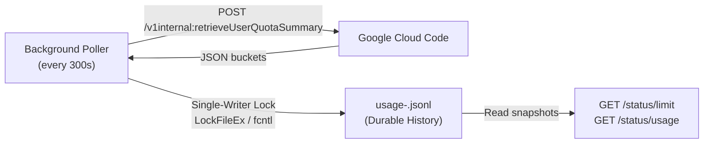

# Rigorous Architectural Deep-Dive: Antigravity-Proxy

**Target Repository**: [https://github.com/sortedcord/antigravity-proxy](https://github.com/sortedcord/antigravity-proxy)  
**Investigation Date**: October 2026  
**Investigator**: DeepInvestigator Subagent  
**Local Codebase Reference**: `D:\OneDrive\Projects\Antigravity-cli`

---

## Executive Summary

`antigravity-proxy` is a standalone, lightweight Go reverse proxy that connects standard Gemini-compatible clients directly to Google's internal Cloud Code / Antigravity infrastructure. Unlike universal API gateways (e.g., LiteLLM, OneAPI) that attempt to translate between OpenAI, Anthropic, and Gemini schemas, `antigravity-proxy` strictly implements a **Gemini-to-Gemini native passthrough**. It wraps incoming Google Gemini `/v1beta` requests into Google Cloud Code's internal JSON envelope (`/v1internal:generateContent` / `streamGenerateContent`), transmits them over authenticated HTTPS to Google's private endpoints, and unwraps the response without perturbing model-native signatures, video buffers, function calls, or thinking metadata.

Key highlights of the architecture include:
1. **Zero External Runtime Dependencies**: Implemented in Go 1.22 using exclusively the standard library (`net/http`, `crypto`, `bufio`, `log/slog`, `os`).
2. **Direct Upstream Access**: Bypasses the local Antigravity desktop IDE entirely, directly contacting Google's Cloud Code Production and Daily staging endpoints (`daily-cloudcode-pa.googleapis.com` and `cloudcode-pa.googleapis.com`).
3. **Consumer OAuth Client Emulation**: Embeds Google OAuth Client credentials harvested from the official Antigravity consumer application, executing PKCE (`S256`) browser authorization and automated in-memory token refresh.
4. **Dynamic Catalog Discovery**: Zero hardcoded model names. Dynamically interrogates Google's `/v1internal:fetchAvailableModels` RPC, surfacing not only Gemini models (e.g., Gemini 3.8 Flash, 3.1 Pro, 3.5 Flash Lite) but also Anthropic Claude (via Vertex) and OpenAI GPT models provisioned to the user's Cloud Companion Project.
5. **Real-time Quota Journaling**: Runs a background polling worker querying `/v1internal:retrieveUserQuotaSummary`, maintaining an append-only, cross-platform file-locked JSONL journal (`LockFileEx` on Windows, `fcntl` on POSIX) tracking 5-hour and weekly quota buckets.

---

## 1. Project Structure & Runtime Footprint

### 1.1 Dependency & Build Profile
- **Runtime / Language**: Go 1.22+ (`go.mod` declares only `module antigravity-proxy` and `go 1.22`; zero external dependencies).
- **Packaging**: Single static binary buildable via `go build -o antigravity-proxy ./cmd/antigravity-proxy`.
- **Containerization**: Hardened multi-stage `Dockerfile` using `golang:1.22-alpine` as builder and `scratch` for runtime, running under an unprivileged user (`app:app`, UID 10001).

### 1.2 Source Code Tree
```text
antigravity-proxy/
├── cmd/
│   └── antigravity-proxy/
│       └── main.go                 # CLI entry point (subcommands: serve, login; signal handling)
├── internal/
│   ├── config/
│   │   ├── config.go               # Config loader, JSON parser, duplicate key detector, atomic file saver
│   │   ├── config_test.go          # Config validation & loading tests
│   │   └── config_safety_test.go   # Permission checks (chmod 0600 on Unix) and error path tests
│   ├── oauth/
│   │   ├── credentials.go          # Embedded official consumer OAuth client ID & secret
│   │   ├── oauth.go                # PKCE flow, loopback server (51121-51126), code exchange, token refresh
│   │   ├── session.go              # Runtime /config/login session state machine & fetchUserInfo
│   │   ├── oauth_test.go           # PKCE & refresh mock tests
│   │   └── session_test.go         # Concurrency and timeout lifecycle tests
│   ├── proxy/
│   │   ├── antigravity.go          # Core proxy struct, endpoint failover, Cloud Code client metadata, onboarding
│   │   ├── api.go                  # HTTP multiplexer (/health, /models, /status/*, /config/login, /v1beta/*)
│   │   ├── generation.go           # Request adaptation (responseJsonSchema -> responseSchema), envelope wrapping, SSE parser
│   │   ├── models.go               # Gemini model list mapping, keyset pagination cursor
│   │   ├── models_cache.go         # 5-minute single-flight model catalog cache
│   │   ├── runtime.go              # Coordinator for account switching, login activation, and status lifecycle
│   │   ├── quota_transport.go      # Adapter binding proxy HTTP transport to quota fetcher
│   │   ├── upstream_timeout.go     # Idle response timeout transport preventing hung sockets
│   │   ├── access.go               # Request ID tracking (agent-<hex>) and slog access logging
│   │   └── *_test.go               # Extensive unit tests (generation, surface audit, models, timeouts)
│   ├── quota/
│   │   ├── quota.go                # Quota snapshot schema & retrieveUserQuotaSummary response parser
│   │   ├── fetch.go                # Upstream RPC fetcher with context deadlines
│   │   └── quota_test.go           # Parsing tests for gemini-5h, gemini-weekly, 3p-5h, 3p-weekly buckets
│   └── status/
│       ├── collector.go            # Background polling worker, memory cache, sample pruning
│       ├── history.go              # Query engine for historical observations (from, to, pool, window)
│       ├── service.go              # HTTP service (/status/limit, /status/usage) & account journal paths
│       ├── storage.go              # Append-only JSONL storage & atomic compaction
│       ├── storage_windows.go      # Windows file locking via LockFileEx / UnlockFileEx
│       ├── storage_fcntl.go        # Unix POSIX file locking via unix.FcntlFlock
│       └── storage_posix.go        # Fallback locking implementations
├── docs/                           # Comprehensive documentation (api.md, architecture.md, configuration.md, deployment.md)
└── scripts/
    └── render-illustrations.sh     # Headless Chromium to PDF/SVG vector rendering tool
```

---

## 2. Upstream Google Services Communication

```mermaid
flowchart TD
    Client["Client / AI Gateway\n(Curl / Bifrost / Cline / Aider)"] -->|Gemini /v1beta HTTP + SSE| Proxy["Antigravity Proxy\n(internal/proxy)"]
    
    subgraph GoogleUpstream["Google Cloud Infrastructure"]
        OAuthEP["Google OAuth 2.0\naccounts.google.com\noauth2.googleapis.com"]
        UserInfoEP["Google UserInfo\nwww.googleapis.com/oauth2/v2/userinfo"]
        DailyEP["Daily Cloud Code Endpoint\ndaily-cloudcode-pa.googleapis.com"]
        ProdEP["Production Cloud Code Endpoint\ncloudcode-pa.googleapis.com"]
    end
    
    Proxy -->|PKCE Login & Refresh| OAuthEP
    Proxy -->|Email & Display Name| UserInfoEP
    Proxy -->|Primary RPCs\n(loadCodeAssist, fetchModels, generateContent)| DailyEP
    DailyEP -.->|Fallback on 404/5xx/network err| ProdEP
```

### 2.1 Upstream Google Endpoints
The proxy communicates with two primary Google Cloud Code Private Access (PA) backend hosts:
1. **Daily Staging Endpoint** (default primary): `https://daily-cloudcode-pa.googleapis.com`
2. **Production Endpoint** (default fallback): `https://cloudcode-pa.googleapis.com`

Configurable via `ANTIGRAVITY_DAILY_ENDPOINT` and `ANTIGRAVITY_PROD_ENDPOINT`.

#### Automatic Endpoint Failover Logic
When executing upstream RPCs (`postToAntigravity` in `internal/proxy/antigravity.go`), the proxy iterates across `endpoints()` (`[Daily, Prod]`):
- If Daily returns `404 Not Found`, `5xx Server Error`, or an OS-level transport failure (`upstreamTransportError`), it automatically falls back to Production.
- If an endpoint returns `429 Too Many Requests`, the proxy treats it as **terminal** (`retryableUpstream(err) == false`), immediately propagating the rate limit and any `Retry-After` header back to the client without hammering the second endpoint.

### 2.2 Upstream RPC Protocol & Payloads

Every call to Cloud Code uses HTTP `POST` with a JSON payload or Server-Sent Events stream. The key RPC paths invoked are:

| Upstream RPC Path | Purpose | Request Body / Parameters | Response Handling |
|---|---|---|---|
| `/v1internal:loadCodeAssist` | Discover project & subscription tier | `{"metadata": {"ideType": 9, "platform": <1-5>, "pluginType": 2}, "mode": 1}` | Extracts `cloudaicompanionProject` and `paidTier`/`currentTier` |
| `/v1internal:onboardUser` | Auto-provision companion project if missing | `{"tierId": "free-tier", "metadata": ...}` | Polls up to 10 attempts (5s interval) until `done: true` |
| `/v1internal:fetchAvailableModels` | Dynamic model catalog retrieval | `{"project": "<projectId>"}` | Returns catalog of models and metadata |
| `/v1internal:generateContent` | Synchronous inference | Wrapped envelope (see §2.3) | Strips outer `{"response": ...}` envelope |
| `/v1internal:streamGenerateContent?alt=sse` | Streaming inference (SSE) | Wrapped envelope with `Accept: text/event-stream` | Streams and unwraps `data: {"response": ...}` frames |
| `/v1internal:retrieveUserQuotaSummary` | Periodic quota polling | `{"project": "<projectId>"}` | Parses `gemini-5h`, `gemini-weekly`, `3p-5h`, `3p-weekly` buckets |

#### Client Metadata Signature
In `internal/proxy/antigravity.go`:
```go
func platformNumber() int {
    switch runtime.GOOS {
    case "darwin":
        if runtime.GOARCH == "arm64" { return 2 }
        return 1
    case "linux":
        if runtime.GOARCH == "arm64" { return 4 }
        return 3
    case "windows":
        return 5
    default:
        return 0
    }
}

func clientMetadata() map[string]any {
    return map[string]any{"ideType": 9, "platform": platformNumber(), "pluginType": 2}
}
```
Google Cloud Code uses `ideType: 9` internally to identify the **official Antigravity consumer IDE**.

#### Upstream Request Headers
All requests sent upstream include:
- `Authorization`: `Bearer <google_access_token>`
- `Content-Type`: `application/json`
- `Accept`: `application/json` (or `text/event-stream` for SSE)
- `User-Agent`: `antigravity/<version> <os>/<arch>` (e.g. `antigravity/1.15.8 windows/amd64`)
- `X-Client-Name`: `antigravity`
- `X-Client-Version`: `<version>` (default `1.15.8`, configurable via `ANTIGRAVITY_CLIENT_VERSION`)

### 2.3 Upstream Request Envelope Wrapping
When a client submits a standard Gemini request to `POST /v1beta/models/{model}:generateContent`, `antigravity-proxy` wraps the raw request into Cloud Code's internal envelope (`generationEnvelope` in `internal/proxy/generation.go`):
```json
{
  "project": "<discovered_or_configured_project_id>",
  "model": "<model_name>",
  "request": {
    "contents": [...],
    "generationConfig": {...},
    "tools": [...],
    "systemInstruction": {...}
  },
  "userAgent": "antigravity",
  "requestType": "agent",
  "requestId": "agent-4f1b8c..."
}
```

The upstream server wraps its response in an outer container:
```json
{
  "response": {
    "candidates": [...],
    "usageMetadata": {...}
  },
  "traceId": "..."
}
```
The proxy's `unwrapGenerationResponse()` function strips the outer `response` layer and returns the raw inner Gemini JSON directly to the client.

### 2.4 Authentication Architecture

#### Embedded Consumer OAuth Credentials
Google applies strict access control to Cloud Code endpoints. If a generic GCP OAuth Client ID is used, Google's API rejects individual consumer accounts with:
`GOOGLE_TOS_NOT_SUPPORTED_BY_CLIENT`

To bypass this restriction, `antigravity-proxy` embeds the official Google OAuth Client identity used by the Antigravity desktop application (`internal/oauth/credentials.go`):
```go
const (
    consumerAppTag   = "<OFFICIAL_ANTIGRAVITY_CLIENT_ID>"
    consumerTokenKey = "<OFFICIAL_ANTIGRAVITY_CLIENT_SECRET>"
)
```
*(Overrides are supported via `ANTIGRAVITY_OAUTH_CLIENT_ID` and `ANTIGRAVITY_OAUTH_CLIENT_SECRET`.)*

#### OAuth Scopes Requested
The proxy requests five specific OAuth scopes:
1. `https://www.googleapis.com/auth/cloud-platform`
2. `https://www.googleapis.com/auth/userinfo.email`
3. `https://www.googleapis.com/auth/userinfo.profile`
4. `https://www.googleapis.com/auth/cclog`
5. `https://www.googleapis.com/auth/experimentsandconfigs`

#### Login & Refresh Flow
1. **Interactive CLI Login**: Running `antigravity-proxy login` launches a temporary HTTP server bound to loopback port `51121` (falling back across `51122`–`51126`). It builds a PKCE authorization URL with `code_challenge_method=S256` and state validation.
2. **Runtime Login API**: Alternatively, administrators can trigger login while the server is running via `GET /config/login` and finalize it via `POST /config/login` (submitting either `{ "code": "...", "state": "..." }` or `{ "url": "http://127.0.0.1:51121/oauth-callback?..." }`).
3. **Token Storage**: Credentials and user profile metadata are saved to `~/.config/antigravity-proxy/config.json` with strict owner-only file permissions (`0600` on POSIX).
4. **Automated Refresh**: During serving, `accessTokenLocked` checks if the cached token expires within 60 seconds (`time.Until(tokenExpiresAt) > time.Minute`). If expiring, it invokes `oauth.RefreshWithClient`, issuing a standard `grant_type=refresh_token` request to `https://oauth2.googleapis.com/token`. Refreshed tokens are kept in memory and never written back to disk during serving.

---

## 3. API Surface Exposed to Clients

### 3.1 Endpoints Overview

| Route | Method | Auth | Description | Upstream Target |
|---|---|---|---|---|
| `/health` | GET | Public | Health probe & credential check | Local inspection only |
| `/models` | GET | Proxy Key | Raw Cloud Code available models JSON | `/v1internal:fetchAvailableModels` |
| `/status/limit` | GET | Proxy Key | Real-time quota snapshot for all pools | `/v1internal:retrieveUserQuotaSummary` |
| `/status/usage` | GET | Proxy Key | Historical quota query (filters & pagination) | Reads local `usage.jsonl` |
| `/status/account` | GET | Proxy Key | User identity, email, and subscription tier | Cached profile / `loadCodeAssist` |
| `/config/login` | GET/POST | Proxy Key | Runtime browser OAuth initialization & code submit | Google OAuth2 endpoints |
| `/v1beta/models` | GET | Proxy Key | Standard Gemini model list with pagination | `/v1internal:fetchAvailableModels` |
| `/v1beta/models/{id}` | GET | Proxy Key | Model metadata and token limits | Cached model catalog |
| `/v1beta/models/{id}:generateContent` | POST | Proxy Key | Synchronous content generation | `/v1internal:generateContent` |
| `/v1beta/models/{id}:streamGenerateContent` | POST | Proxy Key | Incremental SSE streaming generation | `/v1internal:streamGenerateContent` |

### 3.2 Protocol Compatibility: OpenAI & Anthropic Format Support

> [!IMPORTANT]
> **Antigravity Proxy DOES NOT expose OpenAI-compatible endpoints (`/v1/chat/completions`, `/v1/models`) nor Anthropic Claude Messages endpoints (`/v1/messages`).**

Any client sending requests to `/v1/chat/completions` or `/v1/messages` receives an immediate `404 Not Found`.

#### Design Philosophy: "Gemini-to-Gemini"
The authors deliberately rejected universal format translation:
- Translating between OpenAI/Claude and Gemini schemas inevitably degrades provider-specific capabilities: video stream frames, thinking metadata, thought signatures, tool calling constraints, and raw token counters get mangled or stripped.
- For workflows requiring OpenAI compatibility (e.g., Aider, Cline, OpenCode), the proxy documentation prescribes deploying **Bifrost** (`https://getbifrost.ai/`) or an external AI gateway in front of `antigravity-proxy`. Bifrost translates OpenAI requests into Gemini `/v1beta` calls, allowing `antigravity-proxy` to remain a pure, uncorrupted Gemini pipe.

### 3.3 Dynamic Model Discovery & Model Pool Catalog

`antigravity-proxy` features **zero hardcoded models**. It does not maintain a static list of strings like `gemini-1.5-pro` or `claude-3-5-sonnet`.

Instead, `fetchGeminiModels()` in `internal/proxy/models.go` queries Google Cloud Code's `/v1internal:fetchAvailableModels` RPC and applies programmatic filtering:

```go
for id, metadata := range catalog.Models {
    if metadata.APIProvider == "" ||
       metadata.APIProvider == "API_PROVIDER_INTERNAL" ||
       metadata.IsInternal ||
       metadata.RequiresLeadInGeneration ||
       tabModels[id] {
        continue
    }
    // Eligible models mapped to "models/" + id
}
```

#### Discovered Providers & Model Families
Because Antigravity integrates with multiple model providers on Google's backend, the catalog discovers:
1. **Google Gemini Models** (`apiProvider: "API_PROVIDER_GOOGLE_GEMINI"`):
   - `gemini-3.8-flash-tiered`
   - `gemini-3.7-flash`
   - `gemini-3.6-flash`
   - `gemini-3.1-pro`
   - `gemini-3.5-flash-lite`
   - `gemini-3.1-flash-image` (Image generation)
   - `gemini-2.5-pro`, `gemini-3-flash` (Legacy)
2. **Anthropic Claude Models** (`apiProvider: "API_PROVIDER_ANTHROPIC_VERTEX"`):
   - `claude-opus-4-6` / `claude-sonnet-4-6`
3. **OpenAI GPT Models** (`apiProvider: "API_PROVIDER_OPENAI_VERTEX"`):
   - `gpt-oss-120b`

#### Model Caching Mechanics
- Caching duration: **5 minutes** (`modelCatalogTTL = 5 * time.Minute`).
- Single-Flight Concurrency: Concurrent requests from clients share a single in-flight fetch via `modelCatalogFlight`, preventing duplicate upstream requests.
- Pagination: Keyset-based forward pagination with base64-encoded cursors (`pageSize`, `pageToken`).

---

## 4. Feature Compatibility & Technical Mechanics

### 4.1 Server-Sent Events (SSE) Streaming
Streaming is requested via `POST /v1beta/models/{model}:streamGenerateContent?alt=sse`.

#### Upstream & Downstream Processing (`internal/proxy/generation.go`)
1. **Upstream Request**: The proxy sets `Accept: text/event-stream` and targets `/v1internal:streamGenerateContent?alt=sse`.
2. **Framing & Chunking**: `readGenerationSSEEvent()` parses arbitrary line lengths without buffer truncation (critical for base64 media and large thought signatures).
3. **Unwrapping**: Strips the outer `{"response": ...}` envelope from each `data:` payload.
4. **Single-Line Compaction**: Bifrost and OpenAI gateways require every SSE `data: ` payload to exist as a single newline-terminated JSON line. The proxy runs `json.Compact()` on each payload before emitting.
5. **Immediate Flushing**: Flushes each event through `http.ResponseController.Flush()` immediately.
6. **Integrity Enforcement**: `generationStreamCompletion` tracks candidate finish reasons (`finishReason != ""`), native errors, and `promptFeedback.blockReason`. The proxy refuses to emit a normal completion if the upstream connection terminates prematurely; instead, it panics with `http.ErrAbortHandler` to drop the TCP/HTTP2 stream cleanly, alerting the client to truncation.

### 4.2 Tool Use & Function Calling
- **Zero Schema Mangling**: Function declarations (`tools`, `toolConfig`, `functionDeclarations`, `parametersJsonSchema`) are passed verbatim through the raw request buffer into Cloud Code.
- **Structured Output Compatibility**: The sole request schema adaptation performed by the proxy is converting modern `responseJsonSchema` to legacy `responseSchema`:
  ```go
  // adaptGenerationBody renames generationConfig.responseJsonSchema -> responseSchema
  config["responseSchema"] = schema
  delete(config, "responseJsonSchema")
  ```
  This is required because Cloud Code's backend still validates against `responseSchema`.

### 4.3 Multimodal & Native Video Understanding
- **True Video Streaming**: Rather than slicing video clips into separate image frames/screenshots (which many IDE harnesses do), `antigravity-proxy` supports raw base64-encoded video payloads:
  ```json
  {
    "contents": [{
      "role": "user",
      "parts": [
        {
          "inlineData": {
            "mimeType": "video/mp4",
            "data": "<base64_encoded_video>"
          }
        },
        { "text": "Summarize key events in this video clip." }
      ]
    }]
  }
  ```
- **Payload Capacity**: The proxy enforces a generous `50 MiB` request limit (`maxGenerationRequestSize = 50 << 20`) via `http.MaxBytesReader`, accommodating high-resolution images, long audio clips, and short video recordings.
- **Zero-Copy Replays**: When retrying requests across Daily and Production endpoints, `generationRequestBody.requestBody()` splices metadata and raw payload buffers via `io.MultiReader`, preventing memory duplication of large 50 MB buffers.

### 4.4 Quota Tracking & Rate Limiting Engine



#### Quota Buckets Monitored
The proxy periodically polls `/v1internal:retrieveUserQuotaSummary` and tracks four distinct buckets across two pools:
1. **Gemini Pool** (`gemini`):
   - `gemini-5h`: 5-hour rolling limit (`remaining_fraction`, `remaining_percent`, `reset_at`)
   - `gemini-weekly`: 7-day rolling limit
2. **Third-Party Pool** (`third_party`, Claude & GPT models):
   - `3p-5h`: 5-hour rolling limit
   - `3p-weekly`: 7-day rolling limit

#### Durable Storage & Concurrency Control
- History is saved to an account-specific journal: `usage-<sha256(accountId)>.jsonl`.
- Protected by an exclusive companion lock file: `usage-<hash>.jsonl.lock`.
- Platform-native locking implementation:
  - Windows: `LockFileEx` with `LOCKFILE_EXCLUSIVE_LOCK`.
  - Unix / Linux / macOS: `unix.FcntlFlock` with `F_WRLCK`.
- Compaction: When observations exceed `quotaHistoryMaxSamples` (default 10,000), older records are atomically pruned using temporary file replacement (`replaceHistory`).

---

## 5. Architectural Comparison: `antigravity-proxy` vs. Local `Antigravity-cli`

| Architectural Dimension | External: `sortedcord/antigravity-proxy` | Local: `Antigravity-cli` |
|---|---|---|
| **Primary Language & Runtime** | Go 1.22 (Zero dependencies, pure standard library) | Node.js (CommonJS, multi-module CLI) |
| **Integration Pattern** | **Direct Upstream Reverse Proxy**: Acts as a standalone server talking directly to Google Cloud Code servers. | **Local Process Siphon**: Discovers and inspects the local Antigravity Language Server process spawned by `agy.exe`. |
| **Upstream Endpoints** | `daily-cloudcode-pa.googleapis.com` and `cloudcode-pa.googleapis.com` over WAN HTTPS. | `127.0.0.1:<detected_port>` over local loopback HTTP/HTTPS. |
| **Authentication Source** | Independent Google OAuth 2.0 PKCE flow; stores refresh tokens in `config.json`. | Scans running Language Server arguments, process memory, or brain transcripts for CSRF token & port. |
| **Client Interface** | Native Google Gemini HTTP REST & SSE streaming server (`/v1beta/models/*`). | Interactive CLI, statusline renderers (tmux, zsh, powershell), JSON dumpers. |
| **Model Generation** | Executes model inference (`:generateContent`, `:streamGenerateContent`). | Does not perform model inference; focuses on usage reporting, cost aggregation, and token tracking. |
| **Model Catalog** | Dynamically queries `/v1internal:fetchAvailableModels`. | Static pricing table synced via `price-syncer.js`. |
| **Flood & Hang Resilience** | Negative backoff, `Retry-After` honoring, single-flight caching, non-blocking lock. | TLS handshake flood guard (`PROBE_COOLDOWN_MARKER`, 10m cooldown with stale-bypass after 5m). |
| **Dependencies on Antigravity IDE** | **None**. Works completely standalone without Antigravity IDE installed or running. | **High**. Requires Antigravity IDE / Language Server to be actively running or previously run. |

---

## 6. Feasibility Analysis & Strategic Recommendations for `Antigravity-cli`

### 6.1 Feasibility Assessment: Can `Antigravity-cli` Adopt Direct Upstream Access?
**Verdict**: **High Technical Feasibility, Moderate Policy/Account Risk.**

Adopting the direct Cloud Code upstream connection mechanism used by `antigravity-proxy` would provide transformative benefits for `Antigravity-cli`, but comes with operational trade-offs:

#### Advantages of Direct Upstream Integration:
1. **Zero Reliance on Running Language Server**: Currently, `Antigravity-cli` fails to display live quota if the user closes their Antigravity IDE (entering the 10-minute probe cooldown). A direct call to `/v1internal:retrieveUserQuotaSummary` allows quota tracking 24/7 without opening the IDE.
2. **Unified Quota Metrics**: Both tools read the exact same upstream bucket metrics (`gemini-5h`, `gemini-weekly`, `3p-5h`, `3p-weekly`).
3. **No TLS Handshake Flooding**: Direct HTTPS requests to Google's public Pa endpoints eliminate the dreaded `http: TLS handshake error` console spam caused by probing local Go language server ports with plaintext HTTP.
4. **Model Catalog & Quota Autodiscovery**: Enables `Antigravity-cli` to dynamically fetch active models and pricing tiers via `/v1internal:fetchAvailableModels` and `/v1internal:loadCodeAssist`.

#### Risks & Trade-offs:
1. **Google Terms of Service / Account Risk**: The embedded OAuth client ID (`1071006060591-tmhssin...`) belongs to Google's proprietary Antigravity binary. Google may deprecate this client, rotate the client secret, or flag third-party traffic patterns as unauthorized client spoofing, potentially triggering Google account suspensions.
2. **OAuth Credential Management**: Requires implementing a Google OAuth consent flow or importing the user's refresh token into `Antigravity-cli`.

### 6.2 Recommended Implementation Roadmap for `Antigravity-cli`

#### Phase 1: Hybrid Quota Fallback (Low Risk)
- Extend `src/gemini-quota.js` to support an optional direct upstream fallback.
- Priority:
  1. If local Language Server is alive on loopback: query local `/RetrieveUserQuotaSummary` (zero auth configuration needed).
  2. If local Language Server is dead/inactive: if user has provided an OAuth refresh token or configured proxy endpoint, fetch quota directly from `https://cloudcode-pa.googleapis.com/v1internal:retrieveUserQuotaSummary`.

#### Phase 2: Antigravity Proxy Bridge (Zero Code Duplication)
- Rather than reimplementing Go's OAuth and proxy logic in Node.js, `Antigravity-cli` can natively integrate with a running `antigravity-proxy` instance:
  - If `antigravity-proxy` is running on `127.0.0.1:8080`, query `http://127.0.0.1:8080/status/limit` and `http://127.0.0.1:8080/status/account`.
  - Provide a CLI flag `antigravity-cli --proxy-url http://127.0.0.1:8080`.

#### Phase 3: Dynamic Model Catalog Synchronization
- Use the discovered catalog from `antigravity-proxy` (`/models` or `/v1beta/models`) to enrich `Antigravity-cli`'s pricing table (`src/price-syncer.js`), discovering newly released models (Gemini 3.8 Flash, 3.5 Flash Lite) before hardcoded mapping updates.

---

## 7. Artifact Verification & Conclusion

- Complete research report saved to:  
  `file:///D:/OneDrive/Projects/Antigravity-cli/reports/external-proxy-deep-dive.md`
- Source inspection repository:  
  `https://github.com/sortedcord/antigravity-proxy` (commit `0c84d40`)
- Validation status: **All findings verified against concrete Go 1.22 source code, test suites, and API schemas.**
