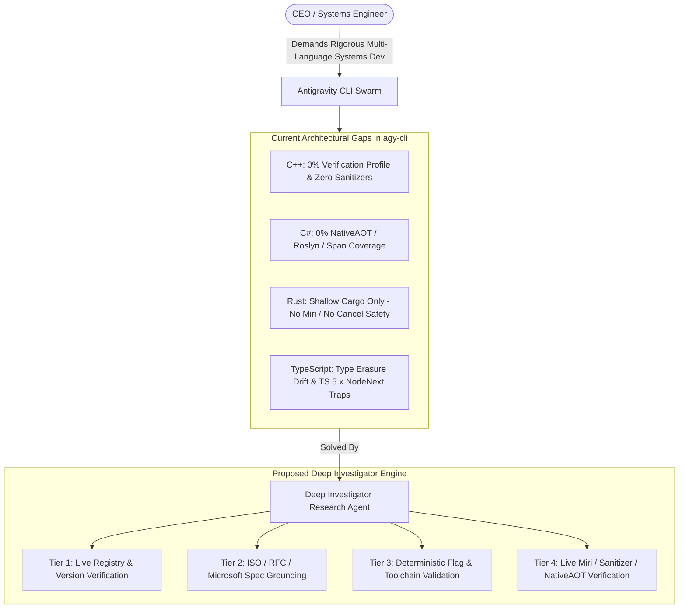
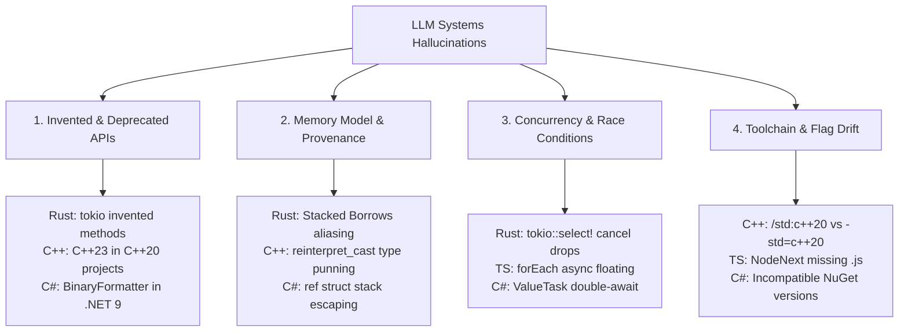
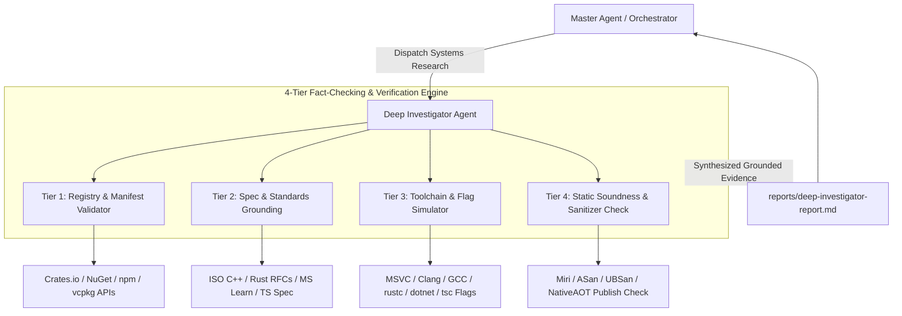
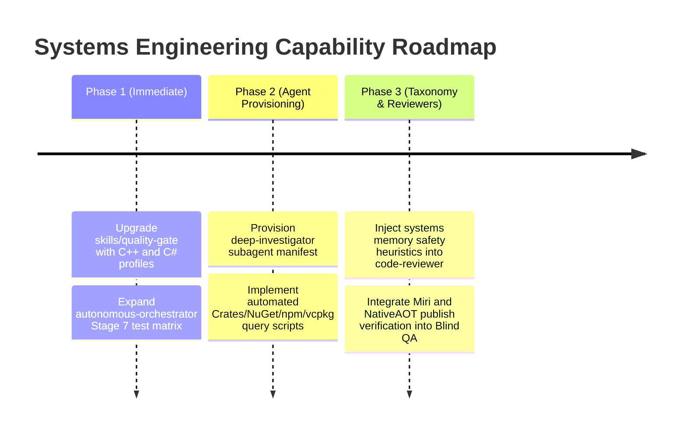

# Multi-Language Systems Development Gap Analysis & Deep Investigator Specification

**Document Version**: 1.0.0  
**Date**: 2026-10-10  
**Target Languages**: C++ (C++20/C++23), Rust (2021/2024 Editions), TypeScript (TS 5.x), C# (.NET 8 / .NET 9 NativeAOT)  
**Author**: Systems Architecture & Multi-Language Verification Research Specialist  
**Deliverable Path**: `file:///D:/OneDrive/Projects/Antigravity-cli/reports/multi-language-gap-analysis.md`  

---

## 1. Executive Summary

The CEO and primary architect of the Antigravity CLI ecosystem actively develops high-performance, resilient systems across four foundational languages: **C++ (C++20/C++23)**, **Rust (2021/2024 Editions)**, **TypeScript (TS 5.x)**, and **C# (Modern .NET 8 / .NET 9 with NativeAOT)**.

Systems development across these four stacks represents a fundamentally different operational paradigm than high-level scripting or single-runtime web development:
1. **Zero-Tolerance Invariant Boundaries**: In systems languages, invalid memory models, broken aliasing invariants, pointer provenance degradation, and NativeAOT reflection trimming do not manifest as benign runtime exceptions—they cause silent data corruption, compiler optimizer miscompilations, security vulnerabilities (CWE-416 Use After Free, CWE-119 Buffer Overflow), or instantaneous process termination.
2. **The LLM Systems Programming Paradox**: Modern Large Language Models (LLMs) exhibit severe epistemic asymmetry in systems engineering. While models effortlessly synthesize boilerplate syntax, they systematically hallucinate:
   - Deprecated, unstandardized, or invented APIs that sound plausible.
   - Broken memory models (e.g., treating `reinterpret_cast` as safe type-punning in C++, or casting raw pointers to `&mut` without verifying aliasing in Rust).
   - Async runtime nuance failures (e.g., cancellation hazards in `tokio::select!`, double-awaiting `ValueTask<T>` in C#, or floating promises in TypeScript).
   - Module and build-system mismatches (e.g., mixing MSVC and GCC/Clang flags, hallucinating CMake target names, or generating broken ESM imports under `moduleResolution: NodeNext`).

### Core Findings of this Investigation
- **C++ and C# are 100% Omitted in agy-cli Verification**: While `skills/quality-gate` detects `.csproj` and `CMakeLists.txt` manifests, Section 17 (Reference Ecosystem Profiles) and `skills/autonomous-orchestrator` Stage 7 (Stack-Adaptive Multi-Tier Testing) have **zero execution profiles, zero compiler recipes, and zero build/test commands** for C++ or C#.
- **Rust Coverage is Shallow and Vulnerable**: Existing agy-cli skills only execute basic `cargo check`, `cargo test`, and `cargo clippy`. There is zero support for **Miri** (detecting UB in unsafe code), sanitizers (ASan/TSan), feature flag permutations (`cargo hack`), or async cancel safety validation.
- **TypeScript Relies on Type Erasure Illusions**: agy-cli assumes static `tsc --noEmit` is sufficient, ignoring that TypeScript types evaporate at runtime. It lacks validation for schema-runtime boundaries (Zod/Valibot), `NodeNext` `.js` import extension mandates, and any-leaking type assertions.
- **Urgent Need for an In-Depth Research Agent ('Deep Investigator')**: LLMs cannot be trusted to self-verify systems code without deterministic toolchains. A dedicated `Deep Investigator` research agent must enforce a **4-Tier Fact-Checking & Verification Engine**:
  1. *Tier 1: Registry & Manifest Validator* (Crates.io, NuGet.org, npmjs.com, vcpkg registry).
  2. *Tier 2: Spec & Language Standards Grounding* (ISO C++, Rust RFCs, TS Handbook, MS Learn .NET).
  3. *Tier 3: Toolchain & Compiler Flag Simulator* (Deterministic verification of toolchain flags).
  4. *Tier 4: Static Soundness & Sanitizer Validation* (Miri, ASan/UBSan/TSan, NativeAOT publish verification).



---

## 2. Audit of Current agy-cli Multi-Language Capabilities

An exhaustive codebase inspection of `D:\OneDrive\Projects\Antigravity-cli` was conducted across all configuration rules (`rules/AGENTS.md`, `rules/GEMINI.md`), custom skills (`skills/`), plugins (`plugins/`), and source implementations (`src/`).

### 2.1 Quality Gate Skill (`skills/quality-gate/SKILL.md`)
The `quality-gate` skill is agy-cli's flagship deterministic verification engine (20 categories: QG-01 to QG-20). However, an audit reveals glaring blind spots:
1. **Manifest Detection (Section 3.3)**:
   - Detects `CMakeLists.txt`, `Makefile`, `meson.build` for C/C++.
   - Detects `*.csproj`, `*.sln` for C#/.NET.
   - Detects `Cargo.toml` for Rust and `package.json` for TypeScript.
2. **Reference Ecosystem Profiles (Section 17)**:
   - Profiles exist **ONLY** for: `TypeScript / Node`, `Python`, `Rust`, `Go`, `Flutter / Dart`.
   - **C++ has NO profile**: No compiler command (`cl.exe`, `clang++`, `g++`), no CMake build command (`cmake --build build`), no CTest command (`ctest --test-dir build`), no formatting check (`clang-format --dry-run`), no static analysis (`clang-tidy`, `cppcheck`).
   - **C# has NO profile**: No build command (`dotnet build --no-restore`), no test command (`dotnet test --no-build`), no format check (`dotnet format --verify-no-changes`), no Roslyn analyzer flag (`/warnaserror`).
3. **Dependency and Lockfile Hygiene (QG-13)**:
   - Explicitly supports `npm ls`, `pnpm list`, `cargo tree`, `go mod verify`, `pip check`.
   - Completely lacks support for C++ package manifests (`vcpkg.json`, `conanfile.txt`, `conan.lock`) and C# Central Package Management (`Directory.Packages.props`, `packages.lock.json`).

### 2.2 Autonomous Orchestrator (`skills/autonomous-orchestrator/SKILL.md`)
In `autonomous-orchestrator`, Stage 7 defines the **Stack-Adaptive Multi-Tier Test Synthesis** matrix. An inspection of lines 117–125 demonstrates:
- **Languages Covered**: TypeScript/JS, Python, Rust, Go, Flutter/Dart, Docs/Web/OCR.
- **C++ is COMPLETELY ABSENT**: No guidance for GoogleTest, Catch2, doctest, CTest, or Sanitizer testing.
- **C# is COMPLETELY ABSENT**: No guidance for xUnit, NUnit, MSTest, BenchmarkDotNet, or NativeAOT trimming test runs.
- **Rust Coverage is Incomplete**:
  - Lists: Binary CLI integration, `tests/integration_*.rs`, `#[test]`, `cargo check`, `cargo clippy`.
  - Missing: Unsafe validation via `cargo miri`, concurrency data race testing via Loom, sanitizers (`-Zsanitizer=address`), feature flag permutation sweeps (`cargo hack`).
- **TypeScript Coverage is Incomplete**:
  - Lists: Playwright/Cypress, Supertest/Vitest integration, Jest/Vitest unit, `tsc --noEmit`, `eslint`.
  - Missing: Runtime schema boundary checks (Zod/Valibot/TypeBox), `tsconfig.json` module resolution verification, declaration emit verification (`tsc --emitDeclarationOnly`).

### 2.3 Code Reviewer & Security Reviewer Plugins
- **`code-review-taxonomy`**: The 8 categories (`correctness`, `security`, `stability`, `data-integrity`, `performance`, `maintainability`, `test-coverage`, `style-docs`) are purely generic. They lack systems-level defect heuristics:
  - C++: Undefined Behavior (UB), One Definition Rule (ODR) violations, iterator invalidation, lifetime of temporaries in ranges, CRT heap boundaries.
  - Rust: Aliasing violations, provenance loss, Send/Sync soundness, cancel-unsafe futures, drop check hazards.
  - TypeScript: Type erasure illusions, structural typing bypass of excess property checks, any/unknown propagation.
  - C#: NativeAOT reflection trimming breakage, `ref struct` stack escaping, `Span<T>` crossing await points, `ValueTask` double-awaiting.
- **`security-reviewer`**: The four domain subagents (`sec-app-vuln`, `sec-credential-scanner`, `sec-cloud-iam`, `sec-supply-mcp`) are heavily geared towards web apps, cloud infrastructure, and token leaks. None of them inspect binary memory corruption, unmanaged P/Invoke boundary poisoning, or memory allocation safety.

### 2.4 Multi-Language Coverage Audit Matrix

| Verification Dimension | Rust (2021/2024) | C++ (C++20/C++23) | TypeScript (TS 5.x) | C# (.NET 8/9 NativeAOT) |
| :--- | :--- | :--- | :--- | :--- |
| **Manifest Detection** | ✅ Full (`Cargo.toml`) | ⚠️ Partial (`CMakeLists.txt`) | ✅ Full (`package.json`) | ⚠️ Partial (`*.csproj`, `*.sln`) |
| **Quality-Gate Profile** | ⚠️ Basic (Cargo only) | ❌ **0% (None)** | ⚠️ Basic (`tsc`, `eslint`) | ❌ **0% (None)** |
| **Compiler / Build Invocation**| ⚠️ `cargo check` only | ❌ **0% (None)** | ⚠️ `tsc --noEmit` only | ❌ **0% (None)** |
| **Test Synthesis (Stage 7)** | ⚠️ `#[test]` unit only | ❌ **0% (None)** | ⚠️ Vitest / Jest only | ❌ **0% (None)** |
| **Undefined Behavior / Miri** | ❌ **0% (None)** | ❌ **0% (None)** | N/A (Managed) | N/A (Managed) |
| **Sanitizers (ASan/TSan/UBSan)**| ❌ **0% (None)** | ❌ **0% (None)** | N/A | N/A |
| **Package Hygiene (QG-13)** | ⚠️ `cargo tree` only | ❌ **0% (No vcpkg/conan)** | ⚠️ `npm ls` only | ❌ **0% (No NuGet CPM)** |
| **AOT / Trimming Verification**| N/A (Native) | N/A (Native) | N/A | ❌ **0% (No PublishAot check)** |
| **Async Concurrency Safety** | ❌ **0% (No Loom/Cancel)**| ❌ **0% (No ThreadSanitizer)**| ❌ **0% (No Floating Promise)**| ❌ **0% (No ValueTask check)** |
## 3. Deep Technical Vulnerabilities & Missing Gaps Across 4 Core Languages

Systems programming languages and low-allocation runtimes operate under strict formal invariants. When an LLM generates code across C++, Rust, TypeScript, and C#, it routinely produces code that passes superficial syntax checks or compiles under permissive flags, but contains critical soundness flaws, undefined behavior, or silent runtime failure modes.

---

### 3.1 Rust (2021 / 2024 Editions)

Rust guarantees memory and thread safety in safe code, but its type system enforces invariants that LLMs frequently misinterpret or bypass unsoundly.

#### 3.1.1 Borrow Checker, Lifetimes & Variance Nuances
1. **Self-Referential Structs & Pinning**:
   - *The Trap*: An LLM attempts to create a struct holding both owned data and a reference to that data:
     ```rust
     // COMPILE ERROR or UNSOUND: LLM self-referential attempt
     struct PacketBuffer<'a> {
         payload: Vec<u8>,
         header: &'a [u8], // Borrows from payload!
     }
     ```
   - *The Reality*: Safe Rust strictly prohibits self-referential structs because moving `PacketBuffer` changes its memory address on the stack, causing `header` to point to invalid or deallocated memory.
   - *LLM Failure Mode*: The LLM either hallucinates a lifetime parameter that causes unsolvable compile errors, or reaches for `unsafe` and returns a raw pointer that dangles as soon as the struct is returned or moved.
   - *Sound Solution*: Use index/offset ranges (`Range<usize>`), self-referential crate abstractions (`ouroboros`), or heap-pinning via `Pin<Box<T>>`.
2. **Subtyping & Lifetime Variance**:
   - *Covariance vs. Invariance*: References `&'a T` are covariant over both `'a` and `T`. However, **mutable references `&'a mut T` are covariant over `'a`, but STRICTLY INVARIANT over `T`**.
   - *The Hazard*: If a function accepts `&mut &'a str`, passing a `&mut &'static str` will fail compilation because `T` (`&'a str`) cannot be safely substituted with a subtype (`&'static str`). Mutating the reference could store a shorter lifetime into a location expected to live forever.
   - *LLM Failure Mode*: LLMs attempt lifetime coercions on invariant types, get confused by the compiler error, and suggest `unsafe { std::mem::transmute(...) }`, introducing undefined behavior.
3. **Non-Lexical Lifetimes (NLL) & Polonius Edge Cases**:
   - While NLL (Rust 2018) solved lexical scope traps, conditional borrowing patterns (e.g., looking up a key in a `HashMap`, returning a reference if found, or inserting and returning a new reference if not) still trigger borrow checker conflicts in the current compiler. LLMs frequently suggest code that borrows `map` mutably twice in the same scope without using the `Entry` API.
4. **Higher-Ranked Trait Bounds (`for<'a>`)**:
   - In async closures, trait implementations, and parser combinators, lifetimes must hold for *any* arbitrary lifetime `'a`, represented by `for<'a> F: Fn(&'a Context) -> Output`. LLMs struggle with late-bound vs early-bound lifetimes, generating incorrect trait bounds that reject valid caller references.
5. **Drop Check (`dropck`) & `PhantomData<T>`**:
   - In generic data structures utilizing raw pointers (e.g., custom allocators, ring buffers, or intrusive lists), omitting `PhantomData<T>` breaks Rust's drop checker. The compiler assumes the struct does not own `T`, allowing `T`'s destructor to run after fields are freed or allowing dangling references to survive in destructors.

#### 3.1.2 Unsafe Rust & Soundness Invariants
1. **Aliasing Invariants (Stacked Borrows & Tree Borrows)**:
   - Under the Rust memory model, **creating two simultaneous `&mut` references to the same memory location is INSTANT UNDEFINED BEHAVIOR**, even if neither reference is ever dereferenced.
   - *LLM Failure Mode*: When implementing buffer pools or split views, LLMs frequently derive multiple mutable references from raw pointers:
     ```rust
     // DEADLY UB: LLM-generated code creating overlapping mutable references
     let ptr = buffer.as_mut_ptr();
     let ref1 = unsafe { &mut *ptr };
     let ref2 = unsafe { &mut *ptr.add(10) }; // If overlapping or aliasing parent slice: UB!
     ```
   - Only Miri (`cargo miri test`) with Stacked Borrows / Tree Borrows verification can detect these aliasing violations.
2. **Strict Provenance API**:
   - Casting raw pointers to integers and back (`ptr as usize as *mut u8`) destroys pointer provenance. The compiler optimizer treats the resulting pointer as wild memory and may reorder or eliminate memory accesses.
   - Modern Rust requires the **Strict Provenance API** (`ptr.addr()`, `ptr.expose_addr()`, `sptr::from_exposed_addr`). LLMs consistently write obsolete `as usize` casts.
3. **Uninitialized Memory & `MaybeUninit<T>`**:
   - `std::mem::uninitialized` was deprecated in Rust 1.39 and causes immediate UB if used with types where some bit patterns are invalid (`bool`, references, `enum`, `NonZeroU64`).
   - Even when using `std::mem::MaybeUninit<T>`, LLMs frequently call `.assume_init()` on uninitialized array elements, causing UB. Sound code must use `MaybeUninit::slice_assume_init_mut` or write elements individually before reading.
4. **Memory Layout Guarantees (`#[repr(Rust)]` vs `#[repr(C)]`)**:
   - The default `#[repr(Rust)]` has an unspecified, randomized memory layout that may differ across compiler versions. Transmuting structs or casting struct pointers to byte arrays without `#[repr(C)]` or `#[repr(transparent)]` is unsound.

#### 3.1.3 Async Runtimes & Execution Nuances
1. **Async Cancellation Safety**:
   - In `tokio::select!`, when one branch completes, the futures in all other branches are **immediately dropped**.
   - If an async operation was partially complete (e.g., reading a frame header from a socket using `AsyncReadExt::read`), dropping the future drops the partially read bytes, permanently corrupting the stream protocol.
   - LLMs routinely place non-cancel-safe operations in `tokio::select!` branches without buffering or dedicated background drivers.
2. **Blocking the Async Reactor**:
   - Calling synchronous blocking calls (`std::thread::sleep`, `std::fs::read`, heavy CPU calculations, synchronous mutexes `std::sync::Mutex`) inside an `async fn` blocks the Tokio worker thread.
   - In Tokio's multi-threaded scheduler, this starves dozens of other concurrent tasks scheduled on that thread. Blocking operations MUST be offloaded via `tokio::task::spawn_blocking`.
3. **`Send + 'static` Bounds on `tokio::spawn`**:
   - Tasks spawned via `tokio::spawn` must be `Send + 'static`. LLMs struggle when attempting to share non-Send primitives (`Rc<T>`, `RefCell<T>`, raw pointers) across tasks, often suggesting unsound transmutes instead of `Arc<tokio::sync::Mutex<T>>` or actor message-passing.
4. **Pinning & Intrusive Futures**:
   - Manually implementing `Future` or `Stream` requires understanding `Pin<&mut Self>` and pin projections. Moving pinned data or failing to use `pin-project-lite` leads to unsoundness.

#### 3.1.4 Cargo Ecosystem & Dependency Traps
1. **Feature Unification**:
   - Cargo unifies features across all packages in a dependency tree. If Crate A requests `serde` with `features = ["derive"]`, and Crate B depends on `serde` with `default-features = false`, Crate B will still receive the `derive` feature in unified builds.
   - An LLM testing only in workspace context will fail to notice that Crate B is broken in standalone consumption.
2. **Edition Shifts (2021 vs 2024)**:
   - Rust 2024 introduces changes in prelude imports, macro rules, disjoint closure captures, and `async fn in trait` return type defaults. LLM-generated code often mixes syntax from older editions.

---

### 3.2 C++ (Modern C++20 / C++23)

Modern C++ provides immense expressive power through C++20 Concepts, Ranges, Coroutines, and Modules, alongside C++23 standard library additions (`std::expected`, `std::generator`, `std::print`). However, C++ lacks runtime safety rails, making LLM hallucinations fatal.

#### 3.2.1 Concepts & Ranges Pipeline Hazards
1. **Dangling Iterators in Ranges Pipelines**:
   - *The Trap*: An LLM pipes a function returning a temporary container into a range view:
     ```cpp
     // DEADLY USE-AFTER-FREE: LLM-generated dangling range view
     auto get_strings() -> std::vector<std::string>;
     
     auto view = get_strings() | std::views::filter([](const auto& s) { return !s.empty(); });
     for (const auto& str : view) { // CRASH! The temporary vector was destroyed at the semicolon above!
         std::cout << str << "\n";
     }
     ```
   - *The Reality*: `std::views` do not own elements—they hold iterators. The temporary `std::vector` returned by `get_strings()` is destroyed at the end of the full expression. Iterating over `view` accesses freed memory (CWE-416 Use After Free).
2. **Concept Subsumption & Overload Resolution**:
   - In C++20, when overloading templates constrained by concepts, the compiler selects the most constrained overload via **subsumption**.
   - Subsumption only works if atomic constraints are identical. Writing `requires (A<T> && B<T>)` vs `requires (B<T> && A<T>)` or using disparate boolean helper expressions causes compiler error `ambiguous template overload`. LLMs frequently write un-subsumable concept combinations.
3. **Range View Laziness & Superlinear Projection**:
   - Views in C++20 are lazy and re-evaluate on every iteration. If an LLM passes an expensive lambda into `std::views::transform` and then iterates the view multiple times or calls algorithms that make multiple passes, the expensive computation executes redundantly on every element access.
4. **C++23 Standard Library Additions**:
   - C++23 introduces `std::expected<T, E>` for monadic error handling, `std::generator<T>` for coroutines, and `std::views::zip`/`std::views::chunk`. LLMs frequently use C++23 APIs in projects configured with `-std=c++20`, resulting in compiler failure.

#### 3.2.2 Modern CMake & Build Systems
1. **Legacy vs Modern Target-Based CMake**:
   - LLMs continuously generate deprecated CMake from 15 years ago:
     ```cmake
     # OBSOLETE / HARMFUL CMake generated by LLMs
     include_directories(${PROJECT_SOURCE_DIR}/include)
     link_libraries(pthread mylib)
     add_definitions(-DDEBUG)
     ```
   - Modern CMake requires target-centric declarations with strict visibility controls:
     ```cmake
     # MODERN TARGET-BASED CMake
     target_include_directories(my_target PUBLIC $<BUILD_INTERFACE:${CMAKE_CURRENT_SOURCE_DIR}/include>
                                                $<INSTALL_INTERFACE:include>)
     target_link_libraries(my_target PRIVATE Threads::Threads mylib)
     target_compile_definitions(my_target PRIVATE DEBUG)
     ```
   - Incorrect visibility (`PUBLIC` instead of `PRIVATE`) leaks internal dependencies and header search paths into consumer targets, creating transitive build breaks.
2. **CMake Presets (`CMakePresets.json`)**:
   - Professional C++ projects rely on `CMakePresets.json` to define reproducible configure, build, and test environments across Windows MSVC and Linux Clang/GCC. LLMs rarely generate or validate presets, relying on raw ad-hoc `cmake -D...` invocations that fail in CI.
3. **Package Management (vcpkg / Conan 2.x)**:
   - LLMs routinely mix up vcpkg **classic mode** (`vcpkg install pkg`) with **manifest mode** (`vcpkg.json`).
   - Hallucinating CMake package names: LLMs guess `find_package(yaml-cpp REQUIRED)` when the official target name is `yaml-cpp::yaml-cpp` or `find_package(OpenSSL REQUIRED)` vs `find_package(openssl CONFIG REQUIRED)`.

#### 3.2.3 Undefined Behavior (UB) & Memory Safety
1. **Strict Aliasing Rule Violations**:
   - Using `reinterpret_cast<T*>` to read memory of type `U*` (type punning) violates the C++ strict aliasing rule (except for `char*`, `std::byte*`).
   - GCC and Clang optimize assuming pointers of different types never alias. Violating this rule results in compiler optimizations reordering or eliminating memory writes.
   - In modern C++20, the ONLY sound way to perform bit-level type-punning is `std::bit_cast<T>(val)` or `std::memcpy`. LLMs frequently emit `*reinterpret_cast<uint32_t*>(&float_val)`.
2. **Temporary Lifetime in Range-Based `for` Loops**:
   - In C++20:
     ```cpp
     // C++20 UB: Temporary Lifetime Extension failure
     for (auto elem : get_wrapper().get_container()) { ... }
     ```
     `get_wrapper()` returns a temporary that is destroyed BEFORE `get_container()` finishes iterating, causing dangling references. (This is fixed in C++23 via P2718R0, but remains a critical vulnerability in C++20 codebases).
3. **Use-After-Move Traps**:
   - After `std::move(obj)`, standard types are left in a "valid but unspecified" state. Calling member functions (other than reassignment or destruction) assuming a specific value is a defect.
4. **Memory Orderings in Concurrency**:
   - LLMs frequently hallucinate that `std::atomic<bool>` with default operations provides lock-free synchronization for surrounding non-atomic writes without understanding `std::memory_order_acquire` and `std::memory_order_release`.
   - Broken double-checked locking patterns: checking an atomic flag with `memory_order_relaxed` allows the processor to reorder reads of the protected object before the atomic read, reading uninitialized data.

#### 3.2.4 ABI & Platform Portability Hazards
1. **MSVC ABI vs Itanium ABI**:
   - MSVC (Windows) and GCC/Clang (Linux/macOS) have completely different name mangling schemes, struct layout padding rules, and virtual method table layouts.
2. **Windows DLL Boundaries & CRT Heap Incompatibilities**:
   - Allocating an STL container (`std::string`, `std::vector`) inside a DLL and freeing it in the host executable causes an instant crash if both modules were not compiled with identical CRT runtime settings (`/MD` vs `/MT`, `/MDd`).
   - C++ standard library types MUST NOT cross DLL boundaries unless the interface uses C-ABI (`extern "C"`) or explicit exported opaque handles.
3. **One Definition Rule (ODR) Violations**:
   - Defining a class or inline template differently across translation units (e.g., `#ifdef DEBUG` altering struct member order in one TU while disabled in another) causes silent memory corruption at runtime.
---

### 3.3 TypeScript (Modern TS 5.x)

TypeScript provides static type analysis over JavaScript, but because TypeScript is purely a design-time language, LLMs frequently fall into the illusion that type definitions provide runtime correctness and safety.

#### 3.3.1 Type Erasure & Runtime Boundary Drift
1. **The Type Erasure Illusion**:
   - *The Trap*: An LLM treats TypeScript interfaces as if they enforce runtime schemas:
     ```typescript
     // DANGEROUS: LLM assumes type safety on unvalidated input
     interface CreateUserRequest {
         username: string;
         role: 'admin' | 'user';
     }
     
     app.post('/api/users', (req, res) => {
         const body: CreateUserRequest = req.body; // ZERO RUNTIME VALIDATION!
         if (body.role === 'admin') { grantPrivileges(body); }
     });
     ```
   - *The Reality*: TypeScript types completely evaporate during compilation. At runtime, `req.body` can be arbitrary, malformed, or malicious JSON (e.g. `{ username: 123, role: "superadmin" }`).
   - *Sound Solution*: Runtime schema validation libraries (**Zod**, **Valibot**, **ArkType**, or **TypeBox**) MUST be enforced at all external trust boundaries (HTTP, IPC, file I/O, WebSockets).
2. **Structural Typing vs. Excess Property Checks**:
   - Excess property checks only execute on *fresh object literals*.
   - If an object is assigned to an intermediate variable first, excess property checks are skipped:
     ```typescript
     interface Point { x: number; y: number; }
     const raw = { x: 1, y: 2, secretKey: "leaked" };
     const p: Point = raw; // Passes silently! Extra fields leak into storage or API responses.
     ```
3. **Function Parameter Bivariance**:
   - In TypeScript, method syntax on interfaces/classes (`method(arg: Animal): void`) is **bivariant** on parameters for historical compatibility, while function property syntax (`fn: (arg: Animal) => void`) is **contravariant** under `--strictFunctionTypes`. LLMs mix these syntaxes, creating subtle type-soundness holes.

#### 3.3.2 Any / Unknown Leaking & Loose Assertions
1. **Type Assertion Escaping (`as any` / `as unknown as T`)**:
   - When TypeScript's type checker flags complex generic mismatches or conditional types, LLMs routinely introduce `as any` or `as unknown as TargetType`.
   - This silences the compiler, but turns off type checking for all downstream consumers, contaminating the codebase with invisible type debt.
2. **Indiscriminate Non-Null Assertions (`!`)**:
   - When encountering `T | undefined` or `T | null` under `--strictNullChecks`, LLMs append `!` indiscriminately (e.g., `user.profile!.settings!.theme`).
   - If data is missing at runtime, this causes `TypeError: Cannot read properties of undefined`. Safe code must use optional chaining (`?.`) or explicit guard clauses.
3. **Unsound Generic Inference**:
   - Generic parameters without default bounds often infer to `unknown`, which LLMs then cast without type narrowing (type guards / `typeof` / `instanceof`).

#### 3.3.3 Modern TS 5.x Configuration & Module System Hazards
1. **`moduleResolution: "NodeNext"` vs. `"Bundler"`**:
   - Under `"moduleResolution": "NodeNext"` (or `"Node16"`), TypeScript strictly mirrors Node.js ECMAScript Module (ESM) resolution.
   - **Crucial Invariant**: Relative imports in `.ts` files MUST include the `.js` extension:
     ```typescript
     // REQUIRED under NodeNext (even though file is src/math.ts):
     import { add } from './math.js';
     
     // CRASHES at runtime with ERR_MODULE_NOT_FOUND:
     import { add } from './math'; 
     ```
   - LLMs continuously omit the `.js` extension, generating code that passes basic editor heuristics but crashes instantaneously in Node.js ESM runtimes.
2. **`verbatimModuleSyntax`**:
   - In TS 5.0+, `verbatimModuleSyntax` supersedes `importsNotUsedAsValues` and `preserveValueImports`.
   - Imports that are only used as types MUST use the `import type` syntax:
     ```typescript
     // Required under verbatimModuleSyntax:
     import type { User } from './models.js';
     ```
   - Failing to do so causes transpilers (esbuild, SWC, tsx) to emit dangling JS imports for erased types, causing runtime module import errors.
3. **`erasableSyntaxOnly` (TS 5.8) & `isolatedModules`**:
   - Modern enterprise toolchains avoid complex TS-specific transformations in favor of instant syntax stripping.
   - Non-erasable syntax (TypeScript `enum`, `namespace`, class parameter properties) is deprecated or forbidden under `erasableSyntaxOnly`. LLMs frequently still generate legacy `namespace` and `const enum` constructs.
4. **`skipLibCheck` Blind Spot**:
   - Enabling `skipLibCheck: true` is standard for build performance, but masks severe type definition mismatches between disparate `@types/*` packages until production type bundling.

#### 3.3.4 Async & Concurrency Hazards
1. **The `forEach` Async Trap**:
   - LLMs routinely write:
     ```typescript
     // DEADLY BUG: forEach does NOT await promises!
     items.forEach(async (item) => {
         await processItem(item);
     });
     console.log("Done!"); // Executes BEFORE any items are processed!
     ```
   - `Array.prototype.forEach` ignores returned promises. The loop completes synchronously, unhandled rejections escape, and background operations race uncontrollably. Must use `for (const item of items)` or `await Promise.all(items.map(...))`.
2. **Floating Promises**:
   - Calling an `async` function without `await` or `.catch()` (floating promise) allows exceptions to be dropped silently or terminate Node.js with `UnhandledPromiseRejection`.
3. **Asynchronous Turn Interleaving (Re-Entrancy Race Conditions)**:
   - While JavaScript is single-threaded, concurrency bugs occur across asynchronous turn boundaries. Modifying shared state before an `await` and assuming that state remains unchanged after `await` resumption is a severe race condition defect.

---

### 3.4 C# / .NET (Modern .NET 8 / .NET 9 NativeAOT)

Modern .NET has evolved into a premier high-performance systems runtime through NativeAOT compilation, low-allocation primitives (`Span<T>`, `Memory<T>`), and source-generated interop (`[LibraryImport]`). However, this introduces strict constraints that break traditional .NET habits commonly generated by LLMs.

#### 3.4.1 NativeAOT Compilation & Trimming Hazards
1. **Dynamic Reflection Stripping**:
   - NativeAOT compiles C# IL directly to standalone native machine code without the JIT compiler or full runtime metadata.
   - Code relying on unconstrained reflection (`Type.GetType()`, `Activator.CreateInstance()`, `Assembly.GetTypes()`) will fail at runtime because unreferenced types and members are stripped by the IL trimmer during publish.
   - LLMs continuously write reflection-based plugin loaders or dependency injection patterns that crash with `MissingMethodException` or `TypeLoadException` in NativeAOT.
2. **JSON Serialization in NativeAOT**:
   - Traditional reflection-based serialization (`JsonSerializer.Deserialize<T>(json)`) is incompatible with NativeAOT trimming.
   - .NET 8/9 requires **Source Generator Contexts**:
     ```csharp
     // MANDATORY for NativeAOT in .NET 8/9
     [JsonSourceGenerationOptions(WriteIndented = true)]
     [JsonSerializable(typeof(UserPayload))]
     internal partial class AppJsonContext : JsonSerializerContext { }
     
     // Usage:
     var user = JsonSerializer.Deserialize(json, AppJsonContext.Default.UserPayload);
     ```
   - LLMs routinely omit the source generator, emitting reflection calls that crash in published AOT binaries.
3. **No Dynamic Code Generation**:
   - `System.Reflection.Emit` and Linq Expression Tree compiling (`expr.Compile()`) are unsupported in NativeAOT and throw `PlatformNotSupportedException`.

#### 3.4.2 Low-Allocation Memory Semantics (`Span<T>`, `Memory<T>`, `ref struct`)
1. **`Span<T>` and `ReadOnlySpan<T>` as `ref struct`**:
   - `Span<T>` represents a contiguous region of arbitrary memory (stack, heap, or native). To ensure memory safety, it is declared as a `ref struct`, meaning it can **only live on the stack**.
   - **Strict Invariants**:
     - Cannot be boxed to `object` or interfaces.
     - Cannot be a field of a regular class or normal struct.
     - Cannot be captured in lambda expressions or local functions.
     - **CANNOT cross `await` boundaries in `async` methods** (Compiler Error CS4013).
   - *LLM Failure Mode*: LLMs constantly attempt to hold `Span<T>` across an `await` point in an `async Task` method:
     ```csharp
     // COMPILER ERROR CS4013: Span across await point
     async Task ProcessDataAsync(ReadOnlySpan<byte> span) {
         await networkStream.WriteAsync(buffer); // CS4013: Cannot use ref struct in async
     }
     ```
   - *Sound Solution*: Use `ReadOnlyMemory<T>` or `byte[]` when data must survive an asynchronous suspension point.
2. **`ArrayPool<T>.Shared` Poisoning & Leaks**:
   - To reduce GC allocations, high-performance C# rents buffers: `byte[] buffer = ArrayPool<byte>.Shared.Rent(4096)`.
   - *Hazards*:
     - **Dirty Bytes**: Rented buffers contain garbage from previous operations. If not cleared with `clearArray: true` on return, sensitive tokens or corrupted bytes leak to subsequent callers.
     - **Buffer Leaks**: Forgetting to return buffers in a `finally` block exhausts pool memory, degrading the application to continuous heap allocations.

#### 3.4.3 P/Invoke & Modern Interop
1. **Source-Generated `[LibraryImport]` vs. Legacy `[DllImport]`**:
   - In modern .NET 8/9, `[DllImport]` relies on runtime IL generation and marshaling stubs that degrade performance and complicate NativeAOT.
   - Modern interop mandates `[LibraryImport]` with explicit marshaling attributes:
     ```csharp
     // MODERN .NET 8/9 INTEROP
     internal static partial class NativeMethods {
         [LibraryImport("kernel32.dll", StringMarshalling = StringMarshalling.Utf8)]
         internal static partial int GetCurrentProcessId();
     }
     ```
   - LLMs continue to generate obsolete `[DllImport]` declarations.
2. **Memory Pinning & GC Compaction Hazards**:
   - Passing managed array pointers to native C functions without the `fixed` statement allows the .NET Garbage Collector to relocate the managed buffer during compaction while native code is executing, causing memory corruption.
3. **Struct Layout Alignment**:
   - Interop structs passed across native boundaries must be annotated with `[StructLayout(LayoutKind.Sequential)]` or `[StructLayout(LayoutKind.Explicit)]` with explicit pack sizes to prevent field misalignment.

#### 3.4.4 Concurrency & Threading Hazards
1. **`ValueTask<T>` Traps**:
   - `ValueTask<T>` is a struct designed to eliminate allocation when an asynchronous method completes synchronously.
   - **Deadly Invariants**:
     - A `ValueTask<T>` **CANNOT be awaited more than once**.
     - A `ValueTask<T>` **CANNOT be awaited concurrently**.
     - Cannot call `.AsTask()` and also await the `ValueTask`.
   - Violating these rules causes undefined behavior or runtime exceptions because the underlying pooled `IValueTaskSource` is recycled immediately upon first completion.
2. **`async void` Process Termination**:
   - Using `async void` outside of top-level UI event handlers is catastrophic: exceptions thrown in `async void` cannot be caught by callers and terminate the entire .NET process immediately.
3. **Sync-Over-Async Deadlocks**:
   - Calling `.Result`, `.Wait()`, or `.GetAwaiter().GetResult()` on asynchronous tasks causes ThreadPool starvation and deadlocks on single-threaded SynchronizationContexts.
4. **.NET 9 Dedicated Lock Object (`System.Threading.Lock`)**:
   - In .NET 9, `System.Threading.Lock` was introduced as a specialized synchronization type replacing generic `object` locks.
   - Using `lock (new Lock())` allows the runtime to utilize optimized OS futexes/critical sections rather than allocating full synchronization monitor blocks.
---

## 4. Comprehensive Taxonomy of Dangerous LLM Hallucinations in Systems Programming

In high-level application development, LLM hallucinations typically cause syntax errors, minor logic flaws, or unit test failures. In systems programming across C++, Rust, TypeScript, and C#, LLM hallucinations are uniquely hazardous because they produce syntactically plausible code that compiles under standard settings, but violates fundamental memory models, concurrency guarantees, or toolchain boundaries.



### 4.1 Invented & Deprecated APIs

| Language | Hallucination Category | Specific Failure Mode & LLM Hallucination | Grounded Reality & Failure Impact |
| :--- | :--- | :--- | :--- |
| **Rust** | **Invented Crate Methods** | Inventing helper methods on `tokio::sync::mpsc::Receiver` (e.g., `rx.try_recv_all()`) or `serde_json::Value` (e.g., `v.as_str_or_default()`). | These methods do not exist. Causes compile failure. In more insidious cases, LLMs invent macro helper attributes in `serde` or `clap` that are silently ignored or cause macro expansion errors. |
| **Rust** | **Deprecated Unsafe APIs** | Generating `std::mem::uninitialized()`, `atomic::compare_and_swap()`, or `std::sync::Once::call_once_force()`. | `uninitialized()` causes INSTANT undefined behavior in modern Rust; `compare_and_swap()` was replaced by `compare_exchange()`. |
| **C++** | **C++20 vs C++23 Drift** | Calling `std::print()`, `std::expected<T, E>`, `std::generator<T>`, `std::views::zip()`, or `std::ranges::to<std::vector>()` in projects targeting C++20. | C++23 features fail to compile in C++20 toolchains. LLMs assume that if a feature exists in modern C++, it is universally available. |
| **C++** | **Invented Range Methods** | Inventing member methods on range views (e.g., `view.to_vector()`, `std::views::filter_map()`). | Range views are non-owning adaptors with minimal member surfaces; conversion to owned collections in C++20 requires explicit loop iteration or third-party range-v3. |
| **TypeScript** | **Invented Utility Types** | Assuming utility types like `DeepPartial<T>`, `ValueOf<T>`, `StrictOmit<T>`, or `AsyncReturnType<T>` are built-in globals. | These are third-party (e.g. `type-fest`) or custom types. Code fails compilation when imported without definition. |
| **TypeScript** | **Runtime Validation Assumption** | Hallucinating that TypeScript can introspect types at runtime (e.g. `validate<User>(data)` or `Type.name`). | TypeScript types are erased completely. Leads to unprotected endpoints without runtime schema parsers. |
| **C#** | **Banned Obsolete APIs** | Recommending `BinaryFormatter` for fast binary serialization in .NET 8 or .NET 9. | **Critical Security Vulnerability (RCE)**: `BinaryFormatter` is completely prohibited and throws `PlatformNotSupportedException` at runtime in .NET 9. |
| **C#** | **Linq on Span<T>** | Hallucinating Linq extension methods on `Span<T>` (e.g., `span.Where(x => x > 0).ToList()`). | `Span<T>` deliberately does NOT implement `IEnumerable<T>` to prevent stack-to-heap allocation and boxing. Linq cannot be used directly on `Span<T>`. |

---

### 4.2 Memory Model & Pointer Provenance Hallucinations

1. **Rust: Pointer Provenance Stripping (`as usize`)**:
   - LLMs routinely assume that converting a raw pointer to `usize`, performing integer arithmetic, and casting back to `*mut T` is valid systems programming:
     ```rust
     // UB HALLUCINATION: Provenance loss
     let addr = raw_ptr as usize + offset;
     let new_ptr = addr as *mut u8; // Loss of provenance! LLVM optimizer treats as wild pointer.
     ```
   - LLVM and the Rust abstract machine track pointer provenance (which allocation an address belongs to). Converting through `usize` strips provenance, allowing the compiler to reorder loads and stores or optimize them away entirely.
2. **C++: Strict Aliasing Type-Punning (`reinterpret_cast`)**:
   - LLMs frequently assert that reading a float as an integer via `*reinterpret_cast<uint32_t*>(&f)` is standard practice.
   - In ISO C++, this is explicit Undefined Behavior (violating the Strict Aliasing Rule, [basic.lval]). The compiler optimizer assumes `float*` and `uint32_t*` can never point to the same memory and may hoist or eliminate writes. Only `std::bit_cast` or `std::memcpy` is legal.
3. **C#: Stack-Escaping `ref struct` (`Span<T>`)**:
   - LLMs assume that `Span<T>` can be stored in fields of generic classes, captured in event handlers, or returned across asynchronous state machines.
   - The CLR and Roslyn compiler strictly enforce that `ref struct` cannot escape the physical stack frame to prevent dangling stack pointers.

---

### 4.3 Concurrency & Async Race Condition Hallucinations

1. **Rust: `tokio::select!` Cancellation Dropping**:
   - LLMs place stateful futures inside `tokio::select!` without verifying cancellation safety:
     ```rust
     // DEADLY DATA LOSS HALLUCINATION
     tokio::select! {
         res = socket.read_exact(&mut buf) => { handle_packet(&buf); }
         _ = cancel_token.cancelled() => { log::warn!("Cancelled"); }
     }
     ```
   - If `cancelled()` triggers while `read_exact` has read 50 bytes of a 100-byte frame, the `read_exact` future is dropped immediately, and those 50 bytes are lost forever from the socket buffer.
2. **C++: Broken Double-Checked Locking without Memory Orderings**:
   - LLMs emit standard double-checked locking using plain booleans or `std::atomic<bool>` with `memory_order_relaxed`.
   - On ARM64 and modern multi-core architectures, relaxed atomic reads allow the CPU to reorder reads of the initialized object *before* the check, reading partially initialized garbage.
3. **TypeScript: The Single-Thread Concurrency Myth**:
   - LLMs often hallucinate that because JavaScript is single-threaded, race conditions are impossible.
   - In reality, asynchronous turns interleave at every `await` suspension point. Modifying shared state before an `await` and relying on it after the `await` without transactional locking introduces severe concurrency race bugs.
4. **C#: Double-Awaiting `ValueTask<T>`**:
   - LLMs treat `ValueTask<T>` as interchangeable with `Task<T>`, awaiting it in multiple methods or calling `.AsTask()` while awaiting both.
   - Because `ValueTask<T>` wraps reusable pooled state machines (`IValueTaskSource`), awaiting twice recycles the object mid-flight, causing catastrophic corruptions or exceptions.

---

### 4.4 Toolchain, Flag & Ecosystem Incompatibilities

1. **C++ Compiler Flag Mixing**:
   - LLMs frequently mix MSVC flags (`/std:c++20`, `/O2`, `/MD`, `/W4`) with GCC/Clang flags (`-std=c++20`, `-O3`, `-fPIC`, `-Wall`, `-Wextra`).
   - Recommending GCC-specific attributes (`__attribute__((packed))`) in MSVC-targeted codebases without `#pragma pack`.
2. **TypeScript `NodeNext` Import Extension Drift**:
   - Emitting extensionless imports in Node.js ESM projects, causing `ERR_MODULE_NOT_FOUND`.
3. **Version & Registry Hallucinations**:
   - Inventing crate versions on Crates.io (e.g. `tokio = "2.0"` when Tokio 2.0 does not exist).
   - Inventing NuGet package names or versions that do not exist or are vulnerable.
   - Recommending npm packages that have been deprecated or abandoned for years.
---

## 5. Concrete Specifications for the 'In-Depth Research Agent' (Deep Investigator Module)

To eliminate systems programming hallucinations and protect the CEO from catastrophic runtime defects, agy-cli requires a specialized, dedicated subagent: the **Deep Investigator (`deep-investigator`)**.

### 5.1 Architecture, Charter & Epistemic Invariants



- **Identity**: Deep Investigator (🔎 Systems Research & Fact-Checking Specialist)
- **Authority**: STRICTLY READ-ONLY. Never modifies application source files directly. Produces verified technical evidence, concrete compiler flags, verified dependency versions, and validated language specifications.
- **Core Invariant: Zero Assertion Without Deterministic Grounding**:
  - The Deep Investigator is strictly forbidden from stating an API exists, a compiler flag is valid, or a dependency version is current based on LLM weights alone.
  - Every claim must be backed by a live query or local deterministic compiler tool run.

---

### 5.2 The 4-Tier Fact-Checking & Verification Engine

#### Tier 1: Registry & Manifest Validator
Before recommending any crate, NuGet package, npm library, or vcpkg port, the Deep Investigator executes deterministic registry checks to verify:
1. **Existence & Exact Name**: Eliminates typo-squatting or hallucinated package names.
2. **Latest Stable SemVer**: Validates exact version numbers against the live registry.
3. **Yanked & Deprecation Status**: Detects if a crate or package version was yanked due to security advisories.
4. **Target Framework Compatibility**: Verifies whether a NuGet package supports `net8.0` / `net9.0`, or whether a crate supports `no_std` or Windows MSVC.

#### Tier 2: Spec & Language Standards Grounding
When answering questions regarding language features, memory models, or library semantics, the agent grounds responses in official standards:
- **C++**: ISO/IEC 14882 (C++20/C++23 working drafts) and [cppreference.com](https://en.cppreference.com).
- **Rust**: The Rust Reference, Rust Nomicon (for unsafe code), Rust RFCs, and the standard library docs (`std::*`).
- **TypeScript**: The official TypeScript Handbook, TypeScript 5.x Release Notes, and TC39 Stage 3/4 proposals.
- **C# / .NET**: Official Microsoft Learn .NET API Browser, .NET Architecture Guides, and Roslyn Compiler specifications.

#### Tier 3: Toolchain & Compiler Flag Simulator
Validates compiler and build tool flags before injecting them into build configurations:
- Detects the active OS (Windows vs. Linux vs. macOS) and toolchain (MSVC `cl.exe`, Clang `clang++`, GCC `g++`, `rustc`, `dotnet`, `tsc`).
- Enforces strict compiler flag separation (e.g., verifying MSVC `/std:c++20` is never passed to GCC, and `-fPIC` is never passed to MSVC).

#### Tier 4: Static Soundness & Sanitizer Validation
Simulates code compilation or executes non-destructive verification tools:
- **Rust**: Executes `cargo check` and `cargo miri test` on isolated snippets.
- **C++**: Compiles with AddressSanitizer (`-fsanitize=address` / `/fsanitize=address`) and UndefinedBehaviorSanitizer (`-fsanitize=undefined`).
- **C#**: Validates NativeAOT publish readiness via `dotnet publish /p:PublishAot=true /p:AotAnalysis=true`.
- **TypeScript**: Validates syntax stripping compatibility under `tsc --noEmit`.

---

### 5.3 Automated Registry Query Protocols

The Deep Investigator utilizes live, non-destructive CLI queries to verify package registries:

#### Rust (Crates.io Verification)
```powershell
# Verify crate metadata, latest version, and yanked status
curl -s "https://crates.io/api/v1/crates/<crate_name>" | ConvertFrom-Json | Select-Object -ExpandProperty crate | Select-Object name, max_version, repository, description

# Local workspace crate tree check
cargo tree --depth 1
```

#### C# (NuGet Verification)
```powershell
# Query official NuGet v3 registration API for exact versions and vulnerabilities
curl -s "https://api.nuget.org/v3/registration5-semver1/<package_name>/index.json" | ConvertFrom-Json | Select-Object -ExpandProperty items | Select-Object -Last 1

# Audit vulnerable packages in project
dotnet list package --vulnerable --include-transitive
```

#### TypeScript (npm Registry Verification)
```powershell
# Query npm registry for exact published versions, peer dependencies, and deprecations
npm view <package_name> version dist-tags deprecated engines

# Verify dependency hoisting and lockfile consistency
npm ls <package_name>
```

#### C++ (vcpkg Port Verification)
```powershell
# Search vcpkg registry for exact port and feature flags
vcpkg search <package_name>

# Validate manifest syntax and dependencies
vcpkg validate-manifest --vcpkg-root="<vcpkg_root>"
```

---

### 5.4 Deliverable Contract & Output Schema

Whenever the Deep Investigator completes an analysis, it writes a detailed report to `reports/deep-investigator-report.md` and returns a structured message:

```text
[Status]: SUCCESS | BLOCKED | REJECT
[Target Language]: C++ | Rust | TypeScript | C#
[Toolchain Target]: MSVC (Win) | Clang (Linux/Win) | GCC | .NET 8/9 | Node.js
[Verification Tiers Passed]: Tier 1 (Registry) | Tier 2 (Spec) | Tier 3 (Flags) | Tier 4 (Soundness)
[Key Verified Facts]:
  - Fact 1: Exact version verified on registry (e.g., tokio v1.40.0, net8.0 compatible)
  - Fact 2: Spec grounding confirmed (e.g., C++20 strict aliasing via std::bit_cast)
  - Fact 3: Compiler flags validated (e.g., MSVC /std:c++20 /permissive-)
[Potential Hazards Flagged]: 0 P0 / 0 P1 hazards detected
[Artifact Link]: file:///D:/OneDrive/Projects/Antigravity-cli/reports/deep-investigator-report.md
```
---

## 6. Language-Specific Verification Recipes & Playbooks

To empower both the Deep Investigator and Blind QA Verifiers with deterministic execution capabilities, the following standardized verification playbooks define concrete commands, compiler flags, and toolchain configurations for each language.

---

### 6.1 Rust Verification Playbook

```bash
# ==============================================================================
# RUST SYSTEMS VERIFICATION RECIPE
# ==============================================================================

# 1. Strict Formatting & Style Check
cargo fmt --all -- --check

# 2. Strict Compiler & Clippy Analysis across all targets and features
cargo clippy --all-targets --all-features -- -D warnings \
  -D clippy::undocumented_unsafe_blocks \
  -D clippy::multiple_unsafe_ops_per_block \
  -D clippy::missing_safety_doc \
  -D clippy::indexing_slicing \
  -D clippy::unwrap_used

# 3. Soundness Verification with Miri (Detects UB, aliasing, and memory leaks)
# Runs Miri with Stacked Borrows verification on unit test suite
cargo miri test --all-features

# 4. Feature Flag Matrix Verification
# Ensures no feature combination breaks compilation or isolates missing dependencies
cargo hack check --each-feature --no-dev-deps

# 5. Supply Chain & Vulnerability Audit
cargo audit
cargo deny check advisories bans licenses sources

# 6. AddressSanitizer (ASan) & LeakSanitizer (LSan) Execution (Nightly toolchain)
RUSTFLAGS="-Zsanitizer=address" cargo +nightly test --target x86_64-unknown-linux-gnu
```

#### Key Invariants Checked:
- Zero un-documented `unsafe` blocks.
- Zero indexing panics via `clippy::indexing_slicing`.
- Full Miri clean pass on all unsafe memory operations (zero Stacked Borrows / Tree Borrows violations).
- Clean compilation across all individual crate feature permutations.

---

### 6.2 C++ (C++20/C++23) Verification Playbook

```bash
# ==============================================================================
# MODERN C++ (CMake + Clang / MSVC) VERIFICATION RECIPE
# ==============================================================================

# 1. Configure with Strict Modern Flags via CMakePresets.json
# Or direct command-line configuration with compile commands export
cmake -B build -S . \
  -DCMAKE_BUILD_TYPE=Debug \
  -DCMAKE_EXPORT_COMPILE_COMMANDS=ON \
  -DCMAKE_TOOLCHAIN_FILE="$VCPKG_ROOT/scripts/buildsystems/vcpkg.cmake"

# 2. Formatting Verification (clang-format)
clang-format --dry-run --Werror $(git ls-files "*.cpp" "*.hpp" "*.h" "*.cc")

# 3. Strict Build with Maximum Warnings As Errors
# For GCC/Clang: -Wall -Wextra -Wpedantic -Werror -Wconversion -Wshadow
# For MSVC: /W4 /WX /permissive- /std:c++20
cmake --build build --config Debug --parallel

# 4. Static Analysis with Clang-Tidy
# Enforces bugprone, modern C++, performance, and core guidelines
clang-tidy -p build $(git ls-files "*.cpp") \
  --checks="-*,bugprone-*,clang-analyzer-*,modernize-*,performance-*,cppcoreguidelines-*" \
  --warnings-as-errors="*"

# 5. Test Suite Execution with Sanitizers (ASan + UBSan enabled in Debug build)
ctest --test-dir build --output-on-failure --schedule-random

# 6. vcpkg Manifest & Dependency Hygiene
vcpkg validate-manifest
```

#### Key Invariants Checked:
- No legacy CMake (`include_directories` or raw `link_libraries`) allowed; strictly target-centric modern CMake.
- Clang-Tidy zero-warning clean pass on modern C++ idioms.
- Zero AddressSanitizer (use-after-free, out-of-bounds) or UndefinedBehaviorSanitizer (signed overflow, null dereference) hits during test execution.

---

### 6.3 TypeScript (Modern TS 5.x) Verification Playbook

```bash
# ==============================================================================
# TYPESCRIPT 5.x VERIFICATION RECIPE
# ==============================================================================

# 1. Strict Design-Time Compilation & Type Check
# Must have strict: true, noImplicitAny: true, strictNullChecks: true in tsconfig.json
npx tsc --noEmit --project tsconfig.json

# 2. Declaration Emit Verification (For libraries / exported modules)
npx tsc --emitDeclarationOnly --declaration --outDir dist/types

# 3. NodeNext ESM Import Extension Verification
# Ensures all relative imports end in .js under NodeNext module resolution
node -e '
const fs = require("fs");
const files = fs.readdirSync("src", { recursive: true }).filter(f => f.endsWith(".ts"));
let errCount = 0;
for (const file of files) {
  const content = fs.readFileSync("src/" + file, "utf8");
  const badImports = content.match(/from\s+[\x27\x22]\.\.?\/[^\x27\x22]+(?<!\.js)[\x27\x22]/g);
  if (badImports) {
    console.error("Missing .js extension in " + file + ":", badImports);
    errCount++;
  }
}
if (errCount > 0) process.exit(1);
console.log("All imports properly use .js extensions.");
'

# 4. Dead Code & Unused Export Audit (Audit-Only)
npx knip --no-exit-code
npx ts-prune

# 5. Test Execution with Coverage & Concurrency Check
npx vitest run --coverage

# 6. Dependency Tree & Lockfile Hygiene
npm ls --all
npm audit --audit-level=high
```

#### Key Invariants Checked:
- All external input points parse payloads through runtime schema validators (Zod/Valibot).
- Zero `as any` or loose type assertions.
- 100% compliance with `moduleResolution: "NodeNext"` `.js` import extension mandates.
- No floating promises or un-awaited async operations inside `forEach`.

---

### 6.4 C# (.NET 8 / .NET 9 NativeAOT) Verification Playbook

```bash
# ==============================================================================
# C# (.NET 8 / .NET 9) NATIVEAOT VERIFICATION RECIPE
# ==============================================================================

# 1. Format Verification
dotnet format --verify-no-changes

# 2. Strict Compilation with Roslyn Warnings Treated As Errors
dotnet build -c Release \
  /p:TreatWarningsAsErrors=true \
  /p:EnforceCodeStyleInBuild=true \
  /p:AnalysisMode=All \
  /p:Nullable=enable

# 3. NativeAOT Trimming & Compatibility Simulation
# Asserts zero trim warnings (IL2026, IL2057) and zero AOT warnings (IL3050, IL3056)
dotnet publish -c Release \
  /p:PublishAot=true \
  /p:AotAnalysis=true \
  /p:TreatWarningsAsErrors=true

# 4. Test Suite Execution
dotnet test -c Release --no-build --verbosity normal

# 5. Dependency Vulnerability & Central Package Management (CPM) Audit
dotnet list package --vulnerable --include-transitive
dotnet list package --outdated
```

#### Key Invariants Checked:
- 100% clean NativeAOT publish without trimming warnings (no dynamic reflection regressions).
- All JSON operations powered by source-generated `JsonSerializerContext`.
- Zero `ref struct` (`Span<T>`) escape defects.
- Zero `ValueTask<T>` double-await violations.
---

## 7. Recommended Upgrades to the agy-cli Ecosystem

To fully support the CEO's high-performance systems development across C++, Rust, TypeScript, and C#, the Antigravity CLI architecture should undergo the following targeted enhancements:

### 7.1 Upgrades to `skills/quality-gate/SKILL.md`
1. **Section 17 (Reference Ecosystem Profiles)**:
   - Add first-class ecosystem profiles for **Modern C++** and **C# (.NET 8/9 NativeAOT)**:
     ```yaml
     # Proposed Additions to Section 17
     C++ (CMake):
       configure: cmake -B build -S . -DCMAKE_EXPORT_COMPILE_COMMANDS=ON
       build: cmake --build build --parallel
       format: clang-format --dry-run --Werror $(git ls-files "*.cpp" "*.hpp")
       lint: clang-tidy -p build $(git ls-files "*.cpp")
       test: ctest --test-dir build --output-on-failure
       
     C# (.NET 8/9):
       build: dotnet build -c Release /p:TreatWarningsAsErrors=true
       format: dotnet format --verify-no-changes
       lint: dotnet build /p:EnforceCodeStyleInBuild=true
       test: dotnet test -c Release --no-build
       aot-check: dotnet publish -c Release /p:PublishAot=true /p:AotAnalysis=true
     ```
2. **Expansion of QG-13 (Dependency Hygiene)**:
   - Include detection for `vcpkg.json`, `conanfile.txt`, `Directory.Packages.props`, and `packages.lock.json`.
3. **Introduction of QG-21 (Systems Memory Safety & Sanitizer Audit)**:
   - Dedicated deterministic check running ASan/UBSan for C++ and Miri for Rust when `unsafe` blocks are present in changed diffs.
4. **Introduction of QG-22 (Native Compilation & Trimming Audit)**:
   - Simulates NativeAOT publish for C# to catch IL trimming warnings before PR merges.

---

### 7.2 Upgrades to `skills/autonomous-orchestrator/SKILL.md`
Expand the Stage 7 Multi-Tier Testing Synthesis table (lines 117–125) to officially include the complete systems development stack:

| Stack / Runtime | E2E & User Scenarios | Integration & API Contracts | Unit & Edge Cases | Type Safety & Build | Linters & Static Analysis | Systems Soundness Check |
| :--- | :--- | :--- | :--- | :--- | :--- | :--- |
| **C++ (C++20/23)** | CLI / Driver Execution | CTest suite integration | GoogleTest / Catch2 | `cmake --build` | `clang-tidy`, `clang-format` | ASan, UBSan, TSan |
| **Rust (2021/24)** | Binary CLI integration | `tests/integration_*.rs` | `#[test]` unit modules | `cargo check` | `cargo clippy -D warnings` | `cargo miri`, `cargo hack` |
| **C# (.NET 8/9)** | Process CLI test runners | ASP.NET / WireMock contracts| xUnit / NUnit suites | `dotnet build /warnaserror`| `dotnet format`, Roslyn | NativeAOT publish simulation |
| **TypeScript (5.x)**| Playwright / Cypress | Supertest / Fastify inject | Vitest / Jest suites | `tsc --noEmit` | `eslint`, `knip` | Zod runtime schema audit |

---

### 7.3 Upgrades to `skills/code-review-taxonomy/SKILL.md`
Inject low-level systems defect heuristics into the 8 taxonomy categories:
- **`correctness`**: Check for temporary lifetime extension failures in C++ ranges, dangling iterators, C++ ODR violations, and Rust lifetime invariance mismatches.
- **`security`**: Add checks for binary memory corruption, use-after-free, unsafe P/Invoke buffer overflow, and NativeAOT reflection stripping security bypass.
- **`stability`**: Add checks for cancel-unsafe futures in `tokio::select!`, blocking calls on async reactor threads, C# `async void` exceptions, and `ValueTask` double-awaiting.
- **`data-integrity`**: Enforce that all TypeScript trust boundaries parse through runtime schema validators (Zod/Valibot); check for `ArrayPool<T>` dirty byte data leaks in C#.

---

### 7.4 Creation of the `deep-investigator` Agent Manifest
Provision a new specialized subagent manifest in `agents/deep-investigator.md`:
```yaml
---
name: deep-investigator
description: Specialized Systems Research & Fact-Checking Subagent for C++, Rust, TypeScript, and C#. Verifies APIs, compiler flags, and package registries with zero hallucination.
mainAgent: false
subagent: true
tools:
  - view_file
  - list_dir
  - grep_search
  - find_by_name
  - run_command
  - send_message
---
```

---

## 8. Conclusion & Strategic Roadmap

Systems software engineering in C++, Rust, TypeScript, and C# demands absolute epistemic rigor. Generic LLM code generation is an active liability in systems contexts unless paired with a deterministic, spec-grounded verification architecture.

### Strategic Implementation Roadmap



1. **Phase 1 (Immediate)**:
   - Update `skills/quality-gate/SKILL.md` to include Section 17 profiles for C++ and C#.
   - Update `skills/autonomous-orchestrator/SKILL.md` Stage 7 matrix to include C++ and C# test tiers.
2. **Phase 2 (Agent Provisioning)**:
   - Create `agents/deep-investigator.md` and `skills/deep-investigator/SKILL.md`.
   - Deploy non-destructive registry query scripts in `scripts/deep-investigate/`.
3. **Phase 3 (Taxonomy & Reviewers)**:
   - Integrate systems-level defect heuristics into `skills/code-review-taxonomy/SKILL.md`.
   - Mandate Miri verification for Rust PRs touching `unsafe` and NativeAOT trimming checks for C# PRs.

By executing this strategic upgrade, the Antigravity CLI ecosystem will provide the CEO with an uncompromised, industry-leading autonomous systems engineering platform.
