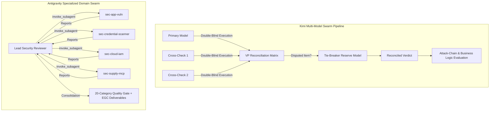
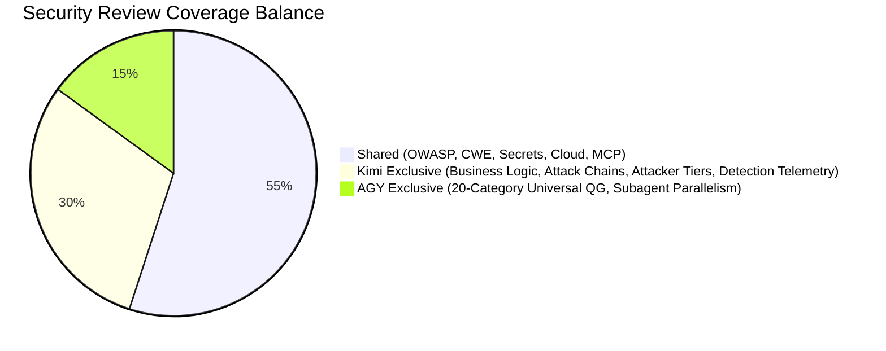
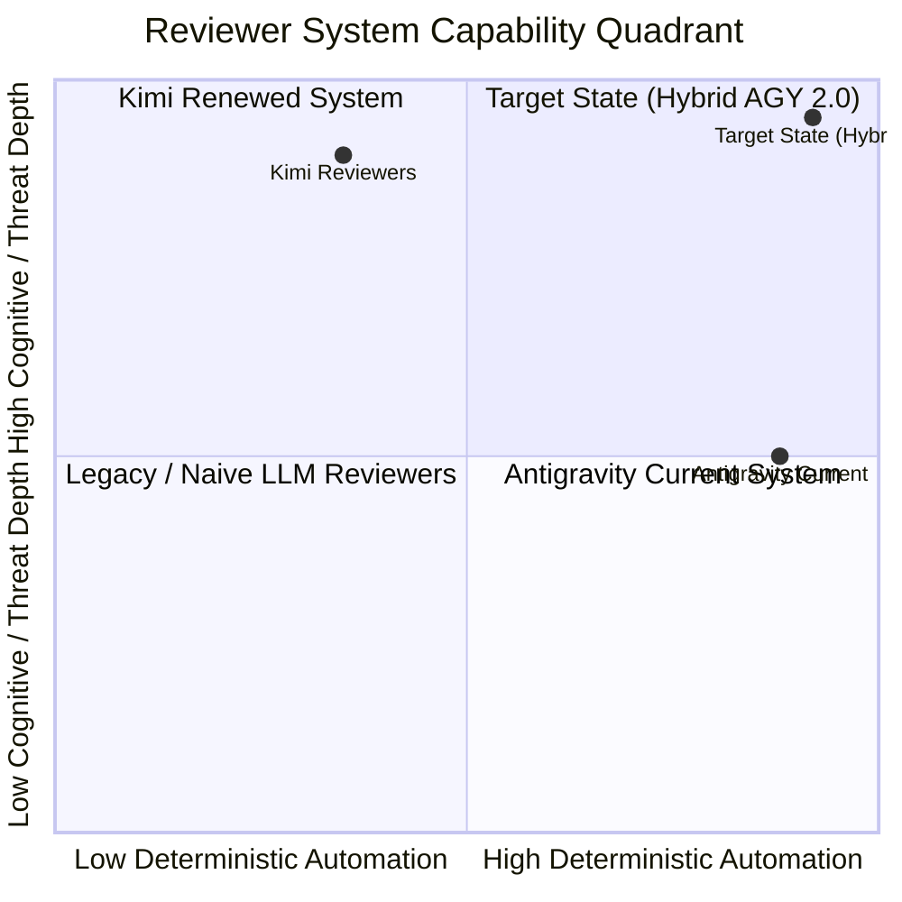

# Comparative Architectural Analysis: Renewed Kimi Reviewers vs. Antigravity (AGY) Reviewers

**Document Version**: 1.0.0  
**Date**: 2026-10-07  
**Author**: Staff AI Agent Systems Architect  
**Scope**:  
- **Kimi Workspace**: `D:\OneDrive\Projects\kimi-settings` (`agents/code-reviewer.md`, `agents/security-reviewer.md`, `SYSTEM.md`, `AGENTS.md`, `skills/code-review-taxonomy/`, `skills/quality-gate/`, `skills/security-review-orchestrator/`)  
- **Antigravity CLI Workspace**: `D:\OneDrive\Projects\Antigravity-cli` & Global Config `%USERPROFILE%\.gemini\config` (`~/.gemini/config`) (`plugins/code_reviewer/`, `plugins/security_reviewer/`, `rules/AGENTS.md`, `rules/GEMINI.md`, `skills/code-review-taxonomy/`, `skills/quality-gate/`, `builtin/`)

---

## 1. Executive Summary

A comprehensive architectural inspection and comparative audit was conducted between the recently renewed **Kimi Code-Reviewer & Security-Reviewer** agents and the **Antigravity (AGY) Reviewer Ecosystem**. Both systems implement pre-merge and pre-commit verification pipelines designed to act as read-only quality gates. However, they diverge significantly in orchestration topology, detection depth, and verification philosophy:

- **Kimi's Superpower**: A **Double-Blind Multi-Model Swarm** (1 primary + 2 rotating secondary cross-check models with non-same-family constraints and automated tie-breaker verification), integrated with **Threat Modeling**, **Attack-Chain Synthesis**, **Business Logic Abuse Auditing**, and **Attacker Tier / Telemetry Detection** grading.
- **Antigravity's Superpower**: A **Specialized Domain Subagent Swarm** (Lead Security Reviewer orchestrating 4 concurrent domain subagents: `sec-app-vuln`, `sec-credential-scanner`, `sec-cloud-iam`, `sec-supply-mcp`), coupled with a massive **Universal 20-Category Deterministic Quality Gate (`quality-gate`)**, and a **Zero-Dependency CLI/Deployment Engine** (`agy-tools`, `configure-customizations.js`).

By cross-pollinating Kimi's advanced threat-modeling, attack-chaining, business logic coverage, and multi-model consensus mechanics into Antigravity's domain-specialized subagent swarm and deterministic quality gate, AGY can achieve an industry-leading, autonomous code security standard.



---

## 2. In-Depth Architectural & Orchestration Comparison

### 2.1 Swarm Topology vs. Pipeline Hierarchy

| Architecture Dimension | Kimi Renewed Reviewers | Antigravity (AGY) Reviewers | Architectural Trade-Off Analysis |
| :--- | :--- | :--- | :--- |
| **Orchestration Pattern** | **Horizontal Multi-Model Cross-Check Swarm** (Double-Blind 3-way consensus) | **Hierarchical Domain-Specialist Swarm** (Lead Orchestrator dispatches 4 functional subagents) | Kimi solves **model bias & hallucination**; AGY solves **domain context dilution & prompt saturation**. |
| **Model Diversity** | High. Rotates primary + 2 secondary models from pool; enforces different model families (e.g., Claude + GPT + Kimi/DeepSeek). | Single model family (`gemini-3.8-flash-high`) shared across orchestrator and all 4 domain subagents. | AGY is susceptible to systematic model family blind spots; Kimi eliminates single-model false positives. |
| **Dispute Resolution** | Formal. $\ge 2$ votes = Confirmed. Exactly 1 vote = Disputed $\to$ dispatches 4th reserve verification model to prove/refute code path. | None. Lead Reviewer synthesizes subagent reports. No independent dispute arbiter exists. | Kimi's tie-breaker prevents single-instance hallucinations from causing spurious gate blocks. |
| **Execution Stages** | 4-step linear per instance (Stage 0 Deterministic $\to$ Stage 1 Taxonomy $\to$ Stage 2 Confidence $\to$ Stage 3 Verdict). | Code Reviewer: 4-stage pipeline. Security Reviewer: Concurrent subagent fan-out via `invoke_subagent`. | AGY achieves higher token parallelism across security domains; Kimi achieves higher epistemic consensus. |
| **Scope Enforcer** | Hard Guard: If diff > 50 files or > 2000 lines, actively halts and demands splitting. | Soft Guard: Mentions changed files only and $\pm 20$ lines of context, but lacks a hard diff-size ceiling. | Kimi protects LLM attention degradation on massive PRs; AGY risks shallow scans on large PRs. |

### 2.2 Tool Gating & Hardware Read-Only Invariants

- **Antigravity Hardware Read-Only**: AGY rigorously enforces the principle of least privilege in agent tool manifests. In `plugins/code_reviewer/agents/code-reviewer/agent.md` and `plugins/security_reviewer/agents/security-reviewer/agent.md`, tools are strictly restricted to:
  ```yaml
  tools:
    - view_file
    - list_dir
    - grep_search
    - find_by_name
    - run_command # (code-reviewer only)
    - invoke_subagent
    - send_message
  ```
  Write and mutate tools (`write_to_file`, `replace_file_content`) are **completely excluded** from the frontmatter schema, making file modifications physically impossible for reviewer subagents.
- **Kimi Anomaly**: In Kimi's renewed agent definitions (`agents/code-reviewer.md` line 10, `agents/security-reviewer.md` line 8), the `Write` tool is still declared in the frontmatter, relying purely on prompt instructions ("Authority: READ-ONLY... NEVER edit files") to prevent modifications. AGY is architecturally superior in runtime boundary enforcement.

---

## 3. Comprehensive Side-by-Side Comparison Matrix

| Evaluation Dimension | Kimi Renewed Reviewers | Antigravity (AGY) Reviewers | Advantage / Gap |
| :--- | :--- | :--- | :--- |
| **1. Multi-Model Consensus** | 3-instance double-blind rotation + 4th reserve tie-breaker | Single model family across all agents | **Kimi**: Dramatically lower false-positive and hallucination rate. |
| **2. Domain Decomposition** | Monolithic security agent (all dimensions in one prompt) | 4 dedicated domain subagents (`sec-app-vuln`, `sec-credential-scanner`, `sec-cloud-iam`, `sec-supply-mcp`) | **AGY**: Deeper specialized prompts without cross-domain attention dilution. |
| **3. Intent Conformance** | Enforces SYSTEM.md 3b checklist; unfulfilled requirements = P1 correctness blocker | Reviews diff semantics only; no formal intent checklist table | **Kimi**: Catches omitted requirements ("absent logic outranks wrong logic"). |
| **4. Threat Modeling** | Mandatory 6-line Threat Model Brief (Assets, Boundaries, Entry Points, Attacker Tiers) | Philosophy alignment & scope listing, but lacks formalized threat model taxonomy | **Kimi**: Grounds audit in attacker capabilities and blast radius. |
| **5. Attack-Chain Analysis** | Synthesizes multi-step chains; escalates chained Medium flaws to Critical `A04:2021` | Evaluates vulnerabilities as isolated, single-point flaws | **Kimi**: Real-world exploit modeling; prevents death by a thousand cuts. |
| **6. Business Logic Abuse** | Comprehensive (TOCTOU, workflow bypass, price/quantity, replay, multi-tenant ORM/RAG isolation) | Narrow focus on classic injection/auth/crypto flaws | **Kimi**: Discovers logic flaws that pass syntactic/type validation. |
| **7. Conditional Dimensions** | Cloud/IAM and Client/Mobile are disabled by default unless target file extensions appear in diff | Cloud/IAM always dispatched via `sec-cloud-iam` regardless of PR scope | **Kimi**: Saves compute and eliminates irrelevant "Not Applicable" noise. |
| **8. Anti-Bikeshedding** | Explicit Failure Rule #13: Bans reporting style/nits already covered by Stage 0 or preferences | Relies on general confidence scoring and category boundaries | **Kimi**: Preserves developer velocity and review focus. |
| **9. Public Contract Blast Radius** | Mandatory repo-wide `grep` on changed exported symbols/configs to identify broken callers | Recommends $\pm 20$ lines of context, but lacks mandatory external caller grep | **Kimi**: Prevents subtle contract regressions across large codebases. |
| **10. Telemetry / Detection Signal** | High/Critical findings must specify `detectable: <log>` vs `no detection: <gap>` | Findings include impact and exploit scenario, but omit detection telemetry assessment | **Kimi**: Provides actionable insight for SOC / SecOps monitoring. |
| **11. Deterministic Quality Gate** | Compact 87-line skill with 8 checks (Node/Rust/Python auto-detect) | Massive 625-line universal framework (20 categories, 6-tier command resolution, mutation stripping) | **AGY**: Far superior breadth across multi-language builds, lockfiles, and static tools. |
| **12. CLI & Deployment Sync** | Manual setup script + Kimi user home sync | Zero-dependency Node.js CLI (`agy-tools`), atomic sync & automatic backups (`.bak.YYYYMMDD-HHMMSS`) | **AGY**: Enterprise-grade infrastructure, self-contained deployment, and backup safety. |

---

## 4. Deep Taxonomy & Detection Coverage Analysis

### 4.1 Code Review Taxonomy Comparison

Both systems share an 8-category taxonomy (`correctness`, `security`, `stability`, `data-integrity`, `performance`, `maintainability`, `test-coverage`, `style-docs`). However, Kimi introduces four critical refinements:

1. **Anti-Bikeshedding Invariant (Rule 13)**:
   > *"Reporting style, formatting, or naming issues the Stage 0 linter or formatter already flags, or proposing personal-preference refactors that match existing codebase conventions. Not a finding; spend the review budget on correctness."*
   AGY lacks this explicit filter, allowing subjective stylistic comments to slip through under `style-docs` or `maintainability`.
2. **Blast Radius Grep on Public Contracts**:
   > *"When the diff changes a public contract (exported signature, interface, event or message name, config key, schema field, default value), first grep the repository for all callers and usages; a caller the diff breaks is a finding attributed to the diff hunk."*
   AGY confines its review scope to diff hunks $\pm 20$ lines. If an agent changes a method signature in `src/service.ts`, AGY will not systematically check callers in `src/controller.ts`, missing broken contracts.
3. **Data-Integrity Expansion**:
   Kimi explicitly includes **backward compatibility** (breaking API response shape changes, rollback-unsafe database migrations) inside `data-integrity`.
4. **Intent Conformance Check**:
   Kimi mandates verifying the diff against the delegation payload's success criteria. If a developer agent implemented 3 of 4 requested features, Kimi flags the 4th missing feature as a **P1 Correctness defect**. AGY currently only reviews what is present in the diff, missing logic omissions.

### 4.2 Security Audit Coverage & The Business Logic Frontier

A direct mapping of security audit dimensions highlights significant coverage asymmetries:



#### A. Business Logic & Multi-Tenant Isolation (Kimi Advantage)
Kimi's `agents/security-reviewer.md` (Section 2.5) covers critical logical vulnerabilities that static linters and basic OWASP checklists miss:
- **Race Conditions / TOCTOU (CWE-362)**: Double-spend, double-claim, coupon reuse, non-atomic inventory/quota increments.
- **Workflow Bypass**: Out-of-order execution (e.g. payment confirmation reached before cart checkout; direct status transitions).
- **Mass Assignment (CWE-915)**: Client-settable fields bound wholesale into models (`role`, `isAdmin`, `ownerId`).
- **Idempotency & Replay**: Missing nonces, unverified webhook signatures, non-idempotent fund transfers.
- **Multi-Tenant Isolation**: Queries missing `tenant_id` WHERE clauses, shared cache keys without tenant namespaces, vector/RAG queries lacking tenant metadata filters.

*AGY Status*: Completely absent from `plugins/security_reviewer`. AGY's subagents focus almost exclusively on syntactic patterns (SQLi, hardcoded strings, permissive IAM roles, outdated packages).

#### B. Attack-Chain Analysis & Chained Severity Escalation (Kimi Advantage)
In real-world security incidents, attackers rarely exploit a single isolated vulnerability. Kimi introduces a mandatory post-scan **Attack-Chain Analysis**:
- Traces end-to-end paths: `Entry Point` $\to$ `Initial Foothold` $\to$ `Privilege/Data Escalation` $\to$ `Attacker Goal`.
- **Chain Escalation Rule**: If multiple individually 🟡 MEDIUM or 🟢 LOW findings combine into a 🔴 CRITICAL impact (e.g., Verbose error leaks tenant ID + IDOR on profile endpoint + unauthenticated export route = bulk exfiltration), Kimi escalates the entire chain into a single **🔴 CRITICAL finding under `A04:2021 - Insecure Design (chain)`**, immediately halting the merge gate.

*AGY Status*: AGY treats findings as isolated list items. A PR with five interconnected Medium vulnerabilities will receive a `PASS` verdict because zero individual findings are Critical or High.

#### C. Conditional Dimension Gating (Kimi Advantage)
- In Kimi, heavy and specialized checks (**Cloud, IAM & IaC** and **Client, Mobile & Desktop**) are conditional: they execute **only** when relevant file extensions (`*.tf`, `Dockerfile`, `*.k8s.yaml`, React Native/Electron shells) are present in the diff.
- In AGY, `security-reviewer` invokes `sec-cloud-iam` on **every single audit**, even if the PR only modified a CSS file or documentation, wasting API tokens and context window space.

---

## 5. Filtering, Precision, and False-Positive Mitigation

### 5.1 False-Positive Elimination Strategies

| Mechanism | Kimi Reviewer System | Antigravity (AGY) System |
| :--- | :--- | :--- |
| **Confidence Scoring** | Strict 4-tier rubric (90-100 Proven, 75-89 Strong, 50-74 Plausible, 0-49 Guess). Cutoff at 75. | Identical 4-tier rubric and 75 cutoff in `code-review-taxonomy`. |
| **Security Bypass** | Security findings bypass confidence filter and route to `security-reviewer`. | Identical bypass rule in `code-review-taxonomy`. |
| **Test & Mock Exemption** | Test directory mock keys downgraded to 🟢 LOW unless valid production credentials. | Identical rule enforced in `sec-credential-scanner/agent.md`. |
| **Multi-Model Consensus** | **Active**: 1-of-3 split findings must be corroborated by a 4th tie-breaker model. | **Inactive**: Relies entirely on Gemini's internal self-consistency. |
| **Detection Telemetry** | High/Critical items must identify if defenders can detect exploitation. | Not evaluated. |

### 5.2 The Single-Model Failure Mode in AGY
In Antigravity's current architecture, both the orchestrator and all subagents run on `gemini-3.8-flash-high`. While fast and cost-effective, if this model misinterprets a complex asynchronous pattern (e.g., Node.js event emitter streams or Rust lifetime borrows), every subagent will agree with the hallucination. Kimi's multi-model consensus actively eliminates this vulnerability by requiring cross-family agreement (e.g. Anthropic Claude + OpenAI GPT + Kimi) before a blocker is confirmed.

---

## 6. Severity Rating, Merge Gates & Decision Framework

### 6.1 Severity Definitions & Gating Rules

Both systems employ a unified severity rating, but enforce different stringency around waivers and soft passes:

```markdown
┌────────────────────────────────────────────────────────────────────────┐
│                        MERGE GATE DECISION FLOW                         │
└────────────────────────────────────────────────────────────────────────┘
                                    │
                               Diff Input
                                    │
                         ┌──────────▼──────────┐
                         │ Deterministic Scan  │ (Stage 0: Linters, Tests)
                         └──────────┬──────────┘
                                    │
                         ┌──────────▼──────────┐
                         │   Taxonomy Scan     │ (Stage 1: Semantic Lenses)
                         └──────────┬──────────┘
                                    │
                         ┌──────────▼──────────┐
                         │  Confidence Filter  │ (Stage 2: Filter < 75)
                         └──────────┬──────────┘
                                    │
                                    ├─── Any P0 / CRITICAL / HIGH?
                                    │      ├─ YES ──► 🔴 REJECT (Halt Gate)
                                    │      └─ NO
                                    │
                                    ├─── Any P1 / P2 / Conditions?
                                    │      ├─ YES ──► 🟡 CONDITIONAL (Requires Fix or Waiver)
                                    │      └─ NO
                                    │
                                    └─── Only P3 / Minor Nits?
                                           └───────► 🟢 PASS (Unconditional)
```

### 6.2 The "Pass With Conditions" Anti-Pattern
Kimi strictly prohibits the "Pass but..." formulation:
> *"Only an unconditional PASS may merge; a 'pass but ...' formulation counts as CONDITIONAL / REJECT."*
Furthermore, Kimi's enterprise skill (`security-review-orchestrator`) introduces a 5-state verdict model:
1. `PASS`: All required passes completed on current revision; zero blockers.
2. `PASS_WITH_ACCEPTED_RISK`: Open items backed by formal business owner + security approver, compensating controls, and expiry date.
3. `FAIL`: Unresolved blocking findings or security invariant breach.
4. `INCONCLUSIVE`: Scope unclear, environment unavailable, or evidence stale.
5. `NOT_READY_FOR_REVIEW`: Workspace or artifacts unstable.

AGY's `code-reviewer` and `security-reviewer` utilize `PASS`, `CONDITIONAL`, and `REJECT`. However, AGY currently lacks the **Evidence Freshness / Staleness Invalidation** rule: in Kimi, if code is modified after the audit scan, the evidence is automatically marked `STALE` and the gate is invalidated.

---

## 7. Output Schema, Reporting & Actionability

### 7.1 Report Schema Comparison

#### Kimi Deliverable Schema:
1. **Threat Model Brief** (Assets, Trust Boundaries, Entry Points, Attacker Tiers).
2. **Activated Dimensions** (Explicitly stating what was turned on/off).
3. **Structured Finding Contract**:
   - `Severity` (🔴/🟠/🟡/🟢)
   - `Category` (OWASP + CWE ID)
   - `Location` (`file:line`)
   - `Attacker Tier` (Anonymous, Authenticated, Insider, Supply Chain)
   - `Exploit Scenario / PoC`
   - `Impact`
   - `Detection Signal` (`detectable: <log>` vs `no detection: <gap>`)
   - `Suggested Remediation (Code Diff)` (exact `-` and `+` blocks)
4. **Attack-Chain Analysis**.
5. **Intent Conformance Table** (Requirements Coverage).
6. **Final Verdict & Required Remediation List**.

#### Antigravity Deliverable Schema:
1. **[1. Philosophy Alignment]** (Risk tolerance, regulatory constraints).
2. **[2. Audit Scope]** (Files, directories, subagents dispatched).
3. **[3. Consolidated Findings]**:
   - `Severity`, `Category`, `Location`, `Description`, `Exploit Scenario/PoC`, `Impact`, `Suggested Remediation (Code Diff)`.
4. **[4. Final Verdict]** (`PASS` / `REJECT` + Actionable Next Steps).

### 7.2 Storage and Handoff Contracts
- **AGY Standard**: Subagents write their comprehensive markdown reports to `reports/<agent-name>-report.md` (e.g. `reports/code-review.md`, `reports/security-review.md`). Return messages follow the compact contract:
  ```text
  [Status]: SUCCESS | BLOCKED | FAILED | PASS | REJECT
  [Verdict]: Quantitative metrics (e.g., P0=0, P1=0)
  [Key Findings]: 3 to 5 concise bullet points
  [Artifact Link]: file:///D:/OneDrive/Projects/Antigravity-cli/reports/xxx.md
  ```
- **Kimi Standard**: Writes to task-isolated directories `docs/YYMMDD_NNNN_session_<task-slug>/<agent>-report.md` (Zoo-Code style) with cross-check model suffixes (`<agent>-report-<model>.md`), keeping Git status clean.

---

## 8. CLI & Operational Infrastructure Comparison

### 8.1 Antigravity's Technological Superiority in Infrastructure

While Kimi excels in cognitive prompt architecture and multi-model swarming, **Antigravity completely outperforms Kimi in local tooling, zero-dependency engineering, and configuration deployment**:

1. **Zero External Dependency Standard (`GEMINI.md`)**:
   AGY CLI tools (`agy-tools`, `agy-dashboard`, `agy-tokens`) are built entirely on native Node.js runtime APIs (`fs`, `path`, `readline`, `crypto`, `child_process`). They achieve sub-10ms execution, zero `npm install` overhead, and native cross-platform support (Windows PowerShell/CMD, macOS Zsh, Linux Bash).
2. **Automated Configuration Synchronization Engine (`configure-customizations.js`)**:
   AGY includes an automated sync and backup engine:
   - Deploys `rules/`, `plugins/`, `skills/`, and `hooks/` from the repository directly into `~/.gemini/config/`.
   - Performs atomic file writes using randomized tempfiles and renames (`writeAtomic`).
   - Generates automatic timestamped backups (`.bak.YYYYMMDD-HHMMSS`) before overwriting any file.
   - Idempotent and non-destructive: never deletes user customizations.
3. **The Universal 20-Category Quality Gate (`quality-gate/SKILL.md`)**:
   AGY's `quality-gate` skill is an industrial-strength, 625-line framework featuring:
   - **6-Tier Command Resolution**: Override $\to$ Workflow $\to$ Script $\to$ Monorepo Member $\to$ Ecosystem Default $\to$ Manual Review.
   - **Active Mutation Flag Stripping**: Automatically converts mutating commands like `prettier --write` into `prettier --check` and `eslint --fix` into read-only linting.
   - **Suspicious Character Scans**: Scans for bidirectional and invisible zero-width Unicode attacks (`[\u200B-\u200F\u202A-\u202E\u2060\uFEFF\u00AD]`).
   - **Dead Code Detection**: Integrates with `knip` and `cargo udeps`.

---

## 9. Synthesis: Asymmetric Strengths and Deficits



### What AGY Must Adopt from Kimi
1. **Threat Model Briefing**: Mandate a 4-part threat model brief (Assets, Trust Boundaries, Entry Points, Attacker Tiers) before executing security reviews.
2. **Business Logic Abuse Audit**: Expand `sec-app-vuln` or introduce a dedicated lens for TOCTOU, workflow bypass, mass assignment, idempotency, and multi-tenant ORM/RAG query isolation.
3. **Attack-Chain Analysis**: Require `security-reviewer` to trace multi-vulnerability attack chains and escalate composite medium flaws to Critical.
4. **Attacker Tiers & Detection Telemetry**: Add `Attacker Tier` and `detectable: <signal>` / `no detection` fields to all high/critical findings.
5. **Anti-Bikeshedding Invariant**: Add Rule 13 to `code-review-taxonomy` to suppress linter redundancy and stylistic bike-shedding.
6. **Public Contract Grep Verification**: Require diff reviewers to grep repository callers when exported interfaces/types change.
7. **Intent Conformance Check**: Require reviewers to verify the diff against the injected user success criteria to detect omitted requirements.
8. **Conditional Dimension Gating**: Stop dispatching `sec-cloud-iam` unconditionally when PRs do not contain IaC/Cloud/Container files.

### What Kimi Can Learn from AGY
1. **Hardware Read-Only Tool Manifests**: Strip `Write` from Kimi's agent frontmatter to eliminate accidental file modifications.
2. **Domain-Specialized Subagent Fan-Out**: Decompose Kimi's monolithic `security-reviewer` into specialized subagents to prevent prompt saturation.
3. **Universal 20-Category Deterministic Quality Gate**: Adopt AGY's 6-tier command resolution, mutation flag stripping, and Unicode sanitization.
4. **Zero-Dependency CLI & Deployment Automation**: Implement atomic configuration deployment and backup mechanics.

---

## 10. Concrete, Actionable Implementation Plan for Antigravity

To elevate Antigravity's review ecosystem to the target state, execute the following phased enhancements across the AGY codebase:

### Phase 1: Enhance `code-reviewer` and `code-review-taxonomy`
- **Target Files**:
  - `plugins/code_reviewer/agents/code-reviewer/agent.md`
  - `plugins/code_reviewer/skills/code-review-taxonomy/SKILL.md`
  - `skills/code-review-taxonomy/SKILL.md`
- **Actions**:
  1. Add **Failure Rule 13 (Anti-Bikeshedding)** into `code-review-taxonomy/SKILL.md` Section 1.
  2. Add **Public Contract Blast-Radius Scan**: Mandate that when diffs alter public signatures, reviewers execute `grep_search` across the codebase for broken callers.
  3. Add **Intent Conformance Checklist**: Update Stage 1 to verify whether all user-specified criteria in the delegation payload are present; mark omitted requirements as P1 Correctness bugs.
  4. Add **Diff Scope Guard**: If diff exceeds 50 files or 2000 lines, instruct reviewer to report scope-split recommendation.

### Phase 2: Upgrade `security-reviewer` & Domain Subagents
- **Target Files**:
  - `plugins/security_reviewer/agents/security-reviewer/agent.md`
  - `plugins/security_reviewer/agents/sec-app-vuln/agent.md`
  - `plugins/security_reviewer/agents/sec-cloud-iam/agent.md`
  - `plugins/security_reviewer/agents/sec-supply-mcp/agent.md`
- **Actions**:
  1. In `security-reviewer/agent.md`:
     - Add **Threat Model Brief** (Assets, Boundaries, Entry Points, Attacker Tiers) to Section 4 deliverables.
     - Add **Attack-Chain Analysis**: Require synthesis of multi-step exploit chains and escalation of composite medium flaws to 🔴 CRITICAL `A04:2021 - Insecure Design (chain)`.
     - Implement **Conditional Dispatch**: Only invoke `sec-cloud-iam` if `*.tf`, Dockerfile, K8s, or cloud configs exist in diff.
  2. In `sec-app-vuln/agent.md`:
     - Expand audit dimensions to include **Business Logic Abuse**: Race conditions / TOCTOU, workflow state bypass, mass assignment, price/quantity tampering, and multi-tenant ORM/RAG isolation.
     - Add Indirect Prompt Injection details: Insecure LLM output execution and confused deputy flows.
     - Add **Attacker Tier** (Anonymous, Authenticated, Insider, Supply Chain) and **Detection Telemetry** (`detectable` vs `no detection`) to the finding schema.

### Phase 3: Port Enterprise `security-review-orchestrator` Skill
- **Target File**:
  - `skills/security-review-orchestrator/SKILL.md`
  - `plugins/security_reviewer/skills/security-review-orchestrator/SKILL.md`
- **Actions**:
  1. Introduce the full 35-section risk-based orchestrator skill into Antigravity to support enterprise multi-pass audits (Pass 0 Threat Model $\to$ Pass 1 Diff Review $\to$ Pass 2 Tooling $\to$ Pass 3 Dynamic $\to$ Pass 5 Release Gate).
  2. Add finding lifecycle tracking (`NEW` $\to$ `TRIAGED` $\to$ `VERIFIED_FIXED`), evidence freshness tracking, and formal risk waiver standards.

### Phase 4: Deploy & Synchronize via `agy-tools`
- **Execution**:
  1. Run `node scripts/lib/configure-customizations.js` to atomically deploy updated plugins and skills to `%USERPROFILE%\.gemini\config` (`~/.gemini/config`).
  2. Verify that backup files (`.bak`) are cleanly created and new configurations pass unit tests in `test/run-tests.js`.

---

## 11. Conclusion & Verdict

The comparative analysis reveals that **Kimi Renewed Reviewers** and **Antigravity Reviewers** represent complementary pinnacles of agent engineering. Kimi excels at cognitive depth, epistemic consensus (multi-model tie-breakers), and real-world attacker modeling (chains, business logic, telemetry). Antigravity excels at modular subagent decomposition, hardware read-only safety, zero-dependency deployment, and exhaustive deterministic verification.

By porting Kimi's cognitive lenses (Threat Modeling, Business Logic, Attack Chaining, and Anti-Bikeshedding) into Antigravity's specialized subagent swarm and running them through AGY's 20-category Quality Gate, the Antigravity ecosystem will establish an unparalleled, state-of-the-art autonomous code and security review capability.
