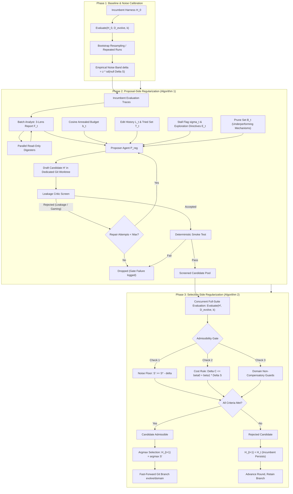

# Google Research RRSI: Comprehensive Deep-Dive Analysis

> **Executive Overview**: This report provides an exhaustive, staff-level research breakdown of Google Research's **RRSI** (*Regularized Recursive Self-Improvement of Agent Harnesses*, [arXiv:2609.24972](https://arxiv.org/abs/2609.24972), September 2026), authored by Peng Xia, Rujun Han, Zifeng Wang, Yanfei Chen, Yufan Zhuang, Yoonho Lee, Chengsong Huang, Han Yu, Zhongying CuiZhu, Yifei Ming, Huaxiu Yao, Burak Gokturk, Tomas Pfister, and Chen-Yu Lee (Google Research, Cloud AI, Stanford University, UNC Chapel Hill).
> 
> The repository ([google-research/rrsi](https://github.com/google-research/rrsi)) implements a disciplined meta-search framework that automatically evolves the scaffolding ("harness") around a frozen LLM policy—prompts, control flow, context management, output plumbing, tools, skills, memory, and sub-agents—without succumbing to the notorious "adaptive overfitting trap" where self-improving agents memorize in-distribution benchmarks and fail out-of-distribution (OOD).

---

## 1. Executive Summary & Research Motivation

### 1.1 The Core Thesis: "Regularize the Search, Not the Harness"
State-of-the-art Large Language Models (LLMs) operate within an execution environment commonly termed an **agent harness** or **scaffold**. The harness comprises:
- System and task prompts (`prompt`)
- Loop mechanics, retry policies, and completion checks (`control_flow`)
- Hyperparameters, thresholds, and timeout clamps (`config`)
- Terminal buffer slicing, truncation, and output filtering (`output_plumbing`)
- Context compaction, reactive unwinding, and hierarchical summarization (`context_mgmt`)
- Client-side helper callables (`client_tool`)
- Procedural knowledge bases and progressive-disclosure playbooks (`skill`)
- Episodic and semantic persistence stores (`memory`)
- Targeted delegate LLM calls for specialized sub-tasks (`subagent`)

When prior recursive self-improvement (RSI) algorithms evolve harnesses against a fixed training/evolution suite ($D_{\text{evolve}}$), they exhibit severe **adaptive overfitting**: the proposer model crafts suite-specific regexes, hardcoded constant thresholds, task-identifying branches, or bloated prompts tailored to idiosyncrasies of specific benchmark tasks. As a result, massive gains on $D_{\text{evolve}}$ shrink or completely vanish when evaluated Out-Of-Distribution (OOD)—and in multiple prior frameworks, evolved agents actually degrade below the baseline harness ($H_0$).

Prior attempts to mitigate overfitting typically restrict the **harness edit space** (e.g., restricting evolution only to prompt rewording, or only to parameter tuning, or only to adding modular tools). 

**RRSI's foundational thesis** is diametrically opposed:
> **Keep the harness edit space unconstrained and open to all arbitrary mechanisms, but strictly regularize the trajectory of the search through that space.**

Instead of limiting what the agent harness may eventually contain, RRSI imposes mathematical, statistical, and semantic constraints on:
1. How many changes may be proposed at once.
2. How new proposals are conditioned on past failures and unexercised components.
3. What forms of logic are screened out prior to spending compute on evaluation.
4. What statistical threshold a gain must clear relative to evaluation noise variance.
5. How much additional inference token cost is permitted for a given performance gain.
6. How obsolete, non-contributing mechanisms are systematically pruned.

```
       Prior RSI Approaches                       RRSI Paradigm
┌─────────────────────────────────┐     ┌─────────────────────────────────┐
│     Restricted Edit Space       │     │       Open Edit Space           │
│  (Prompts only / Tools only)    │     │  (Prompts, Code, Tools, Memory, │
│                │                │     │   Control Flow, Subagents...)   │
│                ▼                │     │                │                │
│       Unconstrained Search      │     │                ▼                │
│   (Greedy Hill-Climbing, Overfit│     │      Regularized Search         │
│   to In-Distribution Benchmarks)│     │  (Noise Floor, Cost Envelope,   │
│                │                │     │   Annealed Budget, Prune Sets)  │
│                ▼                │     │                │                │
│  OOD Degradation / Negative ROI │     │                ▼                │
└─────────────────────────────────┘     │  Guaranteed Generalization OOD  │
                                        └─────────────────────────────────┘
```

---

## 2. Core Architecture & Workflow Lifecycle

### 2.1 The Two-Sided Regularization Paradigm
RRSI splits its regularization mechanisms into two complementary sides:
1. **Proposal-Side Regularization (Algorithm 1)**: Controls candidate generation, attribution, historical conditioning, exploration diversity, and pre-evaluation leak screening.
2. **Selection-Side Regularization (Algorithm 2)**: Governs empirical measurement, noise variance adjustment, cost budgeting, multi-criteria domain guards, and candidate acceptance.



### 2.2 Mathematical Formulations

#### 1. Empirical Estimators (Score and Cost)
For candidate harness $H$ evaluated on benchmark dataset $D$ with $k$ trials per task:
$$\hat{S}(H) = \frac{\sum_{x \in D} \sum_{j=1}^k r(x, \tau_x^{(j)}) \cdot w(x)}{\sum_{x \in D} \sum_{j=1}^k w(x)}$$

$$\hat{C}(H) = \frac{1}{|D| \cdot k} \sum_{x \in D} \sum_{j=1}^k c(\tau_x^{(j)})$$

Where:
- $r(x, \tau_x^{(j)}) \in [0, 1]$ is the empirical trial reward.
- $w(x)$ is the task/criterion weight (1.0 for binary pass/fail tasks; criteria count for rubric-based tasks).
- $c(\tau_x^{(j)})$ is the total policy token consumption (input + output tokens) for trajectory $\tau$.
- **Zero-imputation for infrastructure failures**: If a trial crashes, times out, or throws an unhandled exception, it contributes $r=0.0$ while retaining the full denominator weight. A candidate cannot inflate its score by crashing on difficult tasks.

#### 2. Cosine Annealed $L_0$ Edit Budget
Let $b_t$ denote the maximum number of independent mechanisms permitted in round $t \in [0, T-1]$:
$$b_t = \left\lceil b_{\min} + \frac{b_{\max} - b_{\min}}{2} \left(1 + \cos\left(\frac{\pi t}{T}\right)\right) \right\rceil$$
- **Early rounds ($t \to 0$, $b_t = b_{\max}$)**: Proposer may bundle coordinated changes across multiple components (e.g., prompt + control flow + client tool) to escape local minima.
- **Late rounds ($t \to T$, $b_t = b_{\min} = 1$)**: Forces strictly single, attributable, fine-grained edits.

#### 3. Noise Band Calibration
The empirical noise band $\delta$ bounds the null distribution score variance between two evaluations of the *identical* harness:
$$\delta = z \cdot \operatorname{sd}(\text{null } \Delta S), \quad z = 2.0$$
Calculated via either:
1. Direct standard deviation over $R \ge 2$ repeat evaluations of baseline harness $H_0$.
2. Task-stratified bootstrap resampling over trial rewards within a single $k$-trial evaluation:
   $$\operatorname{se}(\hat{S}) = \text{Bootstrap}(\hat{S}, B=2000), \quad \operatorname{sd}_{\text{boot}} = \sqrt{2} \cdot \operatorname{se}(\hat{S})$$

#### 4. Selection Admissibility Gate
A candidate $H'$ with measurement $(S', C')$ evaluated against incumbent $(S_t, C_t)$ and global peak $S^*$ is admissible if and only if:
1. **Noise-Adjusted Floor**:
   $$S' \ge S^* - \delta$$
2. **Token Cost Envelope**:
   $$\text{cost\_rule}(H') = \begin{cases} 
   \Delta C \le \beta_0 + \beta_1 \Delta S & \text{if } \Delta S > \delta \\ 
   w_s \Delta S - w_c \Delta C + w_n \nu(l') > 0 & \text{if } \Delta S \le \delta 
   \end{cases}$$
   Where:
   - $\Delta S = S' - S_t$
   - $\Delta C = \frac{C' - C_t}{C_t}$ (relative token growth)
   - $\nu(l')$ is the novelty metric (number of structural component types introduced that the incumbent has never had an accepted edit on)
   - $\beta_0, \beta_1$ define the token growth allowance for real gains
   - $w_s, w_c, w_n$ shape the within-band tradeoff: candidates within evaluation noise survive *only* if they achieve token savings ($\Delta C < 0$) or introduce verified structural novelty ($\nu > 0$).
3. **Non-Compensatory Domain Guards**:
   $$\forall g \in \text{Guards}(D), \quad g(H_t, H') = \text{True}$$
   (e.g., in engineering design, the valid design rate drop must not exceed 0.03, and the no-submission rate rise must not exceed 0.02).

#### 5. History, Stall Detection, and Prune Sets
- **Edit History**:
  $$L_t = \{(t_i, l_i, h_i, d_i, \Delta S_i, \Delta C_i, a_i) : i \le n_t\}$$
- **Tried Component Set**:
  $$T_t = \{l_i : i \le n_t, \Delta S_i \ne \text{None}\}$$
- **Untried Component Set**:
  $$U_t = K \setminus T_t$$
- **Stall Flag**:
  $$\sigma_t = \mathbf{1}[S_t - S_{t-w} \le \delta]$$
  If the incumbent score has not improved by more than the noise band over window $w$, $m_{\text{draft}}$ candidate slots in round $t$ are **strictly reserved** for untried components $U_t$.
- **Recent Yield Summary**:
  $$g_t(l) = \max \{\Delta S_i : l_i = l, t - t_i \le n_{\text{prune}}\}, \quad \max(\emptyset) = -\infty$$
- **Prune Set**:
  $$B_t = \{l \in T_t : g_t(l) \le 0\}$$
  Identifies components that were accepted in earlier rounds but have yielded zero or negative score gains within the recent window $n_{\text{prune}}$, directing the proposer to actively delete underperforming machinery.

---

## 3. Component & Codebase Breakdown

The RRSI codebase is engineered in clean, dependency-minimal Python ($\ge 3.10$) structured into the core search library (`rrsi/`), domain adapters (`domains/`), and vendored execution harnesses (`third_party/`).

```
scratch/rrsi/
├── rrsi.py                  # Main CLI entrypoint
├── pyproject.toml           # Packaging and dependencies
├── rrsi/                    # Core search engine & regularizers
│   ├── __init__.py
│   ├── analyst.py           # Batch Analyst & 3-lens reporting
│   ├── calibrate.py         # Empirical noise band calibration
│   ├── components.py        # Component vocabulary, anti-spoofing & novelty
│   ├── config.py            # Dataclasses & hyperparameter schema
│   ├── critic.py            # Leakage review, regex denylist & repair loop
│   ├── digester.py          # Jailed read-only trace inspection subagent
│   ├── domain.py            # Abstract Domain interface
│   ├── driver.py            # Sequential execution driver & crash breaker
│   ├── evaluate.py          # Empirical estimator, weights, and scoring
│   ├── gitops.py            # Git worktree isolation & branch lifecycle
│   ├── history.py           # Edit history, stall detection, yield & prune
│   ├── llm.py               # AnthropicVertex client with prompt caching & rotation
│   ├── loop.py              # Main round lifecycle (Run class)
│   ├── propose.py           # Proposer coding agent & action loop
│   ├── schedule.py          # Cosine annealing budget calculator
│   └── selection.py         # Pure functional Algorithm 2 selection logic
├── domains/                 # Benchmark Domain Adapters
│   ├── coding/              # Terminal-Bench 2.1 + SWE-bench Verified
│   ├── workspace/           # Harvey LAB + JobBench/GDPval/APEX-Agents
│   └── eng/                 # EngDesign-Open + Frontier-Eng
├── tests/
│   └── test_core.py         # Method-level unit tests (zero-dependency)
└── third_party/             # Vendored base harnesses
    ├── archipelago/         # ReAct toolbelt runner for workspace & eng
    └── harbor_terminus2/    # Terminus-2 tmux harness for coding
```

### 3.1 Detailed Module Dissection

#### 1. `rrsi/config.py` — Hyperparameters & System Constants
Defines `RRSIConfig` as a dataclass mapping directly to the paper's mathematical symbols:
- Horizon: $T=20$ (or 40), $k=2$ (or 4), $m=2$ candidates per round.
- Proposal: $b_{\min}=1, b_{\max}=4, w=3$ (stall window), $m_{\text{draft}}=1$.
- Selection: $\delta$ (null $\to$ auto-calibrated), $\delta_z=2.0, \beta_0=0.10, \beta_1=40.0, w_s=100.0, w_c=15.0, w_n=0.5, n_{\text{prune}}=4$.
- Operational Knobs: `repair_rounds=5`, `invalid_missing_frac=0.15` (maximum allowed infrastructure failure fraction before round invalidation), `n_fail_traces=22`, `n_success_traces=6`, `eval_parallel=1`.
- Model Configurations: Defaults all three search roles (`proposer_model`, `analyst_model`, `critic_model`) to `claude-opus-4-8`.

#### 2. `rrsi/domain.py` — The Domain Abstraction Interface
Defines `Domain`, ensuring RRSI itself **never** interacts directly with Docker containers, tmux sessions, file paths of deliverables, or benchmark verifiers:
- `evolve_ids()`, `heldout_ids()`, `smoke_ids()`: Benchmark dataset splitting.
- `run(root, runs_dir, job, ids, k)`: Runs the harness located at worktree `root` against `ids`. Must be resume-safe.
- `score(runs_dir, job, ids, k)`: Parses raw trial directories into `TaskResult` dicts and aggregates.
- `guards(incumbent, candidate)`: Non-compensatory domain checks returning violated constraint strings.
- `load_trial()`, `render_trace()`, `task_row()`: Formats execution trajectories into human/LLM-readable logs.
- `smoke()`: Fast liveness gate checking compile validity, class constructor instantiation, and a miniature rollout.
- `critic_patterns`, `component_signals`, `briefs`: Domain-specific regex denylists, diff categorization regexes, and system prompt text injections.

#### 3. `rrsi/components.py` — Taxonomy & Anti-Spoofing Normalization
Maintains the closed vocabulary $K$:
$$K = \{\text{prompt}, \text{control\_flow}, \text{config}, \text{output\_plumbing}, \text{context\_mgmt}, \text{client\_tool}, \text{skill}, \text{memory}, \text{subagent}\}$$
$$K_{\text{str}} = \{\text{client\_tool}, \text{skill}, \text{memory}, \text{subagent}\}$$
- **Anti-Spoofing Protection (`normalize`, `has_evidence`, `text_only`)**: LLM proposers frequently attempt to satisfy reserved exploration quotas or claim novelty by mislabeling prompt adjustments as "skill" or "memory". `has_evidence()` checks diffs against regexes (e.g., `Memory(`, `skills/`, `ToolRegistry`, `subcall(`). If the diff consists purely of string literal modifications or comments, `text_only()` reclassifies it to `prompt`.
- **Structural Novelty (`novelty`)**: Counts the number of components in $K_{\text{str}}$ touched by the candidate that have *zero* accepted edits in the incumbent history.

#### 4. `rrsi/history.py` — Edit History & Attribution Bookkeeping
Maintains `history.jsonl`, where every candidate edit bundle is decomposed into attributable records:
- Tracks: round $t$, variant label (e.g., 'A'), edit ID, declared and normalized component, hypothesis, targeted failure mode, predicted affected tasks, git diff reference, measured $\Delta S$, relative $\Delta C$, acceptance verdict (`ACCEPTED`, `LOST`, `REJECTED`, `critic_reject`, `smoke_fail`), and incumbent snapshot.
- Computes $T_t$ (tried components), $U_t$ (untried components), $g_t(l)$ (recent yield), $\sigma_t$ (stall flag), and $B_t$ (prune set with exact machinery references).

#### 5. `rrsi/analyst.py` & `rrsi/digester.py` — Subagent Trace Digestion & 3-Lens Reporting
Instead of flooding the batch analyst with megabytes of raw multi-step trajectories, RRSI implements a two-tier hierarchical inspection architecture:
- **`digester.py`**: A read-only subagent jailed to the round's rendered traces directory. Equipped with strictly whitelisted inspection actions (`read_file`, `glob`, `grep`, and read-only bash: `grep`, `head`, `tail`, `wc`, `cat`, `ls`, `find`, `cut`, `sort`, `uniq`, `awk`, `jq`, `sed` [no `-i`], `tr`, `paste`). Writes, redirections, and python execution are strictly rejected by `DENY_BASH`. Digester outputs are hard-capped at 6,000 characters.
- **Three Inspection Lenses**:
  1. `failure`: Blocker mechanism, concrete chronological narrative, short exact evidence quotes, verifier error logs, needed resolution.
  2. `capability_gap`: What the agent attempted to do, why the environment/scaffold blocked it, tool limitations, observed partial workarounds.
  3. `success`: Reusable behaviors exhibited in high-scoring trials, step ranges, and regression risks if disrupted.
- **`analyst.py`**: Dispatches up to 8 digester subagents concurrently (`DIGEST_PARALLELISM = 6`) across failing and representative passing trials. Synthesizes digests into `analysis_report.json`, merging overlapping failure mechanisms, ranking by total lost points, preserving persistent cross-round mode naming, and maintaining **`success_habits`** as explicit invariants.

#### 6. `rrsi/propose.py` — The Regularized Harness Engineer
Runs as an autonomous coding agent operating inside a candidate's isolated git worktree:
- **Action Space**: `list_files`, `read_file`, `list_traces`, `read_trace` (with step range filtering), `edit_file` (exact unique string replacement), `write_file` (strictly for new files), and `done`.
- **The "No-Abort" Rule**: The prompt explicitly forbids aborting: *"THERE IS NO ABORT ACTION. You must ship a candidate. A round that ships nothing tests nothing... A rejection is data; an abort is not."*
- **Strict `done()` Contract Enforcement**:
  - The number of declared edits must not exceed $b_t$.
  - Declared components must belong to $K$.
  - If a reserved exploration slot is active ($\sigma_t=1$), at least one edit must target an untried component $U_t$.
  - Must provide `targets_mode`, `why_not_lower_lever`, `trigger_condition`, `predicted_affected` (concrete task IDs), `retroactive_check`, and `regression_risk`.
  - Over-budget or malformed submissions are rejected back to the proposer turn loop up to `MAX_TURNS = 40`.

#### 7. `rrsi/critic.py` — The Anti-Overfitting Pre-Evaluation Screen
Evaluates candidate diffs before any benchmark execution compute is spent. Operates in two tiers:
1. **Deterministic Pre-checks**: Generic denylist (API keys, credentials, secret patterns) + domain regexes (verifier solution files, rubrics, task IDs, grader modules).
2. **LLM Review (Claude Opus 4.8)**: Reviews diff against 6 critical rejection vectors:
   - *Leakage / Task-Specialization*: Hard-coding task IDs, company/case names, expected solutions, magic constants, or task-identifying triggers.
   - *Degenerate Changes*: Dead code, unused flags, or removing safety mechanisms (context summarization, truncation, error recovery) without replacement.
   - *Grader Gaming*: Reading, detecting, or reconstructing the verifier or rubric at runtime.
   - *Undeclared Bundling*: Diff containing changes outside the declared edit set.
   - *Runtime Memory / Skill Leakage*: Persisting or injecting task-specific runtime data across trials.
   - *Unbounded Work*: Retry loops without an exit or termination condition.
- **Bounded Repair**: Rejections return specific objections to the proposer for up to `repair_rounds=5` iterations.

#### 8. `rrsi/evaluate.py` & `rrsi/selection.py` — Adjudication Engine
- `evaluate.py`: Executes the candidate harness via `domain.run()`, aggregates task-level results, handles timeout/crash zero-imputation, and stores `eval.json`.
- `selection.py`: Pure functional implementation of Algorithm 2. Judges candidate admissibility against noise floor $S^* - \delta$, cost rule, and domain guards; selects $H_{t+1} = \operatorname{argmax}_{H' \in \text{admissible}} S'$.

#### 9. `rrsi/calibrate.py` & `rrsi/gitops.py` — Empirical Rigor & Git Isolation
- `calibrate.py`: Resamples task-level trial scores with 2,000 bootstrap iterations to compute $\delta = z \cdot \operatorname{sd}(\text{null } \Delta S)$.
- `gitops.py`: Manages git worktrees under `runs/<domain>/wt/r<t><variant>`. Isolates variant development on dedicated branches (`<domain>/r<t><variant>`). On candidate acceptance, executes an atomic fast-forward on `evolve/<domain>`:
  ```python
  git update-ref refs/heads/evolve/<domain> <winner_commit>
  ```
  The incumbent is guaranteed to always be an immutable git commit.

#### 10. `rrsi/loop.py` & `rrsi/driver.py` — Orchestration & Fault Tolerance
- `loop.py`: Implements `Run.round(t)`. Coordinates analyst $\to$ propose $\to$ critic $\to$ smoke $\to$ evaluate $\to$ select $\to$ commit. Supports `readjudicate` (re-applying selection thresholds without re-running expensive evaluations) and `reevaluate` (re-measuring failed candidate trials after an infrastructure crash).
- `driver.py`: Oversees execution across rounds $0 \dots T-1$. Implements automatic resume, graceful stopping upon detection of `runs/<domain>/STOP`, and a circuit breaker halting the run if consecutive infrastructure failures reach `MAX_CONSECUTIVE_INFRA = 3`.

---

## 4. Prompt Engineering & Reasoning Methodology

### 4.1 System Prompts & Constitutional Engineering
RRSI enforces behavior through structured Markdown "constitutions" injected into the proposer's context:
- **`SKILL.md` (The Constitution)**: Establishes the rules of engagement: how the work is judged, the mathematical cost and noise rules, the overfitting trap, the hard prohibitions (verifiers, entity names, unbounded loops), and guidelines for choosing levers.
- **`PATTERNS.md` (The Pattern Library)**: Catalogs known mechanism archetypes and traps for each specific domain (e.g., waiting/polling mechanics, output plumbing, parse-error recovery, context budget preservation, and bounded sub-calls).
- **Prompt Caching (`cache_prefix`)**: The stable constitution (`SKILL.md`), pattern library (`PATTERNS.md`), and base harness code are bundled into an ephemeral prompt cache block via AnthropicVertex:
  ```python
  content = [{"type": "text", "text": cache_prefix, "cache_control": {"type": "ephemeral"}},
             {"type": "text", "text": prompt}]
  ```
  This reduces prompt processing latency and token billing by ~80% across the 40-turn proposer loop.

### 4.2 The Three-Lens Analytical Reflection Loop
Rather than simply listing errors, the Batch Analyst categorizes evidence into three distinct lenses:
1. **Failure Modes**: Clustered by underlying root cause, not symptom. Must be formulated in task-agnostic, entity-free language.
2. **Capability Gaps**: Explicitly separates model deficiency from scaffold deficiency. If an agent repeatedly failed to run a simulation because the environment lacked a specific output parser, this is flagged as a plumbing gap rather than reasoning failure.
3. **Success Habits (Preservative Guard)**: Documents behaviors that allowed passing tasks to succeed. The proposer is instructed that any new mechanism **must not** disrupt existing success habits.

```
┌────────────────────────────────────────────────────────────────────────┐
│                        3-Lens Analytical Report                        │
├────────────────────────────────┬───────────────────────────────────────┤
│ Failure Modes (Corrective)     │ Clustered mechanisms losing points.   │
│                                │ e.g., "Premature completion before    │
│                                │ verification execution"               │
├────────────────────────────────┼───────────────────────────────────────┤
│ Capability Gaps (Structural)   │ Scaffold plumbing deficiencies.       │
│                                │ e.g., "Terminal output truncation     │
│                                │ hides compilation error trace"        │
├────────────────────────────────┼───────────────────────────────────────┤
│ Success Habits (Preservative)  │ Reusable clean behaviors to preserve. │
│                                │ e.g., "Self-checking JSON schema stubs│
│                                │ before invoking final_answer"         │
└────────────────────────────────┴───────────────────────────────────────┘
```

### 4.3 Proposer Counterfactuals & Prediction Attribution
In every `done()` call, the Proposer must submit:
1. **`retroactive_check`**: A three-part counterfactual justification:
   - *Corrective*: Walking step-by-step through cited failing traces to demonstrate how the new mechanism would have altered the trajectory.
   - *Preservative*: Consulting the `success_habits` list to argue why passing behaviors will not be degraded.
   - *Transfer*: Explaining why the mechanism generalizes to arbitrary unseen tasks exhibiting the same abstract failure mode.
2. **`predicted_affected`**: A list of specific task IDs the proposer expects to flip from fail to pass.
3. **Attribution Scoreboard**: The system tracks prediction accuracy across rounds:
   $$\text{Hit Rate} = \frac{|\text{Tasks Improved} \cap \text{Predicted Tasks}|}{|\text{Predicted Tasks}|}$$
   Unpredicted regressions (tasks broken outside the prediction set) are logged to `attribution.jsonl` and fed back to subsequent proposer instances, actively discouraging over-claiming.

---

## 5. Evaluation, Benchmarks & Empirical Findings

### 5.1 Multi-Domain Experimental Design
RRSI was evaluated across three distinct agentic domains, spanning both in-distribution evolution splits and unseen out-of-distribution (OOD) benchmarks:

| Domain | Starting Harness | Evolve Split ($D_{\text{evolve}}$) | Held-Out / OOD Benchmarks | Evaluation Metric |
| :--- | :--- | :--- | :--- | :--- |
| **Coding** | Terminus-2 (Harbor) | Terminal-Bench 2.1 (89 tasks) | **SWE-bench Verified** (500 repo tasks) | Binary unit test pass rate |
| **Workspace** | ReAct Toolbelt (Archipelago) | Harvey LAB (120 legal tasks) | **Harvey LAB Held-Out** (40 tasks)<br>**JobBench**<br>**GDPval**<br>**APEX-Agents** | Fraction of rubric criteria passed (mean of 20-100 per task) |
| **Engineering** | ReAct Toolbelt (Archipelago) | EngDesign-Open (61 design tasks) | **EngDesign v1 Hardened**<br>**Frontier-Eng** | Continuous verifier combined score / binary pass rate |

### 5.2 Key Empirical Results (Paper Data)
All primary experiments used **Claude Opus 4.8** as the frozen policy model:

```
Benchmark Performance Comparison (H_0 Baseline vs RRSI Incumbent)
┌───────────────────────────────────────┬────────┬────────┬─────────┐
│ Benchmark (Domain & Role)             │  H_0   │  RRSI  │  Delta  │
├───────────────────────────────────────┼────────┼────────┼─────────┤
│ Terminal-Bench 2.1 (Coding, Evolve)   │  74.2% │  80.2% │ +6.0 pp │
│ SWE-bench Verified (Coding, OOD)      │  82.0% │  83.8% │ +1.8 pp │
├───────────────────────────────────────┼────────┼────────┼─────────┤
│ Harvey LAB (Workspace, Evolve)        │  89.4% │  90.5% │ +1.1 pp │
│ Harvey LAB (Workspace, ID Held-Out)   │  86.9% │  89.2% │ +2.3 pp │
│ JobBench (Workspace, OOD)             │  36.0% │  40.7% │ +4.7 pp │
│ GDPval (Workspace, OOD)               │  48.8% │  52.3% │ +3.5 pp │
│ APEX-Agents (Workspace, OOD)          │  34.2% │  37.9% │ +3.7 pp │
├───────────────────────────────────────┼────────┼────────┼─────────┤
│ EngDesign (Engineering, Evolve)       │  50.0% │  54.9% │ +4.9 pp │
│ Frontier-Eng (Engineering, OOD)       │  17.7  │  22.0  │ +4.3 pts│
└───────────────────────────────────────┴────────┴────────┴─────────┘
```

#### Policy Independence
The framework was also evaluated with **Gemini 3.5 Flash** as the frozen policy on the coding domain:
- **Terminal-Bench 2.1 (Evolve)**: Increased from **64.6%** ($H_0$) $\to$ **78.7%** (+14.1 pp).
- **SWE-bench Verified (OOD)**: Increased from **76.8%** ($H_0$) $\to$ **79.0%** (+2.2 pp).

#### Token & Inference Efficiency
- Unlike unconstrained RSI approaches that continuously bloat system prompts and append redundant agent sub-calls, RRSI's $L_1$ cost rule ($\Delta C \le \beta_0 + \beta_1 \Delta S$) and pruning mechanism achieved its performance gains using **30% fewer policy tokens per task** than unregularized evolution.

---

## 6. Key Strengths, Innovations & Theoretical Contributions

1. **Regularization of Search Dynamics rather than Static Architecture**: By leaving the harness edit space open to code, prompts, tools, memory, and sub-agents, RRSI avoids artificial capability ceilings while using statistical regularizers to prevent overfitting.
2. **Noise-Adjusted Acceptance Floor ($S^* - \delta$)**: Incorporating the empirical variance of identical harness evaluations protects against the "ratchet effect" (where noisy, non-generalizable candidate variations are accepted during local fluctuations).
3. **Formal Cost-Gain Budgeting ($\beta_0 + \beta_1 \Delta S$)**: Establishes a concrete economic contract for agent evolution: inference token increases must be mathematically justified by corresponding empirical reward gains.
4. **Historical Conditioning & Anti-Repetition ($L_t, T_t, U_t$)**: Conditioning the proposer on full edit histories, negative outcomes, and unexercised components prevents repetitive loops and redirects search when progress stalls ($\sigma_t = 1$).
5. **Dynamic Pruning of Non-Contributing Machinery ($B_t$)**: Provides a systematic garbage-collection mechanism for the agent scaffold, continuously eliminating tools or prompt rules that have stopped providing marginal value.
6. **Immutable Git Worktree Architecture**: Candidates are developed, screened, and evaluated in isolated git worktrees, with the incumbent maintained as an immutable git commit, ensuring perfect reproducibility, zero cross-candidate contamination, and auditable diffs.

---

## 7. Architectural Weaknesses, Operational Limitations & Practical Bottlenecks

1. **Extreme Evaluation Compute & Latency Footprint**:
   - Each round evaluates $m=2$ candidates across $|D|$ tasks with $k$ trials.
   - For Terminal-Bench ($89 \times 2 = 178$ rollouts) or EngDesign ($61 \times 4 = 244$ rollouts), a full 20-40 round evolution run requires **thousands of multi-step agent rollouts**.
   - Running full-suite evaluations sequentially can take days to weeks without massive parallel compute clusters.
2. **Reliance on Frontier Proposer Models (Claude Opus 4.8)**:
   - The proposer, analyst, and critic require high-end reasoning and codebase navigation capabilities.
   - Attempting to run RRSI with smaller or less capable proposer models often leads to repeated JSON contract violations, invalid file diffs, or unparseable repairs.
3. **Sequential Round Bottleneck ($T$ iterations)**:
   - While candidates within a round can be evaluated in parallel (`eval_parallel`), the rounds themselves are strictly sequential ($H_t \to H_{t+1}$).
   - There is no asynchronous population-based branch merging or crossover; search is strictly a regularized linear trajectory.
4. **Scalar Reward Collapse**:
   - Complex multi-agent workflows often exhibit multi-dimensional Pareto tradeoffs (e.g., latency vs. accuracy vs. tool calls vs. user alignment).
   - RRSI collapses multi-metric performance into a single scalar $S$, relying on binary non-compensatory guards for auxiliary metrics rather than exploring true multi-objective Pareto frontiers.
5. **Infrastructure Brittleness in Benchmark Jails**:
   - Docker daemon crashes, port conflicts, MCP gateway socket hangs, and container network timeouts require elaborate retry heuristics (`MAX_CONSECUTIVE_INFRA = 3`, `invalid_missing_frac`) that can disrupt unattended runs.

---

## 8. Comparative Analysis: RRSI vs Antigravity CLI (`agy-cli`)

A comparative assessment between RRSI and our **Antigravity CLI** (`agy-tools`) workspace reveals high-value opportunities for mutual cross-pollination.

### 8.1 Architectural Comparison Matrix

| Architectural Dimension | Google Research RRSI | Antigravity CLI (`agy-cli`) |
| :--- | :--- | :--- |
| **Primary Purpose** | Automated, recursive meta-evolution of agent harnesses on benchmark suites | Developer toolkit, token/cost telemetry, interactive dashboard, and operational workflow orchestration |
| **Target LLM Runtime** | Frozen policy LLM executed inside automated test harnesses (Harbor, Archipelago) | Interactive and autonomous developer workflows via Claude 3.5/Opus & Gemini models |
| **Scaffold Editability** | 100% automated LLM-driven edits to python code, prompts, tools, and configs | Modular, human-curated + agent-assisted rules (`rules/`), skills (`skills/`), and plugins (`plugins/`) |
| **Quality Control & Gating** | 2-Tier Critic (regex + LLM) + Noise Floor ($S^* - \delta$) + Cost Rule | Static linter / test runner (`test/run-tests.js`), Quality Gate skill, manual verification |
| **Cost & Token Governance** | Mathematical $L_1$ envelope ($\beta_0 + \beta_1 \Delta S$) enforced before candidate acceptance | Real-time token tracking dashboard (`agy-dashboard`, `agy-tokens`), cost logging, usage summaries |
| **Attribution & History** | JSONL edit history, predictive scoreboard, attribution of task flips to specific diffs | Changelog tracking, git history, operational task lists in brain scratchpads |
| **Isolation Mechanism** | Ephemeral Git Worktrees (`git worktree add -b <branch>`) | Local directory execution, workspace sub-directory scratchpads |

### 8.2 What Antigravity CLI (`agy-cli`) Does Better
1. **Developer Experience & Real-Time Ergonomics**: `agy-cli` is engineered for immediate, zero-dependency human-in-the-loop developer utility. The `agy-dashboard` and `agy-tokens` provide transparent, sub-second telemetry into token burn rates and API costs across Claude and Gemini without requiring multi-hour benchmark runs.
2. **Modular Skill & Rule Synchronization**: `agy-cli` features dedicated rule synchronizers (`scripts/lib/configure-rules.js`, `sync-customizations`) allowing rapid propagation of operational rules across projects and toolchains.
3. **Interactive & Hybrid Multi-Agent Execution**: `agy-cli` supports live subagent delegation, reactive wakeups, message passing (`send_message`), interactive user prompts, and background process management (`run_command`, `manage_task`), whereas RRSI is strictly a batch rollout pipeline.

### 8.3 Gaps & Limitations in Antigravity CLI
1. **Static, Non-Evolving Agent Configuration**: `agy-cli`'s system prompts, rule files, and skill implementations are largely static. When failure patterns recur across development workflows, updates rely on manual developer edits rather than automated recursive discovery.
2. **Lack of Empirical Regression Testing for Agent Rules**: Adding a new guideline to `rules/` or creating a new skill under `skills/` in `agy-cli` currently lacks a statistical verification suite. A rule added to improve one scenario can silently cause token inflation or degrade performance on other tasks.
3. **No Systematic Garbage Collection (Rule Bloat)**: Over time, agent instructions accumulate redundant constraints, warnings, and guidelines. `agy-cli` has no mechanism equivalent to RRSI's **Prune Set ($B_t$)** to identify and purge rules that no longer yield positive outcomes.

### 8.4 Actionable Roadmap: Adopting RRSI Principles into `agy-cli`

```
┌────────────────────────────────────────────────────────────────────────┐
│                Proposed agy-cli Self-Evolution Pipeline                │
├────────────────────────────────────────────────────────────────────────┤
│ 1. agy-eval Benchmark Harness                                          │
│    Curate a representative set of 20-30 repository coding and design   │
│    evaluation tasks with deterministic test suites.                    │
├────────────────────────────────────────────────────────────────────────┤
│ 2. Predictive Skill Attribution Scoreboard                             │
│    Require any proposed modification to skills/ or rules/ to declare   │
│    predicted target tasks and verify them against agy-eval.            │
├────────────────────────────────────────────────────────────────────────┤
│ 3. Cost-Aware Acceptance Gate                                          │
│    Integrate agy-tokens into test runners: block prompt/rule edits     │
│    that increase average token consumption without measurable test     │
│    pass-rate improvements.                                             │
├────────────────────────────────────────────────────────────────────────┤
│ 4. Critic Screen for Rule Customizations                               │
│    Implement an automated pre-check screening custom rules for         │
│    task-specific leakage, contradictory instructions, or dead code.    │
├────────────────────────────────────────────────────────────────────────┤
│ 5. Automated Rule Pruner                                               │
│    Periodically test rule removal on agy-eval to detect neutral or     │
│    harmful legacy rules, keeping system prompts lean and token-efficient│
└────────────────────────────────────────────────────────────────────────┘
```

---

## 9. Conclusion & Reference Links

Google Research's **RRSI** provides a mathematically rigorous, empirically validated blueprint for recursive AI self-improvement. By regularizing the search trajectory rather than restricting the agent's structural capabilities, RRSI demonstrates that autonomous systems can generalize robustly across diverse, unseen problem domains without developer intervention.

- **Research Paper**: [arXiv:2609.24972](https://arxiv.org/abs/2609.24972)
- **Project Page & Run Explorer**: [https://regularized-rsi.com/](https://regularized-rsi.com/)
- **Upstream Source Code**: [https://github.com/google-research/rrsi](https://github.com/google-research/rrsi)
- **Local Analyzed Repository**: [scratch/rrsi](file:///D:/OneDrive/Projects/Antigravity-cli/scratch/rrsi)
- **Comprehensive Deep-Dive Report**: [reports/rrsi-deep-dive.md](file:///D:/OneDrive/Projects/Antigravity-cli/reports/rrsi-deep-dive.md)
